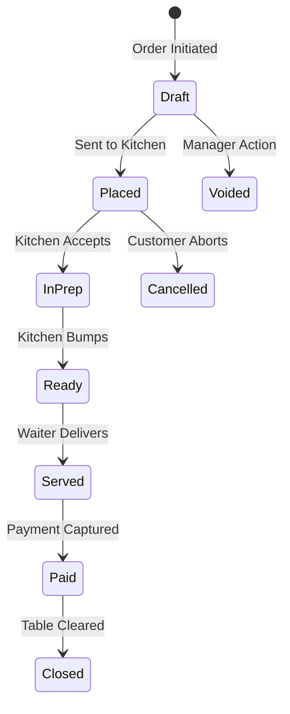
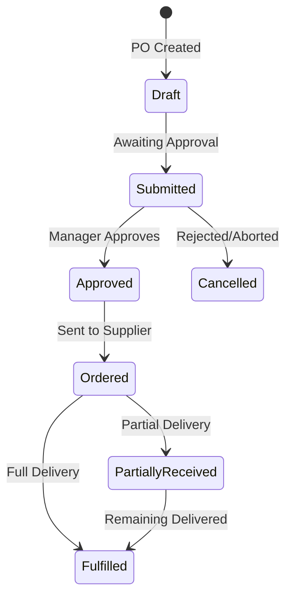
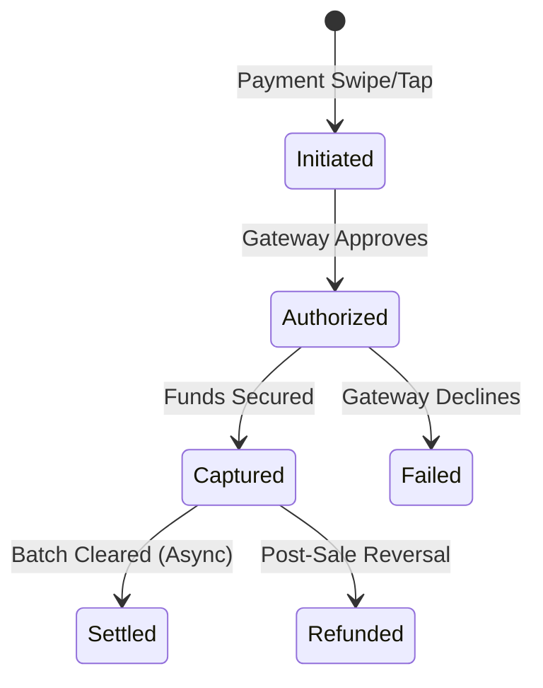
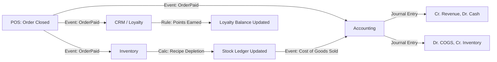
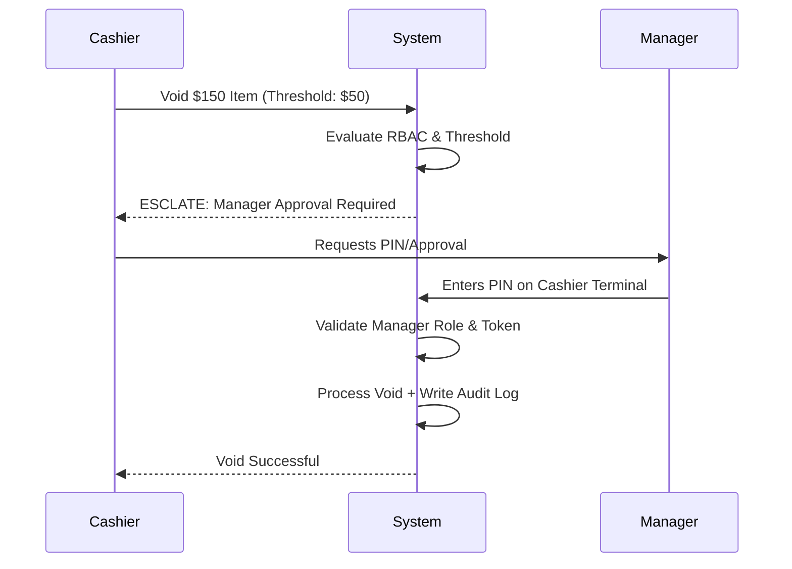

# Application Flow Document: AppFlow.md

**Document Version:** 1.0.0-FLOW  
**Document Type:** Enterprise Operational Workflow Blueprint  
**Status:** Approved for Implementation  
**Reference:** Aligned strictly with `PRD.md`, `Architecture.md`, `DatabaseSchema.md`, and `RBAC.md`

---

## Table of Contents

1. Executive Summary
2. Workflow Philosophy
3. Global Workflow Rules
4. State Management
5. User Journey Overview
6. Core Business Workflows
7. Cross-Module Workflows
8. Exception Handling
9. Offline Workflows
10. Recovery Workflows
11. Notification Flow
12. Approval Flows
13. Audit Flow
14. Background Processing
15. Future Workflow Expansion
16. Glossary

---

## 1. Executive Summary

This document serves as the operational blueprint for the Restaurant ERP + POS SaaS platform. It translates the business requirements (PRD), system boundaries (Architecture), data constraints (Database Schema), and security policies (RBAC) into concrete, step-by-step application behaviors.

This is not a technical API specification or UI design document; it is a **Business Process Model**. It defines _how_ the system behaves when a user initiates an action, _what_ state transitions occur, _which_ modules communicate, and _how_ exceptions and offline scenarios are handled.

---

## 2. Workflow Philosophy

1. **State-Machine Governed:** Entities (Orders, Invoices, Purchase Orders) move through strict, directed state machines. Invalid transitions are hard-rejected by the system.
2. **Event-Driven Side Effects:** Core actions (e.g., closing an order) emit events that trigger asynchronous side effects (inventory deduction, accounting posting) to keep the primary UI highly responsive.
3. **Idempotency by Default:** All state-mutating workflows expect client-generated idempotency keys to ensure network retries or offline syncs never produce duplicate transactions.
4. **Configuration Over Code:** Workflows do not hardcode approval thresholds or tax rules; they query the configuration layer at execution time.
5. **Human-in-the-Loop for Exceptions:** The system surfaces anomalies (e.g., inventory shortages, suspicious voids) for manager review rather than autonomously blocking critical restaurant operations.

---

## 3. Global Workflow Rules

Every workflow in this system adheres to the following sequence before execution:

1. **Authentication Check:** Valid stateless JWT exists and is unexpired.
2. **Context Resolution:** The request maps to a valid `tenant_id` and `branch_id`.
3. **Authorization Check (RBAC):** The user possesses the required permission for the specific resource and action, within the current branch scope.
4. **Validation:** Input payload passes schema validation (Zod) and business logic validation (e.g., table is not already closed).
5. **Concurrency Lock:** Optimistic concurrency (version checking) or row-level locks acquired for sensitive writes.
6. **Execution & State Mutation:** Database transaction begins.
7. **Audit Logging:** Every mutation synchronously appends to the `audit_logs` table before the transaction commits.
8. **Event Emission:** Post-commit, events are published to Redis/BullMQ for cross-module processing.

---

## 4. State Management

### 4.1 Order Lifecycle

### 4.2 Purchase Order Lifecycle

### 4.3 Invoice & Payment Lifecycle

---

## 5. User Journey Overview

### 5.1 The Waiter Journey

1. Logs into POS via PIN.
2. Selects assigned section and views table statuses.
3. Opens table -> Adds items -> Sends order to kitchen.
4. Receives KDS notification -> Serves food.
5. Prints bill -> Hands over to Cashier.

### 5.2 The Kitchen Journey

1. Views KDS screen for incoming tickets.
2. Acknowledges ticket (moves to `InPrep`, reserving inventory).
3. Prepares food according to recipe.
4. Bumps ticket (moves to `Ready`, notifying Waiter).

### 5.3 The Cashier Journey

1. Opens Day Session and Cash Drawer.
2. Receives bill from Waiter -> Collects payment (split or full).
3. Closes order -> Triggers accounting/inventory depletion.
4. Ends shift -> Reconciles drawer.

---

## 6. Core Business Workflows

### 6.1 Daily Opening Procedure (Shift Open)

- **Purpose:** Initializes the accounting and operational boundary for the day.
- **Trigger:** Manager or Cashier logs in at start of day.
- **Preconditions:** Previous Day Session must be closed.
- **Steps:**
  1. User selects "Open Day".
  2. User enters opening float (cash amount in till).
  3. System creates a `Day Session` and `Cash Drawer Session`.
  4. System prompts review of pending POs and 86'd items from yesterday.
- **State Changes:** Branch state -> `Open`.
- **Database:** `day_sessions` (INSERT), `cash_drawers` (INSERT).
- **Audit Events:** `day.open` with declared float.

### 6.2 Table Service & Order Capture (Dine-In)

- **Purpose:** Captures customer requests and routes them to fulfillment.
- **Trigger:** Waiter taps an available table.
- **Steps:**
  1. Waiter selects Table -> Status changes to `Seated`.
  2. Waiter adds items, modifiers, and combos to the ticket.
  3. Waiter taps "Fire to Kitchen".
  4. System generates idempotent key.
  5. System validates item availability against cached inventory.
  6. Order state updates to `Placed`.
  7. Event published to KDS via WebSockets.
- **Permission Checks:** `orders.create`, `tables.open`.
- **Business Rules:** Unavailable (86'd) items cannot be fired without Manager override.
- **Edge Cases:** See 8.4 (Concurrent Editing).

### 6.3 Kitchen Fulfillment (KDS)

- **Purpose:** Manages prep timing and coordinates stations.
- **Trigger:** KDS receives `OrderPlaced` event.
- **Steps:**
  1. Ticket appears on relevant station screens based on recipe routing.
  2. Chef taps ticket to acknowledge -> State changes to `InPrep`.
  3. System asynchronously reserves inventory.
  4. Chef finishes prep -> Taps "Bump" -> State changes to `Ready`.
  5. Notification sent to FOH/Waiter.
- **Edge Cases:** See 8.2 (Kitchen Rejects Item).

### 6.4 Billing and Payment

- **Purpose:** Converts order commitment into recognized revenue.
- **Trigger:** Cashier selects order and applies payment method.
- **Preconditions:** All items must be `Served` or explicitly split off.
- **Steps:**
  1. Cashier generates Bill -> System calculates Taxes based on branch jurisdiction.
  2. Cashier selects payment type (e.g., Card).
  3. Gateway authorizes and captures payment.
  4. Payment state -> `Captured`. Order state -> `Closed`. Table state -> `Available`.
  5. System emits `OrderClosed` event.
  6. Downstream (Async): Inventory is permanently deducted, Accounting Journal Entry is posted.
- **Audit Events:** `payment.captured`, `order.closed`.
- **Recovery:** If Gateway fails, state remains `Initiated`; Cashier can retry or change method.

### 6.5 Daily Closing Procedure (Shift Close)

- **Purpose:** Reconciles cash and locks the operational day.
- **Trigger:** Manager selects "Close Day".
- **Preconditions:** All tables must be closed, paid, or formally suspended.
- **Steps:**
  1. Cashier counts physical cash and enters total.
  2. System compares expected cash vs. physical cash.
  3. If variance exceeds threshold, Manager approval/reason code is required.
  4. System closes `Cash Drawer Session` and `Day Session`.
  5. System triggers daily Z-report generation.
- **State Changes:** Branch state -> `Closed`.
- **Database:** `cash_drawers` (UPDATE), `day_sessions` (UPDATE).

### 6.6 Physical Inventory Count

- **Purpose:** Reconciles theoretical system stock with physical reality.
- **Trigger:** Inventory Manager initiates a Cycle Count or Full Count.
- **Steps:**
  1. Manager generates count sheet (locks theoretical stock snapshot).
  2. Staff enter actual physical quantities.
  3. System calculates variance (Actual - Theoretical).
  4. Manager reviews variance value. If above threshold, Regional approval required.
  5. System creates `Stock Movement` records for the variance.
  6. Accounting Journal Entry posted for Shrinkage Expense.
- **Permission Checks:** `inventory.count`, `inventory.adjust.approve`.

### 6.7 Procurement (PO to Goods Receipt)

- **Purpose:** Restocks inventory via Three-Way Match workflow.
- **Steps:**
  1. System suggests reorder based on low stock, OR Manager creates PO manually.
  2. Manager submits PO (triggers approval flow if above threshold).
  3. PO is sent to Supplier.
  4. Goods arrive -> Manager creates Goods Receipt Note (GRN).
  5. System compares PO quantities vs. GRN quantities.
  6. Supplier Invoice received -> Finance compares PO, GRN, and Invoice.
  7. If matched, Accounts Payable ledger is credited.

---

## 7. Cross-Module Workflows

### 7.1 The Pivot: Operations to Finance

**Data Flow Explanation:** Operations (POS) act as the source of truth for the event. Finance (Accounting) and Supply Chain (Inventory) act as downstream consumers processing the event asynchronously to maintain high POS throughput.

---

## 8. Exception Handling

Every edge case is treated as a first-class workflow, requiring deterministic system and user responses.

### 8.1 Network/Internet Loss (Offline Mode)

- **Detection:** POS client `navigator.onLine` fails or REST API times out.
- **System Response:** Client seamlessly switches to `IndexedDB` caching. UI displays "Offline Mode" banner.
- **User Response:** Staff continue taking orders and cash payments.
- **Recovery:** Upon reconnection, a background Web Worker sequentially replays the idempotent offline queue to the server.
- **Audit:** Offline syncing events are logged.

### 8.2 Kitchen Rejects Item

- **Detection:** Chef taps "Reject" on KDS (e.g., dropped a steak, no more in fridge despite system showing stock).
- **System Response:** Ticket state -> `Rejected`. Notification fired to Waiter's POS.
- **User Response:** Waiter apologizes to customer, voids item (with 'Kitchen Reject' reason), or substitutes.
- **Audit:** `kitchen_ticket.rejected` logged with reason.

### 8.3 Duplicate Payment Attempt

- **Detection:** Waiter double-taps "Charge" during a network lag.
- **System Response:** API evaluates the `Idempotency-Key` header against Redis.
- **User Response:** Second request receives a `200 OK` with the _original_ response payload, preventing a double-charge.

### 8.4 Concurrent Table Editing

- **Detection:** Waiter A and Waiter B open the same table on different terminals and try to add items simultaneously.
- **System Response:** Database relies on `version` column (Optimistic Concurrency Control). Waiter B's save attempt fails with a HTTP 409 Conflict.
- **User Response:** Waiter B is prompted: "Table state has changed. Refreshing..." and the UI updates with Waiter A's items.

### 8.5 Walk-Out / Dine-and-Dash

- **Detection:** Manager confirms customer left without paying.
- **System Response:** Manager initiates "Walk-Out" closure.
- **Database Impact:** Inventory is depleted (food was cooked). Revenue is $0. Accounting posts to `Bad Debt / Loss` expense account instead of Cash.
- **Audit:** Heavily audited event requiring Manager permission.

---

## 9. Offline Workflows

### 9.1 Sync & Conflict Resolution

When an offline terminal reconnects:

1. **Drain Queue:** POS pauses UI mutations and POSTs queued actions sequentially using idempotency keys.
2. **Conflict Detection:** If the server state advanced while the terminal was offline (e.g., a Manager voided an order from a different terminal), the server returns a HTTP 409.
3. **Resolution:** The system applies Last-Write-Wins based on precise offline vector timestamps, OR flags the transaction for a Manager's manual reconciliation queue if it involves a financial discrepancy.

---

## 10. Recovery Workflows

### 10.1 Post-Incident Disaster Recovery

If the primary database cluster fails and restores from a Point-In-Time Backup (PITR):

1. **Data Gap Identification:** The recovered database state is slightly behind reality.
2. **Offline Replay:** POS terminals, recognizing a database state mismatch via session sync, will replay any local transactions stored in their IndexedDB that occurred _after_ the PITR timestamp.
3. **Integrity Check:** Because the system enforces idempotency, replaying these events will safely reconstruct the gap without duplicating transactions that survived the restore.

---

## 11. Notification Flow

- **Trigger:** Domain events (e.g., `StockLow`, `KDS_Bump`, `LargeVoid`).
- **Routing:** Notification Worker evaluates Tenant preferences to determine the channel (In-App, SMS, Email).
- **Delivery:** Dispatched via third-party providers (Twilio, SendGrid).
- **Failure:** If provider fails, BullMQ enforces exponential backoff (e.g., retry at 1m, 5m, 15m). If ultimately failed, logged to audit.

---

## 12. Approval Flows

Configured per the RBAC matrix. Example: **High-Value Void**.

---

## 13. Audit Flow

The audit flow is synchronous and mandatory.

1. Any POST, PUT, DELETE, or PATCH request triggers the Audit Middleware.
2. The middleware extracts `user_id`, `tenant_id`, `branch_id`, and `action`.
3. The database transaction executes the business logic AND an `INSERT INTO audit_logs` in the same `BEGIN...COMMIT` block.
4. If the audit insert fails (e.g., disk full), the entire business transaction rolls back. **Security precedes availability.**

---

## 14. Background Processing

To maintain < 100ms POS latency, heavy workflows execute via Redis-backed BullMQ workers:

1. **Inventory Depletion Worker:** Explodes nested recipes and calculates yield loss asynchronously after an order closes.
2. **Analytics Materialization Worker:** Runs off-peak (3 AM) to aggregate daily sales into reporting snapshots.
3. **Webhook Dispatcher:** Sends payload events to third-party integrations (e.g., accounting software).

---

## 15. Future Workflow Expansion

As defined in PRD Phase 3/4:

- **Auto-PO Generation:** The Demand Forecasting module will generate draft POs based on predictive analytics, dropping them directly into the standard Approval Flow (Section 6.7) for human sign-off before vendor transmission.
- **Franchise Menu Sync:** Tenant-level menu changes will initiate a background workflow to push updates to Franchisee branches, honoring their local override configurations.

---

## 16. Glossary

- **Idempotency Key:** A unique UUID generated by the client to ensure a request is processed exactly once, regardless of retries.
- **Three-Way Match:** A procurement workflow validating Purchase Order == Goods Receipt == Supplier Invoice.
- **Optimistic Concurrency Control (OCC):** Using version numbers to prevent two users from overwriting each other's data simultaneously.
- **KDS Bump:** The action a chef takes on a kitchen screen to mark an item or order as prepared.
- **86'd:** Restaurant terminology for an item that is out of stock or unavailable.
- **Z-Report:** The final daily financial summary generated at Shift Close.

---

_End of Document. This document represents the operational application flow mandated for implementation._
