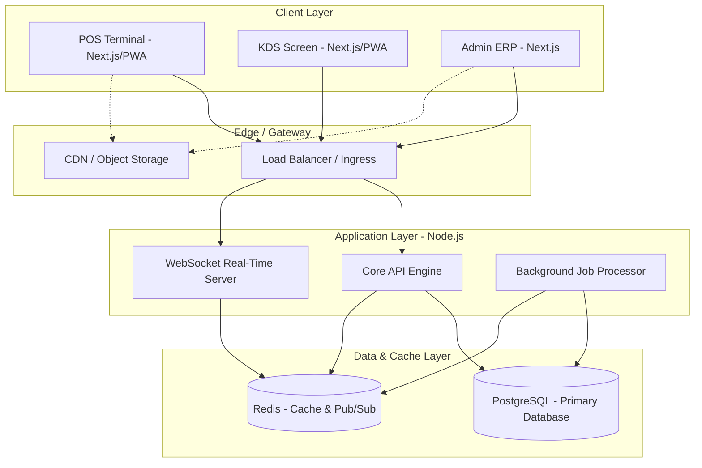
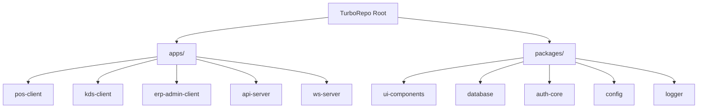
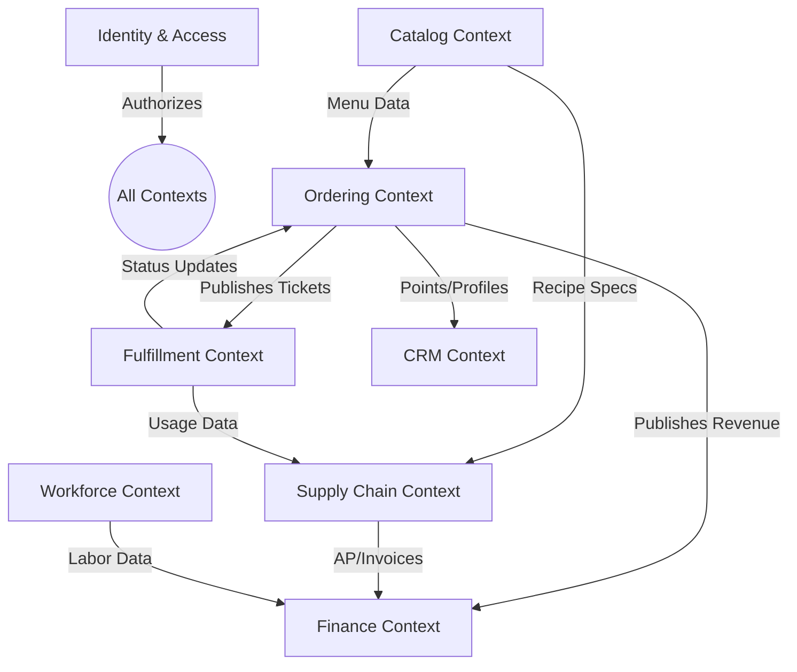
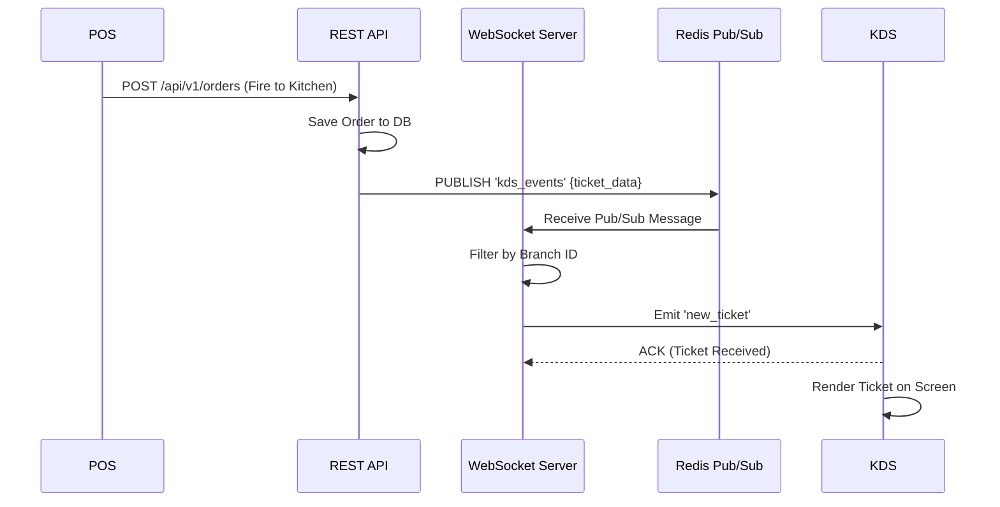
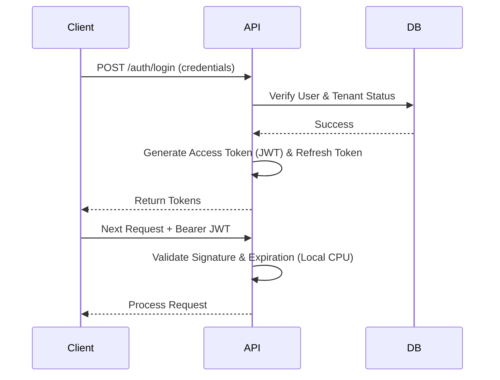
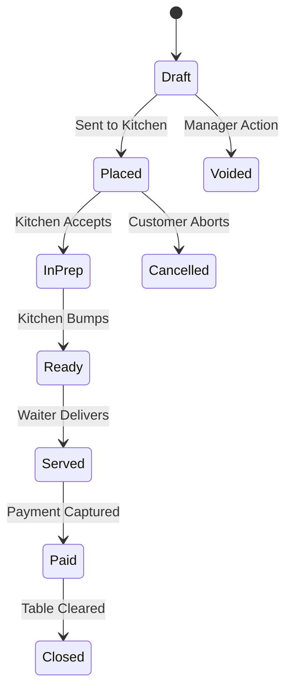
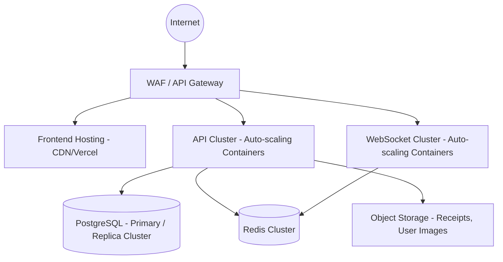

# System Architecture Document

## Multi-Tenant Restaurant ERP + POS SaaS Platform

**Document Version:** 1.2.0-ARCH  
**Status:** Approved for Implementation  
**Target File Name:** `Architecture.md`  
**Reference:** Aligned with `PRD.md` (v1.1.0-PROD)

---

## 1. Executive Summary

This document outlines the technical architecture for the enterprise-grade, cloud-native Restaurant ERP + POS SaaS platform. It translates the functional and business requirements established in the PRD into a scalable, modular, and maintainable system design. Built upon a TurboRepo monorepo, the architecture leverages modern web technologies (Next.js, TypeScript, Node.js) and robust infrastructure (PostgreSQL, Redis, Docker) to deliver a highly available, multi-tenant ecosystem capable of sub-100ms point-of-sale latency and real-time kitchen synchronization.

## 2. Architecture Goals

- **Zero-Downtime Scalability:** Support traffic spikes during peak restaurant hours seamlessly.
- **Absolute Tenant Isolation:** Guarantee data privacy and security across thousands of enterprise tenants via architectural boundaries.
- **High Performance & Low Latency:** Achieve < 100ms response times at the POS and < 200ms KDS synchronization.
- **Offline Resilience:** Ensure uninterrupted POS operations and transaction queuing during WAN outages.
- **Developer Ergonomics:** Maintain a predictable, modular monorepo structure that accelerates feature delivery without introducing technical debt.

## 3. Architectural Principles

1.  **Configuration over Hardcoding:** All business logic (taxes, roles, workflows, menus) must be driven by dynamic database configurations, heavily cached for performance.
2.  **Domain-Driven Design (DDD):** System boundaries reflect business boundaries (e.g., Inventory, POS, Kitchen, Finance).
3.  **Modular Monorepo (TurboRepo):** Shared logic, types, and UI components are abstracted into isolated packages to enforce the Single Source of Truth (SSOT).
4.  **Clean Architecture:** Strict separation of concerns between presentation (UI), transport (HTTP/WebSockets), business logic (Services), and data access (Repositories).
5.  **Security First:** Zero-trust principles, stateless JWT authentication, Row-Level Security (RLS) philosophies, and strictly validated inputs.

---

## 4. High-Level System Architecture

The platform operates on a distributed, cloud-native architecture. Clients communicate through an API Gateway/Load Balancer, which routes traffic to containerized Node.js backend services. State is persisted in PostgreSQL, while Redis manages real-time pub/sub and high-speed caching.

---

## 5. TurboRepo Monorepo Design

The repository is organized using TurboRepo to maximize build caching, enforce modularity, and guarantee consistent dependency resolution.

### 5.1 Repository Structure

### 5.2 Applications (`apps/`)

- `pos-client`: Next.js PWA optimized for touch interfaces and offline capabilities.
- `kds-client`: Next.js PWA optimized for high-visibility displays, bump bars, and WebSocket connections.
- `erp-admin-client`: Next.js web application for dense data visualization, reporting, and system configuration.
- `api-server`: Node.js (Express/Fastify) REST API housing the core business domains.
- `ws-server`: Node.js WebSocket microservice dedicated purely to real-time event broadcasting (e.g., POS to KDS).

### 5.3 Shared Packages (`packages/`)

- `@repo/ui`: The shadcn/ui and TailwindCSS component library. Strictly presentation components.
- `@repo/database`: Contains the Prisma schema, migrations, and generated Prisma Client. Enforces the SSOT for data models.
- `@repo/auth`: Shared JWT validation, RBAC evaluation logic, and permission matrices.
- `@repo/logger`: Standardized structured JSON logging wrapper (e.g., Winston/Pino) used across all apps.
- `@repo/eslint-config` & `@repo/typescript-config`: Unified build and linting rules.

### 5.4 Dependency Rules

- Applications can depend on Packages.
- Packages can depend on other Packages (e.g., `@repo/auth` depends on `@repo/database`).
- **Strict Anti-Pattern:** Applications must _never_ depend on other Applications.

---

## 6. Domain Driven Design & Bounded Contexts

To prevent monolithic spaghetti code, the backend follows Domain-Driven Design. Each context maintains its own services, validation schemas, and business rules, communicating with other contexts via strictly defined interfaces or event buses.

| Bounded Context             | Core Responsibility                                       | PRD Module Alignment    |
| :-------------------------- | :-------------------------------------------------------- | :---------------------- |
| **Identity & Access (IAM)** | Auth, Tenant Context, RBAC evaluation.                    | Auth, Branch Management |
| **Catalog**                 | Menus, Categories, Modifiers, Combos.                     | Menu Management         |
| **Ordering & POS**          | Tickets, Split Billing, Table states, Payment processing. | POS, Tables             |
| **Fulfillment (KDS)**       | Station routing, ticket timers, bumping logic.            | Kitchen Display System  |
| **Supply Chain (ERP)**      | Inventory lifecycle, POs, Recipes, COGS depletion.        | Inventory, Suppliers    |
| **Finance & Ledger**        | AP/AR, Tax engines, Shift reconciliation.                 | Accounting, Finance     |
| **Workforce (HR)**          | Time-tracking, rosters, tip-pooling.                      | HR, Payroll             |
| **CRM**                     | Customer profiles, loyalty points, marketing.             | CRM, Loyalty            |

### 6.1 Domain Context Map

The following Context Map illustrates how bounded contexts interact, establishing explicit integration boundaries to prevent domain leakage.

**Context Responsibilities & Boundaries:**

- **Ordering & POS:**
  - _Owns:_ Orders, line items, split bills, POS active sessions, table states.
  - _Never Owns:_ Inventory quantities, customer loyalty rules, complex menu hierarchies.
  - _Upstream:_ Catalog (for prices/items), IAM (for cashier auth).
  - _Downstream:_ Fulfillment (for kitchen prep), Finance (for revenue posting).
  - _Published Events:_ `OrderCreated`, `OrderPaid`, `OrderVoided`.
  - _Consumed Events:_ `KitchenTicketBumped`, `MenuUpdated`.
- **Supply Chain (ERP):**
  - _Owns:_ Ingredients, recipes, stock levels, GRNs, vendors, stock transfers.
  - _Never Owns:_ Menu item display descriptions, POS terminal statuses.
  - _Upstream:_ Catalog (for recipe-to-item mapping).
  - _Downstream:_ Finance (for AP generation).
  - _Published Events:_ `InventoryDeducted`, `StockLow`, `POApproved`.
  - _Consumed Events:_ `OrderClosed` (to trigger theoretical deductions).

### 6.2 Enterprise Event Catalog

The platform utilizes an Event-Driven Architecture (EDA) to decouple domains. Events are transmitted via Redis Pub/Sub (for ephemeral real-time UI updates) and BullMQ/Kafka (for guaranteed asynchronous processing).

| Event Name             | Producer     | Consumers          | Delivery Method | Idempotency / Retry           | Dead Letter Queue (DLQ)              |
| :--------------------- | :----------- | :----------------- | :-------------- | :---------------------------- | :----------------------------------- |
| `OrderCreated`         | POS          | KDS, Analytics     | Pub/Sub & MQ    | Event ID deduplication        | N/A (UI ephemeral) & Yes (Analytics) |
| `OrderModified`        | POS          | KDS                | Pub/Sub         | Overwrite latest state        | Dropped if obsolete                  |
| `OrderCancelled`       | POS          | KDS, Finance       | Pub/Sub & MQ    | Reversal lock check           | Yes (Manual intervention)            |
| `KitchenTicketCreated` | POS          | KDS                | Pub/Sub         | Hash matching                 | Alerts KDS Admin                     |
| `KitchenAccepted`      | KDS          | POS                | Pub/Sub         | Timestamp tracking            | N/A                                  |
| `KitchenRejected`      | KDS          | POS                | Pub/Sub         | Manager alert trigger         | N/A                                  |
| `InventoryReserved`    | POS          | Supply Chain       | MQ              | Exponential Backoff (3x)      | Yes (Un-reserves on timeout)         |
| `InventoryReleased`    | POS          | Supply Chain       | MQ              | Event ID validation           | Yes                                  |
| `InventoryDeducted`    | Supply Chain | Analytics, Finance | MQ              | Idempotency Key mapping       | Yes (Requires audit)                 |
| `PaymentInitiated`     | POS          | Finance            | Direct API      | Unique Request ID             | No (Fails fast to UI)                |
| `PaymentCaptured`      | POS/Gateway  | Finance            | MQ              | Transaction ID matching       | Yes (Alerts Finance Team)            |
| `InvoiceGenerated`     | Finance      | CRM, Notification  | MQ              | PDF Hash verification         | Yes                                  |
| `JournalCreated`       | Finance      | Analytics          | MQ              | Ledger Entry ID               | Yes                                  |
| `ShiftOpened`          | HR/POS       | Analytics, Finance | MQ              | Shift ID locking              | Yes                                  |
| `ShiftClosed`          | HR/POS       | Finance            | MQ              | Daily reconciliation check    | Yes                                  |
| `CustomerCreated`      | CRM/POS      | Analytics          | MQ              | Email/Phone unique constraint | Yes                                  |
| `CustomerUpdated`      | CRM          | POS                | MQ              | Version number increment      | No (Last write wins)                 |
| `LoyaltyUpdated`       | CRM          | POS, Finance       | MQ              | Point transaction ledger      | Yes                                  |
| `NotificationSent`     | Notification | Audit              | MQ              | External Provider ID          | No (Logs failure)                    |
| `AuditRecorded`        | ALL          | Security           | MQ              | Write-only append log         | Yes (Critical alert)                 |

### 6.3 System Interaction Matrix

| Domain        | Owns             | Consumes                   | Publishes          | Primary DB Objects    | External Integrations |
| :------------ | :--------------- | :------------------------- | :----------------- | :-------------------- | :-------------------- |
| **POS**       | Orders, Tables   | Menu, Auth, Kitchen Status | Sales, Tickets     | `orders`, `tables`    | Payment Gateways      |
| **Inventory** | Stock, Recipes   | Menu, Orders               | Depletions, Alerts | `inventory`, `pos`    | Vendor EDI            |
| **Kitchen**   | Tickets, Timers  | Orders                     | Prep Status        | `kds_tickets`         | IoT Ovens/Printers    |
| **Finance**   | Invoices, GL     | Sales, Labor, Inventory    | Ledgers            | `invoices`, `ledgers` | QuickBooks, Xero      |
| **CRM**       | Profiles, Points | Sales                      | Rewards            | `customers`, `points` | Mailchimp             |
| **Auth/RBAC** | Users, Roles     | Config                     | Auth Events        | `users`, `roles`      | Auth0 / SAML          |

---

## 7. Frontend Architecture

- **Framework:** Next.js (App Router for Admin, Client-side rendering focused for POS/KDS to support offline/PWA capabilities).
- **Styling:** TailwindCSS with `@repo/ui` encapsulating accessible headless UI components (shadcn/ui + Radix).
- **Server State (API Layer):** React Query. Used for fetching, caching, synchronizing, and updating server data with optimistic UI updates.
- **Client State (Local UI):** Zustand. Used for complex, ephemeral local state (e.g., building a complex split bill in memory before committing to the server).

### 7.1 Offline Synchronization Strategy

To ensure zero-downtime operations during internet outages, the POS terminal employs a robust offline-first architecture.

- **Offline Queue:** All state-mutating requests (creating orders, applying payments) intercept network failures and serialize the request payload into IndexedDB (using libraries like `idb` or `rxdb`).
- **Partial Synchronization:** Read-heavy data (Menus, Taxes, Floorplans) are synced to IndexedDB on login and refreshed quietly via background polling.
- **Conflict Detection & Resolution:**
  - System relies on **Last-Write-Wins (LWW)** using vector clocks or accurate UTC timestamps.
  - Conflicts are flagged for manual managerial review rather than silently dropping financial data.
- **Idempotency & Duplicate Prevention:** Every offline transaction generates a unique UUID (Idempotency-Key) on the client. Upon reconnection, the backend checks this key against the `processed_keys` cache to prevent double-charging or duplicate orders.
- **Clock Skew:** Terminals sync their internal delta offset against the server clock upon authentication to prevent invalid timestamps during offline periods.
- **Recovery After Reconnect:** A dedicated Web Worker monitors `navigator.onLine`. Upon restoration, it pauses active UI mutations, drains the offline queue sequentially, handles any HTTP 409 (Conflict) errors, and then unlocks the UI.

---

## 8. Backend Architecture

- **Framework:** Node.js (TypeScript).
- **Pattern:** Controller-Service-Repository (Clean Architecture).
  - _Controllers:_ Handle HTTP request/response, extract JWTs, parse inputs (Zod).
  - _Services:_ Execute pure business logic (e.g., applying discount rules, calculating recipe depletion).
  - _Repositories:_ Handle database interactions via Prisma ORM.

### 8.1 API Philosophy

- **RESTful Design:** Predictable, resource-oriented endpoints (e.g., `POST /api/v1/orders`).
- **Idempotency:** All state-mutating endpoints (creation/payments) must require an `Idempotency-Key` header to prevent duplicate processing during network retries (crucial for offline POS sync).
- **Input Validation:** Strict runtime validation using Zod before any request hits the service layer.

### 8.2 API Evolution Strategy

- **Versioning Strategy:** URL-based versioning (`/api/v1/`, `/api/v2/`) combined with header-based resource representations where necessary.
- **Backward Compatibility:** New fields are additive. Renamed or removed fields require a major version bump.
- **Deprecation Policy:** Deprecated endpoints return a `Sunset` header indicating the shutdown date, allowing client developers to migrate gracefully.
- **Long-Term Governance:** Managed via OpenAPI 3.0 schemas acting as the contract between frontend and backend monorepo packages.

### 8.3 Real-Time Communication Architecture

The `ws-server` microservice acts as the nerve center for real-time POS and KDS synchronization.

- **Transport:** WebSockets (via Socket.io or native `ws`) with long-polling fallbacks.
- **Connection Lifecycle:** Clients connect with a short-lived ticket JWT. The WS Server validates the token, attaches the socket to `tenant_id` and `branch_id` rooms, and begins emitting.
- **Ordering Guarantees & Acknowledgment:** KDS terminals must emit an `ack` back to the WS Server upon receiving a ticket. If no `ack` is received within 2 seconds, the message is placed in a retry queue.
- **Offline Handling:** If a KDS goes offline, the WS Server pauses emissions. Upon reconnection, the KDS fetches a full state snapshot via REST to catch up, then resumes WebSocket listening.

---

## 9. Multi-Tenant Architecture

### 9.1 Data Isolation Strategy

The platform utilizes a **Logical Isolation (Pool Model)**. All tenants share the same database infrastructure, but data isolation is strictly enforced at the application layer and database layer.

1.  **Tenant ID Stamping:** Every table in the system (except global dictionaries) must contain a `tenant_id` column.
2.  **Prisma Middleware/Extensions:** A mandatory database extension intercepts every query. It automatically injects `WHERE tenant_id = ?` into reads and `tenant_id: ?` into writes based on the async local storage execution context.
3.  **Row-Level Security (RLS):** As a defense-in-depth measure, PostgreSQL RLS policies will be enforced, ensuring that even if the application layer fails, a database query cannot retrieve cross-tenant data.

---

## 10. Authentication & RBAC Architecture

### 10.1 Authentication Flow

Stateless authentication using JWTs.

### 10.2 RBAC Evaluation

Permissions are evaluated as defined in the PRD (`[Module].[Resource].[Action].[Scope]`).

- **Payload Context:** The JWT payload contains the `role_id`, `tenant_id`, and `branch_id`.
- **Evaluation Middleware:** The `@repo/auth` middleware intercepts the request, looks up the cached permission matrix for the `role_id` in Redis, and asserts if the user possesses the required capability for the requested scope.

---

## 11. Database & State Management Strategy

### 11.1 PostgreSQL Philosophy (Primary Data Store)

- **UUIDs as Primary Keys:** Integers are strictly prohibited for primary keys to prevent enumeration attacks and facilitate seamless offline ID generation by POS terminals.
- **Soft Deletes:** Records are never physically deleted. An `is_deleted` boolean and `deleted_at` timestamp are used to preserve financial and audit integrity.
- **Auditability:** Every row must track `created_at`, `updated_at`, `created_by`, and `updated_by`.

### 11.2 Redis Strategy

Redis is explicitly required for the following enterprise workflows:

1.  **Low-Latency KDS Routing:** Redis Pub/Sub drives the WebSocket server, ensuring a ticket fired on a POS is broadcast to the correct KDS screen in < 50ms.
2.  **Idempotency Lock:** Preventing double-charges if a waiter rapid-clicks the payment button.

### 11.3 Multi-Level Caching Strategy

To achieve high performance at scale, caching is applied at four distinct tiers:

- **Browser Cache (Service Worker):** Caches static assets (JS, CSS, images) and offline structural definitions.
- **React Query Cache:** In-memory caching on the client terminal for API responses (TTL 1-5 minutes depending on volatility).
- **Redis App Cache:** Centralized cache for configuration, menus, and RBAC rules. Uses Cache-Aside pattern.
  - _Stampede Protection:_ Implement locking or probabilistic early expiration to prevent DB overload when a massive tenant cache expires.
  - _Invalidation:_ Event-driven. When an Admin updates a menu, a Pub/Sub event immediately invalidates the specific `tenant_id:menu` Redis key.
- **Database Cache:** PostgreSQL shared buffers for raw disk data.

### 11.4 Background Worker Architecture

The `api-server` offloads heavy lifting to dedicated, Redis-backed job queues (via BullMQ).

- **Inventory Worker:** Processes `OrderClosed` events to calculate complex recipe deductions asynchronously, keeping the POS UI blazing fast.
  - _Retry:_ Exponential backoff. _Failure:_ Sends alert to Inventory Manager if negative stock is hit.
- **Notification Worker:** Routes SMS and Emails. Handles third-party API rate limits and retries.
- **Analytics & Reporting Worker:** Aggregates daily sales, calculates PMIX (Menu Engineering), and materializes views during off-peak hours.
- **Export/Import Worker:** Handles large CSV generation for accounting ledgers or bulk ingredient uploads.
- **Cleanup Worker:** Scheduled CRON job that purges soft-deleted records past their retention period and rotates logs.

### 11.5 File Storage Architecture

- **Provider:** S3-compatible Object Storage (AWS S3, Cloudflare R2).
- **Use Cases:** Menu item images, digital receipt PDFs, employee onboarding documents, and temporary export files.
- **Security:** Clients upload directly to S3 via pre-signed URLs generated by the API, keeping binary load off Node.js. Employee documents require signed URLs for viewing.
- **Lifecycle:** Temporary export files are auto-deleted after 7 days via bucket lifecycle rules.

### 11.6 Search Architecture

- **Current Phase:** Leverages PostgreSQL's native capabilities (`tsvector` for full-text search, `pg_trgm` for fuzzy matching on customer names and menu items).
- **Future Scale Migration:** If search load begins impacting primary DB compute (e.g., massive cross-tenant reporting), data will be synced via Debezium (CDC) to a dedicated ElasticSearch/OpenSearch cluster.

---

## 12. Configuration & Feature Flag Engine

Adhering strictly to the **Configuration over Hardcoding** principle, system behavior is governed dynamically.

### 12.1 Configuration Architecture

- **Hierarchy Resolution:** Configurations resolve in a strict cascading order: `Global Default` -> `Tenant` -> `Branch` -> `Station`. The lowest level overrides the higher levels.
- **Storage & Cache:** Stored natively in PostgreSQL as JSONB payloads. Cached aggressively in Redis.
- **Runtime Injection:** The frontend fetches the active configuration payload upon login, applying dynamic rules for Tax calculation, Discount thresholds, role permissions, and notification preferences locally to allow offline usage.

### 12.2 Feature Flag Architecture

- **Granularity:** Flags can be toggled globally, per-tenant, or per-branch.
- **Gradual Rollout:** Supports percentage-based rollouts to safely introduce new POS features or backend integrations.
- **Emergency Kill-Switches:** Architecture allows immediate disabling of buggy features via an Admin dashboard, syncing down to POS terminals in real-time via WebSockets.

---

## 13. State Machines & Entity Lifecycles

Critical business entities follow strict, directed state machines. Invalid transitions throw explicit domain errors.

### 13.1 Order Lifecycle

- **Valid:** Draft -> Placed -> InPrep -> Ready -> Served -> Paid -> Closed
- **Exceptions:** Any (pre-Paid) -> Voided; Placed -> Cancelled.

### 13.2 Kitchen Ticket Lifecycle

- **Valid:** Created -> Accepted -> InPrep -> Bumped
- **Failure:** Created -> Rejected (Alerts Manager)

### 13.3 Reservation Lifecycle

- **Valid:** Pending -> Confirmed -> Seated -> Completed
- **Failure:** Confirmed -> NoShow, Confirmed -> Cancelled

### 13.4 Invoice Lifecycle

- **Valid:** Draft -> Issued -> Paid
- **Exceptions:** Issued -> Voided, Paid -> Refunded

### 13.5 Payment Lifecycle

- **Valid:** Initiated -> Authorized -> Captured
- **Exceptions:** Authorized -> Failed, Captured -> Refunded

### 13.6 Purchase Order Lifecycle

- **Valid:** Draft -> Submitted -> Approved -> PartiallyReceived -> Fulfilled
- **Exceptions:** Submitted -> Cancelled

### 13.7 Inventory Adjustment Lifecycle

- **Valid:** Draft -> PendingApproval -> Applied
- **Exceptions:** PendingApproval -> Rejected

### 13.8 Shift Lifecycle

- **Valid:** Scheduled -> Opened -> Closed -> Reconciled

---

## 14. Notification Architecture

The Notification Engine abstracts the complexity of contacting customers, employees, and management.

- **Event Sources:** Triggered by Domain Events (e.g., `OrderReady` triggers SMS to customer, `StockLow` triggers Email to Inventory Manager).
- **Omnichannel Routing:** A unified service evaluates User Preferences, selects the correct channel (Email, SMS, Push, In-App Dashboard Alert), and loads localized templates.
- **Failure Handling:** Third-party gateway failures (e.g., Twilio outage) trigger exponential retries via BullMQ. Persistent failures are logged to an audit table.

---

## 15. Logging, Monitoring, & Security (Observability)

### 15.1 Observability Architecture

- **Structured Logging:** All application logs output as JSON via `@repo/logger`.
- **Correlation IDs:** Every incoming HTTP request or WebSocket event generates a unique `trace_id`. This ID is injected into every subsequent log, database query, and background job for distributed tracing.
- **Metrics & Tracing:** OpenTelemetry (OTel) instrumentation collects API latencies, DB query durations, and memory usage, exporting to Prometheus/Grafana or Datadog.
- **Health Checks:** `GET /health/liveness` (App is running) and `GET /health/readiness` (App is connected to DB & Redis) endpoints drive Kubernetes pod routing.

### 15.2 Security

- **Secret Management:** Environment variables managed via secure vaults (e.g., AWS Secrets Manager). Never hardcoded.
- **Data at Rest/Transit:** DB encrypted at rest. TLS 1.3 mandated for all transit.
- **Rate Limiting:** Enforced at the API Gateway based on Tenant ID and IP Address.
- **Audit Logging:** Critical actions (voids, refunds) write to a dedicated, immutable `audit_logs` table.

---

## 16. Deployment Architecture & Scalability

### 16.1 Deployment Model

The platform is designed to run in containerized environments (Docker) orchestrated by Kubernetes (EKS/GKE) or managed container services (AWS ECS).

### 16.2 Scalability Strategy

- **Compute Scalability:** API and WS services are stateless and horizontally scalable based on CPU/Memory thresholds.
- **Database Scalability:** Read-heavy operations (Reporting, Dashboard metrics, Menu loading) route to Read-Replicas. Write operations route to the Primary database.
- **Connection Pooling:** PgBouncer (or Prisma Accelerate) deployed in front of PostgreSQL to manage database connection exhaustion during peak traffic events.

---

## 17. Architectural Decision Records (ADRs), Trade-offs & Risks

### ADR-001: Next.js PWA over Native Mobile Apps for POS

- **Decision:** Build the POS and KDS clients as Progressive Web Apps (PWAs) using Next.js.
- **Trade-off:** Sacrifices native operating system UI components in exchange for a unified codebase, instant over-the-air updates, and cross-hardware compatibility.

### ADR-002: Logical vs. Physical Tenant Isolation

- **Decision:** Logical isolation (shared DB, separated by `tenant_id`) over physical isolation.
- **Risk:** "Noisy neighbor" issues.
- **Mitigation:** Application-level ORM middleware forces the `tenant_id` on all queries. Dedicated read-replicas isolate compute workloads.

### ADR-003: Asynchronous Inventory Depletion

- **Decision:** Decouple POS order closing from ERP inventory recipe depletion via message queues.
- **Trade-off:** Theoretical inventory quantities may lag physical reality by a few seconds during extreme rush hours (eventual consistency).
- **Mitigation:** The POS UI evaluates 86'd status from a high-speed Redis cache, not the exact ERP stock integer.

---

## 18. Future Expansion Strategy

To align with the PRD's Phase 2 and 3 roadmaps:

- **Public API Layer:** The architecture supports spawning a dedicated `apps/public-api` gateway to securely expose restricted REST endpoints for third-party integrations (UberEats, QuickBooks) without exposing internal core services.
- **AI Analytics:** The event-driven architecture enables seamless streaming of historical order data into a future Data Warehouse (e.g., Snowflake/BigQuery) for training machine learning forecasting models.
