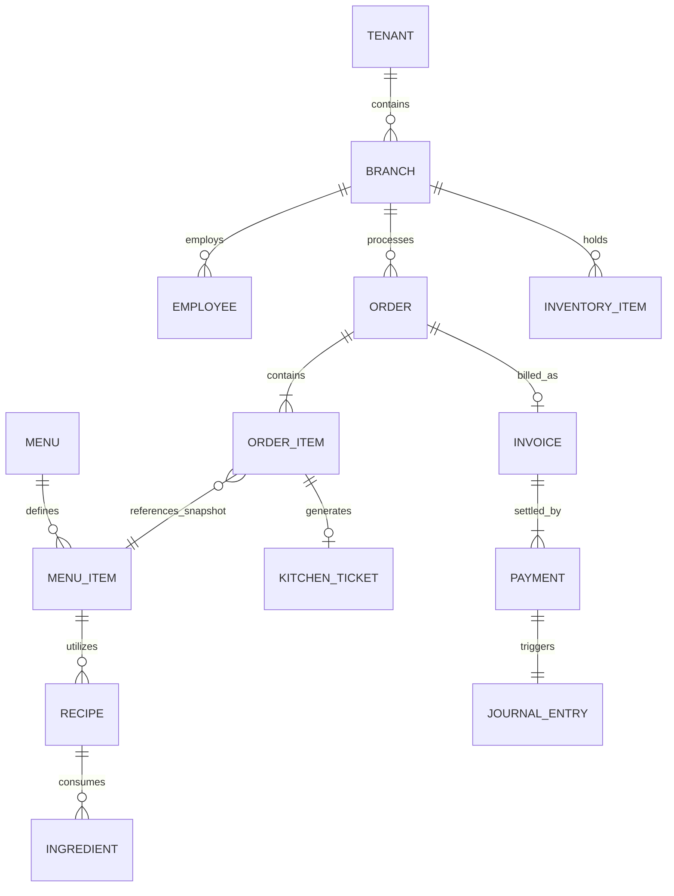
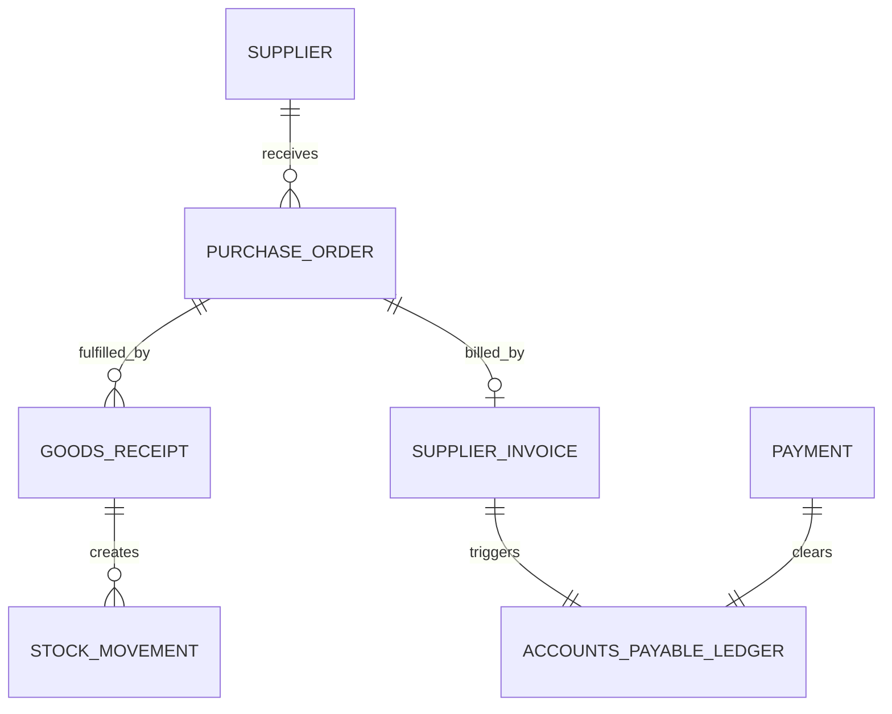

# Database Design Document: Enterprise Restaurant ERP + POS SaaS

**Document Version:** 1.0.0-DBA  
**Target Architecture:** PostgreSQL (Logical Pooled Multi-Tenancy)  
**Reference:** Aligned strictly with `PRD.md` (v1.1.0-PROD) and `Architecture.md` (v1.2.0-ARCH)  
**Author:** Principal Database Architect

---

## 1. Executive Summary

This document defines the foundational data architecture for the cloud-native Restaurant ERP + POS SaaS platform. It serves as the single source of truth for the enterprise data model, bridging the operational workflows outlined in the PRD and the bounded contexts established in the System Architecture Document. This is an implementation-agnostic schema design defining constraints, relationships, strategies, and principles before physical DDL or ORM models are generated.

## 2. Database Philosophy

The core philosophy of this database is **Absolute Operational Truth**. The database is not merely a persistence layer; it is the ultimate system of record for financial, operational, and audit data.

- **Configuration over Hardcoding:** Tax rules, hierarchical RBAC, menu structures, and approval thresholds are modeled as data, not code.
- **Tenant Isolation:** A pooled logical multi-tenancy model ensures cross-tenant data boundaries are cryptographically and structurally impenetrable.
- **Data Integrity:** The database enforces constraints at the lowest level. Application-level validation is secondary to database-level relational integrity.
- **Auditability:** Every mutation leaves a permanent cryptographic and relational shadow. Fraud prevention is built into the schema.
- **Historical Traceability:** Reporting on past events must reflect the state of the world _at that time_ (e.g., historical item prices and recipes).
- **Maintainability & Scalability:** A modular schema mapping directly to Domain-Driven Design (DDD) contexts ensures independent scaling.
- **Security:** Strict separation of duties enforced through the schema.

## 3. Design Principles

1. **Immutability of Financial Records:** Paid bills, closed shifts, and posted ledgers are immutable. Corrections require explicit, audited counter-transactions (e.g., Credit Notes, Voids).
2. **Asynchronous Consistency Tolerated, Inconsistency Denied:** While read-heavy operations may rely on eventual consistency via Redis, the primary PostgreSQL schema enforces strict ACID compliance for all financial and inventory transactions.
3. **No Silent Data Loss:** Records are never physically deleted (Soft Deletion strategy).
4. **Offline First Preparedness:** Data types (e.g., UUIDs) allow POS terminals to function and generate state while disconnected, achieving seamless cloud sync upon reconnect.

## 4. Domain Ownership

Following the Domain-Driven Design (DDD) Bounded Contexts, the schema is conceptually partitioned into:

- **IAM:** Tenant, Branch, Auth, RBAC.
- **Catalog:** Menus, Categories, Combos.
- **Ordering:** Orders, Tables, Reservations.
- **Fulfillment:** Kitchen Tickets, Prep Timers.
- **Supply Chain:** Inventory, Recipes, Suppliers, POs.
- **Finance:** Ledgers, Journals, Invoices, Payments, Shifts.
- **CRM:** Customers, Loyalty, Coupons.

## 5. Entity Classification

- **Master Data:** Shared or inherited data that changes infrequently (Tenants, Suppliers, Global Recipes, Roles).
- **Operational Data:** High-velocity transactional data (Orders, Kitchen Tickets, Stock Movements, Payments).
- **Configuration Data:** Rules and settings governing system behavior (Tax rates, Branch settings, Approval thresholds).
- **Audit Data:** Append-only logs of state changes.

## 6. Data Ownership

Data is owned at specific hierarchical levels:

- **Global:** Core system feature flags, master permission dictionaries.
- **Tenant-Level:** Chain-wide menus, centralized CRM profiles, generic supplier agreements, Central Recipes.
- **Branch/Legal Entity-Level:** Localized pricing, physical stock, cash drawers, localized tax rates, localized shift data.

## 7. Multi-Tenant Strategy

- **Logical Isolation (Pool Model):** All tenants share the same physical database structure, minimizing schema migration overhead.
- **Tenant Stamping:** Every table (excluding global dictionary tables) mandatorily includes a `tenant_id` column.
- **Branch Stamping:** Transactional and branch-scoped master data must include a `branch_id` and belong to a tenant.
- **Database Enforcement:** PostgreSQL Row-Level Security (RLS) policies will be deployed as a defense-in-depth measure, guaranteeing `tenant_id` boundaries even if application-layer ORM isolation fails.
- **Cross-Tenant Restrictions:** Foreign keys can never cross tenant boundaries.

## 8. Relationship Strategy

- **One-to-One:** Used sparingly, mostly for extending base entities (e.g., `User` to `EmployeeProfile`) without locking the highly concurrent base table.
- **One-to-Many:** The default hierarchical structural relationship (e.g., `Branch` to `Order`, `Order` to `OrderItem`).
- **Many-to-Many:** Resolved exclusively through explicit associative (join) tables with their own UUID primary keys, created/updated timestamps, and audit fields (e.g., `EmployeeBranchRole` tracking "Manager at Branch A, Waiter at Branch B").
- **Hierarchical/Recursive:** Used for organizational charting, accounting ledgers (Chart of Accounts), and nested menu categories.

## 9. Naming Conventions

- **Tables:** `snake_case`, plural (e.g., `orders`, `inventory_items`).
- **Columns:** `snake_case`, singular (e.g., `created_at`, `total_amount`).
- **Primary Keys:** `id` (implied UUID).
- **Foreign Keys:** `[entity_name]_id` (e.g., `tenant_id`, `branch_id`).
- **Booleans:** Prefix with `is_`, `has_`, or `can_` (e.g., `is_deleted`, `has_stock`).
- **Timestamps:** Suffix with `_at` (e.g., `published_at`).

## 10. Primary Key Strategy

- **UUIDv4 / UUIDv7:** Integers are strictly prohibited. UUIDs prevent enumeration attacks, distribute evenly across partitioned indexes, and critically allow offline Next.js POS clients to generate idempotent keys locally before syncing to the cloud.

## 11. Foreign Key Strategy

- Strict referential integrity.
- `ON DELETE RESTRICT` is the default. Deletions must be handled logically via soft deletes.
- Cascading deletes are strictly forbidden to prevent accidental massive data loss, except in ephemeral associative tables where the parent's lifecycle absolutely dictates the child's (e.g., `order` -> `order_item`).

## 12. Data Integrity Strategy

- **Database-Level Constraints:** Heavy reliance on `CHECK` constraints (e.g., `amount >= 0`, `discount_percent BETWEEN 0 AND 100`).
- **Unique Indexes:** Partial unique indexes are used extensively to enforce uniqueness only among active records (e.g., `UNIQUE (tenant_id, email) WHERE is_deleted = false`).
- **State Machine Enforcement:** Where feasible, database triggers or constraints prevent invalid state jumps (e.g., `Order` cannot go from `Draft` directly to `Closed`).

## 13. Transaction Strategy

- **Boundary Definition:** A transaction boundary must encompass the entire operational event. For example, a "Day Close" transaction must lock the shift, aggregate the tills, post to the accounting ledger, and write the audit log within a single `BEGIN ... COMMIT` block.
- **Offline Idempotency:** State-mutating payloads from offline POS queues include an `idempotency_key`. The database enforces uniqueness on this key to prevent double-charging or duplicate order creation upon reconnection.

## 14. Concurrency Strategy

- Optimistic Concurrency Control (OCC) using `version` integer columns on high-contention entities (e.g., `InventoryItem`, `Order`). Clients must pass the known version; the database rejects updates if the version has incremented, forcing the client to re-read and resolve the conflict.

## 15. Locking Strategy

- **Row-Level Locks:** `SELECT ... FOR UPDATE` is used strictly during highly sensitive financial calculations (e.g., consuming the last available unit of an ingredient, applying a final payment split).
- **Deadlock Avoidance:** Application services must acquire locks in a consistent, deterministic order (e.g., ordering by `id` alphanumerically before bulk updates).

## 16. Audit Strategy

Every table (with minor exceptions for high-throughput ephemeral metrics) includes:

- `created_at` (Timestamp)
- `updated_at` (Timestamp)
- `created_by` (UUID of User/System)
- `updated_by` (UUID of User/System)

Critical tables (Financials, Permissions) utilize a shadow/history table pattern (e.g., `orders_history`) or trigger-based append-only logging to the `audit_logs` table to capture the "before" and "after" state of every mutation, including the reason code.

## 17. Soft Delete Strategy

- Physical `DELETE` statements are prohibited for master and operational data.
- Entities include `is_deleted` (Boolean, default `false`) and `deleted_at` (Timestamp).
- Views and application middleware automatically append `WHERE is_deleted = false`.

## 18. Historical Data Strategy

- **Immutability of Context:** When an order is placed, the price, tax rate, and recipe snapshot are copied to the `order_items` table. The order does not join back to the live `menu_items` table for its price. If a burger's price changes tomorrow, yesterday's sales reporting must remain unaffected.

## 19. Backup Strategy

- Continuous Write-Ahead Log (WAL) archiving via continuous replication.
- Point-in-Time Recovery (PITR) support with 5-minute RPO (Recovery Point Objective).
- Daily automated snapshots retained redundantly across geographic regions.

## 20. Recovery Strategy

- Automated failover to hot-standby read-replicas within seconds.
- In the event of primary database failure, POS clients automatically transition to offline-queueing mode. Upon recovery, idempotency keys ensure the offline backlog is safely drained into the new primary.

## 21. Performance Strategy

- Heavy reads (reporting, dashboards) are explicitly routed to Read-Replicas.
- Aggressive caching of Master Data (Menus, RBAC, Configurations) in Redis.
- Background asynchronous workers handle complex multi-row depletion math (e.g., stock reduction based on recipe explosion).

## 22. Indexing Philosophy

- Primary keys and Foreign Keys are indexed by default.
- Composite indexes are created based on common query patterns (e.g., `(tenant_id, branch_id, status, created_at)` for filtering branch orders).
- Over-indexing is avoided to maintain write throughput. Indexes are added based on slow-query log analysis.

## 23. Partitioning Philosophy

- As the SaaS scales, `orders`, `audit_logs`, and `stock_movements` will be range-partitioned natively in PostgreSQL by `created_at` (e.g., monthly partitions) to ensure consistent index sizes and allow efficient archiving of cold data.

## 24. Future Scalability

- The schema is designed to support a future extraction of Analytics and Audit Logs into a dedicated Data Warehouse (Snowflake/BigQuery) via Change Data Capture (CDC) using Debezium without altering the transactional schema.

---

## 25. Entity Design

The following details the purpose, ownership, and constraints of entities mandated by the PRD and Architecture.

### 25.1 IAM, Tenant, & Organization

#### Tenant

- **Purpose:** The root boundary of a restaurant business (Single outlet or Chain).
- **Owner Domain:** IAM
- **Lifecycle:** Created -> Active -> Suspended
- **Business Rules:** All data except global dictionaries maps back to a Tenant.
- **Audit Requirements:** Strict auditing of status changes. Never hard deleted.

#### Restaurant (Legal Entity)

- **Purpose:** Represents the statutory entity for tax and accounting purposes.
- **Relationships:** Belongs to Tenant; Has Many Branches.
- **Business Rules:** Required for distinct corporate reporting within a single tenant chain.

#### Branch

- **Purpose:** A physical or virtual operating location.
- **Relationships:** Belongs to Legal Entity/Tenant; Has Many Tills, Tables, Employees.
- **Business Rules:** Holds localized Tax Configuration, Timezone, and Currency. Never hard-deleted; suspended to preserve historical data.

#### User

- **Purpose:** The authenticated identity (Employee or API actor).
- **Owner Domain:** IAM
- **Business Rules:** Identity can span multiple tenants, but authorizations are tenant-isolated. Pin-based fast-switching support is required.

#### Role & Permission

- **Purpose:** Governs Data-Driven RBAC.
- **Business Rules:** Configurable thresholds (e.g., `discount > 15% requires Manager`). Dynamic, supporting temporary grants (`effective_from`, `effective_until`). Ensures segregation of duties structurally.

#### Employee

- **Purpose:** Links a User to a Tenant's HR/Payroll system.
- **Relationships:** Many-to-Many with Branch and Role (e.g., `EmployeeBranchRole` table tracking "Manager at Branch A, Waiter at Branch B").

---

### 25.2 Catalog & Menu

#### Menu

- **Purpose:** Tenant-level template or Branch-specific offering.
- **Relationships:** Belongs to Tenant; Assigned to Branch.
- **Business Rules:** Versioned. Price changes create new versions to protect past operational reporting.

#### Category & Modifier

- **Purpose:** Hierarchical grouping and customization of items.
- **Business Rules:** Modifiers carry min/max selection logic and directly link to ingredient/inventory deduction logic.

#### Combo

- **Purpose:** Bundled pricing mechanism.
- **Business Rules:** Must physically decompose into constituent items for recipe and COGS (Cost of Goods Sold) accounting at the time of order.

---

### 25.3 Supply Chain & Inventory

#### Supplier

- **Purpose:** Vendor management. Can be tenant-wide or branch-specific.
- **Business Rules:** Holds contracted pricing and performance metrics.

#### Ingredient & Inventory Item

- **Purpose:** Tracks physical goods (Raw Materials or Semi-Finished Goods).
- **Relationships:** Belongs to Branch or Central Kitchen.
- **Business Rules:** Tracks Theoretical vs. Actual stock. Deductions are handled via asynchronous workers responding to POS events.

#### Recipe

- **Purpose:** The transformation matrix mapping Menu Items/Combos/SFGs to Ingredients.
- **Business Rules:** Includes Yield Loss and Spoilage percentage factors. Central recipes can have branch-level ingredient substitutions without breaking the parent model.

#### Inventory Batch & Stock Movement

- **Purpose:** Tracks FIFO/FEFO lifecycles and physical stock flow.
- **Business Rules:** Every movement (Consumption, Spoilage, Transfer) is immutable and writes a ledger entry justifying the variance.

#### Purchase Order & Goods Receipt

- **Purpose:** Procurement lifecycle.
- **Business Rules:** Three-Way Match enforcement (PO vs. Goods Receipt Note vs. Supplier Invoice).

---

### 25.4 Ordering & POS

#### Order & Order Item

- **Purpose:** The pivot point of the system connecting operations to finance.
- **Relationships:** Belongs to Branch, User (Waiter), Table.
- **Business Rules:** Unbilled orders hold revenue in suspense. Items cannot be billed if in 'In Prep' state unless explicitly split. Order Items snapshot price, tax, and applicable recipe at the moment of creation.

#### Dining Table & Reservation

- **Purpose:** Spatial management and advance booking.
- **Business Rules:** Tracks states (`Available`, `Seated`, `Billed`). Supports Table Merging and Splitting via associative transaction tables. Overbooking allowed based on tenant policy threshold.

---

### 25.5 Fulfillment (KDS)

#### Kitchen Ticket

- **Purpose:** Station routing and prep timing.
- **Relationships:** Belongs to Order Item; Routed to KDS Station.
- **Business Rules:** Triggers actual ingredient depletion (Inventory Reservation) when marked 'In Prep'. Highly concurrent.

---

### 25.6 Finance & Ledger

#### Invoice, Payment, & Refund

- **Purpose:** Cash flow capture.
- **Business Rules:** Payments follow a strict state machine (`Initiated -> Authorized -> Captured`). Refunds against closed periods require elevated permissions distinct from current-shift refunds.

#### Expense, Journal, & Ledger

- **Purpose:** Double-entry accounting system of record.
- **Business Rules:** Accounting is downstream of operations. POS sales automatically generate balanced Journal Entries mapping to the configured Chart of Accounts. Closed periods are locked.

#### Cash Drawer & Shift

- **Purpose:** Daily operational boundaries.
- **Business Rules:** A Branch cannot sell without an open Day Session. Day Close triggers final reconciliation and locks the operational day from standard mutations.

#### Daily Closing

- **Purpose:** Snapshot of reconciled physical vs. expected cash/card, triggering period lockdown. Reopening a closed day is heavily audited and requires Controller permissions.

---

### 25.7 CRM & Marketing

#### Customer

- **Purpose:** Unified profile.
- **Business Rules:** Isolated per tenant. Anonymous sales are supported natively. PII is strictly protected.

#### Membership, Loyalty, Coupon, & Gift Card

- **Purpose:** Retention and liability tracking.
- **Business Rules:** Gift Cards and unredeemed Loyalty Points are modeled strictly as balance-sheet liabilities until redeemed, generating appropriate Ledger entries. Coupons support targeted issuance logic.

---

### 25.8 System & Audit

#### Notification

- **Purpose:** Omnichannel alert routing (KDS alerts, Low Stock emails).

#### Audit Log

- **Purpose:** Tamper-evident, append-only record of critical actions (Voids, Config changes, Reopening closed shifts).
- **Business Rules:** Written synchronously with the triggering transaction to ensure it is never bypassed.

#### Configuration & Feature Flag

- **Purpose:** JSONB-based resolution of cascading rules (Global -> Tenant -> Branch -> Station).
- **Business Rules:** Lower levels override higher levels. Heavily cached in Redis.

#### Analytics Snapshot

- **Purpose:** Materialized views of operational metrics (PMIX, Labor % to Sales).
- **Business Rules:** Generated by async workers to protect primary OLTP database performance.

---

## 26. Relationships

### Operational Flow (ER Diagram)

_This diagram illustrates the core transactional spine of the platform._

### Procurement & Finance Flow (ER Diagram)

_This diagram illustrates the Three-Way Match and Accounting consequences._

---

## 27. Glossary

- **Tenant:** The highest-level commercial entity subscribing to the platform.
- **Logical Isolation:** Using `tenant_id` columns and Row-Level Security rather than separate physical databases.
- **Three-Way Match:** Procurement validation ensuring PO == Goods Received == Invoice Billed.
- **Idempotency Key:** A UUID generated by the client to prevent duplicate transaction processing during network retries.
- **Soft Delete:** Updating an `is_deleted` flag instead of issuing a SQL `DELETE` command.
- **Day Session:** The primary accounting and operational boundary for a branch, distinct from a calendar day.
- **SFG:** Semi-Finished Good; an intermediate recipe output held in inventory.

---

_End of Document._
