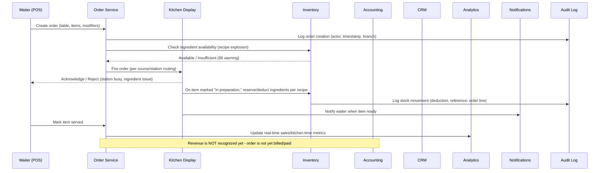
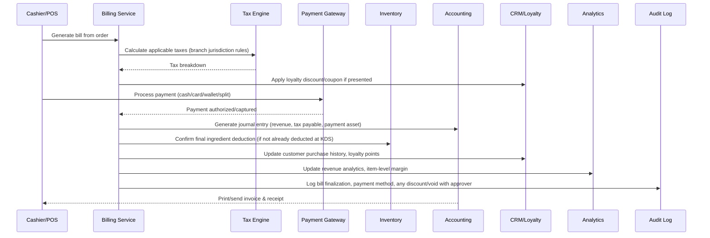
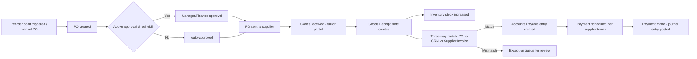

# Restaurant ERP + POS SaaS Platform

## Product Requirements Document (PRD)

**Document Owner:** Head of Product
**Status:** Draft for Cross-Functional Review (CEO, PM, BA, Enterprise Architecture, Engineering, UX, QA, DevOps)
**Document Type:** Business & Product Blueprint (not a feature catalogue)
**Scope:** Multi-tenant, cloud-native Restaurant ERP + POS platform for single outlets through global restaurant chains

---

## How to Read This Document

This PRD is organized so that business understanding precedes software design. Sections 1–7 establish _why_ the product exists and _how restaurants actually operate_. Sections 8 onward translate that understanding into system behavior, module specifications, business rules, matrices, and delivery priorities. Engineering teams should not skip to the Module Specifications without first internalizing the Business Domain Analysis and Operational Workflows — the rules in later sections only make sense in that context.

---

## Table of Contents

1. Executive Summary
2. Business Context & Problem Statement
3. Vision, Goals & Success Metrics
4. Stakeholders
5. User Personas
6. Business Domain Analysis (Lifecycles)
7. Operational Workflows (Daily Restaurant Operations)
8. System Interaction Flows
9. Multi-Tenancy Model
10. Role-Based Access Control (RBAC) Model
11. Module Specifications & Business Rules
12. Accounting Behavior
13. Inventory & Recipe Behavior
14. Edge Cases & Failure Recovery
15. Role Matrix
16. Permission Matrix
17. Workflow Matrix
18. Reporting & Analytics Matrix
19. Non-Functional Requirements
20. Risk Analysis
21. Dependencies, Assumptions & Constraints
22. Acceptance Criteria
23. Prioritization (MoSCoW)
24. Roadmap
25. Glossary
26. Appendix

---

## 1. Executive Summary

Restaurants — from a single independent café to a 500-branch quick-service chain — run on a fragmented stack: a POS terminal that doesn't talk to inventory, a spreadsheet for recipes, a separate accounting package reconciled manually at month-end, and WhatsApp groups substituting for purchase orders. Every disconnection between these systems is a point of revenue leakage, inventory shrinkage, or accounting error that the owner discovers weeks too late, if at all.

This platform is a single, cloud-native system of record for restaurant operations: POS and order-taking, kitchen production, inventory and recipe costing, supplier and procurement management, customer relationship management, and full double-entry accounting — all sharing one data model, one permission model, and one audit trail, from the first sale of the day to the closed books at month-end.

It is built for multi-tenancy from day one (many restaurant brands, many legal entities, many branches, many currencies, many tax regimes on one platform) and for configurability over hardcoding (roles, workflows, tax rules, and approval chains are data, not code), because restaurant businesses vary too much — legally, operationally, and culturally — for any fixed workflow to fit all of them.

The product is not a website builder, not a generic CRUD admin panel, and not a single-purpose POS. It is operational software of record: if the platform is down, the restaurant cannot sell, cannot cook, and cannot close its books. That standard governs every design decision in this document.

---

## 2. Business Context & Problem Statement

### 2.1 How restaurants currently operate (the status quo)

Most restaurants, even well-run ones, stitch together 3–7 disconnected tools:

- A **POS system** for taking orders and payments (often locked to a single hardware vendor, with no real accounting or inventory depth).
- A **spreadsheet or notebook** for recipes, costing, and menu engineering.
- A **separate or absent inventory system**, updated manually, days after stock actually moved.
- **WhatsApp/phone calls** to suppliers, with purchase orders that exist only as chat messages.
- A **bookkeeper or external accountant** who receives a shoebox of receipts and a bank statement once a month and reconstructs the books after the fact.
- **No CRM**, or a bolted-on loyalty app that doesn't share data with the POS.
- **Excel-based payroll and shift management.**

This creates predictable, expensive failure modes:

| Problem                                                                               | Root Cause                                                                                                             | Business Impact                                                                                       |
| ------------------------------------------------------------------------------------- | ---------------------------------------------------------------------------------------------------------------------- | ----------------------------------------------------------------------------------------------------- |
| Owner doesn't know true food cost until month-end (if ever)                           | Recipes and inventory are not linked to POS sales in real time                                                         | Menu is priced on guesswork; margin erosion goes unnoticed for months                                 |
| Inventory shrinkage (theft, waste, over-portioning)                                   | No automatic deduction of ingredients per sale; no reconciliation between theoretical and actual stock                 | 3–8% of revenue lost annually in typical full-service restaurants (industry-standard shrinkage range) |
| Revenue leakage at POS (voided orders, unauthorized discounts, unrecorded cash sales) | No enforced approval chain; no audit trail on voids/discounts                                                          | Cash and card revenue diverge from actual sales; fraud goes undetected                                |
| Books don't close on time                                                             | Accounting is a manual, after-the-fact reconstruction from POS exports                                                 | Owner cannot make timely pricing, staffing, or expansion decisions                                    |
| Multi-branch chains can't compare branches                                            | Each branch runs its own disconnected tools, no unified data model                                                     | Head office cannot benchmark performance, negotiate supplier terms centrally, or standardize menus    |
| Compliance risk                                                                       | Tax rules, invoicing formats, and audit requirements vary by jurisdiction and change over time; hardcoded logic breaks | Fines, failed audits, blocked expansion into new regions                                              |

### 2.2 The problem this product solves

The core problem is **operational fragmentation**: the restaurant's _physical_ workflow (a customer orders → the kitchen cooks → ingredients are consumed → money changes hands → the books must reflect it → the owner must be able to see it) has no _single digital backbone_. Every handoff between disconnected tools is a place where data is lost, delayed, or manually re-entered — and manual re-entry is where both errors and fraud live.

This platform's job is to make that physical workflow and the digital record of it the same thing, in real time, across every branch of a chain, under a single tenant, governed by configurable roles and rules rather than hardcoded assumptions about how one particular restaurant works.

### 2.3 Why existing solutions fall short

- **Toast, Square, Lightspeed**: strong POS, weak-to-absent deep accounting and multi-entity ERP behavior; primarily built for US/single-market tax and payment rails.
- **Oracle MICROS / SAP Business One**: strong enterprise depth, but expensive, slow to configure, and not restaurant-workflow-native (SAP is general ERP retrofitted to F&B).
- **Odoo**: broad modular ERP, but restaurant-specific operational depth (KDS, recipe yield loss, table/course management) is shallow without heavy customization.

The gap this product fills: **enterprise-grade multi-tenant ERP depth (accounting, inventory, multi-branch) combined with restaurant-native operational depth (KDS, recipes, table service, delivery aggregation)** in one system, configurable enough to serve one outlet or one thousand.

---

## 3. Vision, Goals & Success Metrics

### 3.1 Vision

A restaurant of any size should be able to run its entire business — sales, kitchen, inventory, staff, suppliers, and books — on one platform, and trust that what the system shows is what actually happened, in real time, with a full audit trail.

### 3.2 Goals

1. **Unify the operational and financial record** — every sale, every ingredient consumed, every payment, and every journal entry trace back to a single originating event.
2. **Make fraud and leakage visible, not just possible to investigate after the fact** — enforce approval chains and produce exception reports (voids, discounts, negative inventory, price overrides) as a first-class feature, not an afterthought.
3. **Support the full spectrum** — a single café owner and a 500-branch chain configure the same platform differently; neither is a special case requiring a different codebase.
4. **Close the books on time, automatically** — every operational transaction should post to accounting without manual re-entry, so period close is a review step, not a reconstruction project.
5. **Be jurisdiction-agnostic by design** — tax rules, currencies, invoice formats, and fiscal calendars are configuration, because the same platform must serve a single-branch restaurant in one country and a chain spanning several.

### 3.3 Success Metrics

| Metric                                                              | Target Rationale                                                                                                                                                                                               |
| ------------------------------------------------------------------- | -------------------------------------------------------------------------------------------------------------------------------------------------------------------------------------------------------------- |
| Time from sale to inventory deduction                               | Near-real-time (seconds), because delayed deduction is the single biggest cause of "phantom stock" that leads to failed physical counts                                                                        |
| % of transactions requiring manual accounting correction post-close | Trending toward zero — measures whether automatic posting logic is trustworthy                                                                                                                                 |
| Void/discount transactions with recorded approval                   | 100% — this is a control, not a KPI to "improve," it is either enforced or it isn't                                                                                                                            |
| Time to close a financial period                                    | Should shrink from "days of reconciliation" (status quo) to "hours of review," because the system posts continuously rather than in a batch reconciliation                                                     |
| Branch onboarding time (chain adding a new outlet)                  | Should be configuration-driven (hours to days), not a new implementation project, because branches reuse tenant-level menu/recipe/role templates                                                               |
| Inventory variance (theoretical vs. physical count)                 | Directionally decreasing over time as recipe accuracy and shrinkage visibility improve — this is a diagnostic metric the _platform_ enables the _restaurant_ to improve, not something the platform guarantees |

We deliberately avoid inventing precision (e.g., "99.99% uptime" or "sub-200ms POS response") without operational justification; see Section 19 for how each NFR target is derived from restaurant operating conditions rather than asserted.

---

## 4. Stakeholders

| Stakeholder                                                     | Interest / Stake                                                                                     |
| --------------------------------------------------------------- | ---------------------------------------------------------------------------------------------------- |
| **Restaurant Owner / CEO (single outlet)**                      | Profitability visibility, fraud prevention, minimal admin overhead                                   |
| **Chain CEO / COO**                                             | Cross-branch benchmarking, standardization, centralized procurement leverage                         |
| **Branch Manager**                                              | Daily operations run smoothly; staff accountable; shift and cash reconciliation is fast and accurate |
| **Waiter / Server**                                             | Fast order entry, accurate table/order status, minimal friction                                      |
| **Cashier**                                                     | Fast, error-resistant billing and payment collection                                                 |
| **Kitchen Staff / Chef**                                        | Clear, prioritized order queue; accurate recipe/ingredient availability                              |
| **Inventory / Purchasing Manager**                              | Accurate stock levels, timely reordering, supplier performance visibility                            |
| **Accountant / Finance Controller**                             | Accurate, timely, auditable books; minimal manual journal entries                                    |
| **HR / Payroll Admin**                                          | Accurate attendance-to-payroll linkage, compliant payroll processing                                 |
| **Marketing Manager**                                           | Customer data for campaigns, loyalty program configuration, coupon performance                       |
| **Customer (diner)**                                            | Correct orders, correct bills, working loyalty/rewards, data privacy                                 |
| **Supplier / Vendor**                                           | Clear purchase orders, timely payment, accurate goods-received records                               |
| **Auditor (internal/external/tax authority)**                   | Complete, tamper-evident audit trail; accurate financial statements                                  |
| **Platform Operator (Anthropic-style SaaS vendor analogy: us)** | Multi-tenant scalability, security, uptime, support cost containment                                 |
| **DevOps / SRE**                                                | Operability, observability, safe deployment, disaster recovery                                       |
| **Compliance / Legal**                                          | Jurisdiction-specific tax, invoicing, and data-residency compliance                                  |

---

## 5. User Personas

**5.1 Amara — Single-Outlet Owner-Operator**
Runs one 40-seat casual dining restaurant. Does the books herself on weekends. Needs the system to _tell her_ when something's wrong (low margin dish, missing stock, suspicious void pattern) rather than requiring her to dig. Low tolerance for complex configuration; wants sensible defaults.

**5.2 Rahul — Multi-Branch Operations Director (12 branches)**
Manages a regional chain. Needs to compare branch performance, standardize menus and pricing with limited per-branch flexibility (e.g., local specials), and negotiate supplier contracts centrally while letting branch managers place local orders within budget.

**5.3 Grace — Branch Manager**
Opens and closes the branch daily, manages staff schedules, approves voids/discounts/refunds within her limit, handles physical inventory counts weekly. Needs speed and clarity, not depth of configuration.

**5.4 Diego — Waiter**
Takes orders tableside, needs offline resilience (spotty branch Wi-Fi), needs to know in real time if an item is 86'd (out of stock).

**5.5 Priya — Executive Chef / Kitchen Manager**
Owns recipes, portion sizes, and prep schedules. Needs the system to reflect _actual_ kitchen behavior — batch prep, yield loss, substitutions — not an idealized recipe.

**5.6 Michael — Finance Controller (chain-level)**
Owns the chart of accounts, period close, consolidated financial statements across branches/currencies. Needs confidence that operational data posts correctly without manual intervention, and an audit trail defensible to external auditors.

**5.7 Sofia — Purchasing/Inventory Manager**
Manages supplier relationships, purchase orders, goods receipt, and stock transfers between central kitchen and branches. Needs visibility into consumption forecasts to avoid both stockouts and overstock/spoilage.

**5.8 External Auditor (non-employee persona)**
Needs read-only, tamper-evident access to financial records and the underlying transaction trail during audit periods — never a modification capability.

---

## 6. Business Domain Analysis (Lifecycles)

Understanding the product requires understanding six interlocking lifecycles. Every module in Section 11 exists to serve a stage in one or more of these lifecycles.

### 6.1 Restaurant / Branch Lifecycle

`Tenant Created → Legal Entity Configured → Branch(es) Created → Menu/Recipes Assigned → Staff Onboarded → Branch Goes Live → Daily Operating Cycle (repeats) → [Branch Suspended / Branch Closed]`

Key business questions this lifecycle must answer (see Section 9 for full multi-tenancy rules):

- A **tenant** is a restaurant business (which may be a single outlet or a chain with many legal entities/branches).
- A **branch** is a physical (or virtual/dark-kitchen) operating location with its own inventory, staff assignments, tax configuration, and till/cash drawer.
- Branches can be temporarily suspended (renovation, seasonal closure) without being deleted — historical data must remain intact and reportable.

### 6.2 Customer Lifecycle

`Anonymous Walk-in → Identified (phone/email/loyalty signup) → Repeat Customer → Loyalty Member → [Lapsed / Churned] → [Win-back campaign] → Reactivated`

- A customer can exist as an anonymous transaction (cash sale, no data captured) — this is the default and must never be blocked; capturing customer data is opt-in, not mandatory for a sale to complete.
- Identification typically happens via phone number, loyalty enrollment, or online-ordering account creation.
- Customer value tiers (loyalty tiers) are driven by configurable rules (spend, visit frequency, recency) evaluated on a schedule (see 11.6).

### 6.3 Employee Lifecycle

`Hired → Onboarded (role + branch assignment) → Active (shifts, attendance, permissions) → [Role Change / Branch Transfer] → [Suspended / Terminated]`

- An employee's _access_ (RBAC) and _employment_ (HR/payroll) are related but distinct: a terminated employee's system access must be revocable immediately, independent of whether their final payroll processing is complete.
- Employees can hold different roles at different branches simultaneously (see Section 9.2) — e.g., a floating manager who is "Manager" at Branch A on Mondays and "Senior Waiter" at Branch B on weekends, if the business models staff that way.

### 6.4 Inventory Lifecycle

`Raw Ingredient Procured (PO → Goods Receipt) → Stocked → [Transformed via Recipe/Prep Batch into Semi-Finished Good] → Consumed by Sale OR Wasted/Spoiled/Adjusted → Reconciled via Physical Count → [Reordered]`

This is the most operationally complex lifecycle in the platform (fully detailed in Section 13) because ingredients are not static SKUs — they transform (raw → semi-finished → finished), degrade (spoilage, expiry), and are consumed non-deterministically (yield loss, portion variance).

### 6.5 Order / Revenue Lifecycle

`Order Created (dine-in/takeaway/delivery/online) → Sent to Kitchen → Prepared → Served → Billed → Paid → [Refunded/Voided] → Recognized as Revenue → Posted to Accounting`

Every order is the pivot point where operations (kitchen, inventory) and finance (billing, accounting, tax) meet — this is why Section 8's system interaction flow for "Customer Places an Order" is the canonical example the platform must get right.

### 6.6 Accounting / Financial Lifecycle

`Transaction Occurs (sale, purchase, payroll, expense) → Journal Entry Generated → Posted to General Ledger → Period Activities Accumulate → Period Close → Financial Statements Generated → [Audit]`

Detailed fully in Section 12. The core principle: **accounting is a downstream consumer of operational events, not a separately maintained record.** A sale doesn't get "entered into accounting" — it _automatically produces_ the correct journal entries at the moment it is finalized, because the chart of accounts mapping is configuration attached to the transaction type (see 12.1).

## 7. Operational Workflows (Daily Restaurant Operations)

Software requirements must be grounded in what actually happens in a restaurant, hour by hour. This section documents the operational backbone the system must support.

### 7.1 Daily Opening Procedure

1. **Shift/Day Open** — a manager or authorized cashier opens the business day at the branch. This creates a _Day Session_ and, per till/register, a _Cash Drawer Session_ with a declared opening float (cash amount counted and entered).
2. **Pre-shift checks** — system surfaces: items auto-86'd from yesterday that need re-enabling decision, low-stock alerts, pending purchase order deliveries expected today, any unresolved exceptions from the prior closing (e.g., a shift that closed with a cash variance).
3. **Staff clock-in** — employees clock in against their scheduled shift; late/early variance is flagged for manager review, not blocked.
4. **Menu availability confirmation** — kitchen/branch manager confirms today's menu (any 86'd items due to missing ingredients, any daily specials).

**Business rule:** A branch cannot process sales before a Day Session is opened. This is deliberate — it forces a discrete accounting boundary per day, which is required for accurate daily reconciliation and prevents "yesterday's till" bleeding into today's numbers.

### 7.2 Daily Closing Procedure

1. **Kitchen close** — outstanding orders must be resolved (served, cancelled with reason) before kitchen close; cannot silently disappear.
2. **Cash drawer reconciliation per till** — cashier/manager counts physical cash, system compares to expected cash (opening float + cash sales − cash paid out − cash refunds). Variance is recorded, not hidden; variances above a configurable threshold require manager sign-off with a reason code.
3. **Card/digital payment reconciliation** — system totals should reconcile against payment gateway/processor settlement batches (may complete asynchronously — see 7.4).
4. **Shift close per employee** — clock-out, tips reconciliation if applicable.
5. **Day close** — once all tills are closed and reconciled (or exceptions are explicitly acknowledged), the manager closes the Day Session. This is the trigger that finalizes the day's transactions for accounting posting (see 12.3) and locks the day against further edits (except through a formal correction workflow).

**Business rule:** Day close is not reversible by a branch-level user. Only a role with elevated "Reopen Day" permission (typically Finance Controller or above) can reopen a closed day, and doing so is itself an audited, reason-coded action, because reopening a closed financial period has accounting consequences (Section 12.4).

### 7.3 Table & Order Service Cycle (Dine-In)

`Guest Seated → Table Opened → Order Taken (course-by-course or all at once) → Course Fired to Kitchen (per course timing) → KDS Prepares → Runner Serves → Additional Rounds (drinks, dessert) → Bill Requested → Bill Split/Settled → Table Closed/Reset`

Real-world variability the system must support: guests move tables mid-meal (table transfer), two tables merge (party combines), a table splits into separate bills for separate parties, an item is sent back to the kitchen (comp or remake), a guest leaves before paying (walk-out — see Section 14).

### 7.4 Payment Settlement Timing

Card and digital wallet payments are **authorized** at the POS in real time but frequently **settle** (funds actually move, processor sends a settlement file) hours or days later, and settlement can differ from the authorized amount (processor fees, chargebacks). The platform must model payment status as a lifecycle (`Authorized → Captured → Settled → [Disputed/Chargeback]`), not a single boolean "paid," because accounting reconciliation (Section 12) depends on knowing which state a payment is in.

### 7.5 Physical Inventory Count Cycle

Performed on a schedule (daily for high-value/high-shrinkage items, weekly/monthly for the full catalogue). Staff count actual stock; system compares to theoretical stock (opening stock + receipts − recipe-driven consumption − recorded waste); variance is posted as a stock adjustment with a required reason, and materially large variances should be flagged for manager/owner review as a potential shrinkage or recipe-accuracy signal (Section 13).

### 7.6 Procurement Cycle

`Reorder Point Triggered (system suggestion) or Manual Request → Purchase Order Created → Approved (if above threshold) → Sent to Supplier → Goods Received (full or partial) → Goods Receipt Note matched against PO → Supplier Invoice Received → Three-Way Match (PO vs. GRN vs. Invoice) → Payment Scheduled → Paid`

The three-way match is the primary fraud/error control in procurement: paying for goods that were ordered but never received, or that were received in different quantity/price than invoiced, must be caught here, not discovered at period close.

## 8. System Interaction Flows

Every major event in the platform touches multiple systems. This section documents the canonical flows — engineering should treat these as the authoritative cross-module contracts.

### 8.1 Flow: Customer Places a Dine-In Order

**Trigger:** Waiter or customer-facing kiosk submits an order.
**Actors:** Waiter, Kitchen staff, (optionally) Customer via QR/online order.
**Systems involved:** Order Service, KDS, Inventory, Notifications, Analytics, Audit Log. Accounting is _not_ touched at order creation — only at billing/payment (Section 8.2) — because an order is a commitment to prepare food, not yet a completed sale.
**Data created:** Order header, order lines, kitchen tickets, ingredient reservation/deduction records.
**Data modified:** Table status (occupied → order-in-progress), inventory stock levels, station queue.
**Permissions checked:** Waiter role must have `order.create` scoped to their assigned branch/section; modifying another server's table requires `order.edit.any` (see Section 10).
**Notifications generated:** Kitchen station alert; waiter "item ready" alert; low-stock alert if the order pushes an ingredient below reorder point.
**Analytics updated:** Real-time covers count, average kitchen prep time, item popularity.
**Failure scenarios:** Ingredient insufficient at fire-time (Section 14.6), KDS station offline (Section 14.1), duplicate fire from network retry (Section 14.4).

### 8.2 Flow: Order Is Billed and Paid

**Trigger:** Cashier or waiter finalizes billing for a table/order.
**Business rule:** Revenue is recognized at the point the bill is finalized and payment is captured (or, for credit/house-account sales, at invoice issuance) — not at order creation. This determines exactly when the accounting journal entry is generated (Section 12).
**Failure scenarios:** Payment declined after items served (Section 14.13), split-bill miscalculation, tax rate change mid-billing (Section 14.9), duplicate payment capture (Section 14.5).

### 8.3 Flow: Purchase Order → Goods Receipt → Payable

### 8.4 Common Thread Across All Flows

Every flow above shares the same closing pattern: **operational action → inventory/CRM/analytics side effects → accounting posting → audit log entry → notification**. This pattern is not incidental; it is the architectural contract every module must honor. A module that mutates operational state (stock, an order, a payment) without producing a corresponding audit log entry — and, where financially relevant, a journal entry — is a defect, not a missing "nice to have."

---

## 9. Multi-Tenancy Model

Multi-tenancy is treated as a business modeling problem, not an infrastructure detail.

**Tenant** = a restaurant business entity that has purchased/subscribed to the platform. A tenant may correspond to one legal entity or, for a chain with regional subsidiaries, may itself contain multiple **Legal Entities** (for statutory accounting/tax separation) each owning one or more **Branches**.

| Business Question                                       | Platform Behavior                                                                                                                                                                                                                                                                                                                                                   |
| ------------------------------------------------------- | ------------------------------------------------------------------------------------------------------------------------------------------------------------------------------------------------------------------------------------------------------------------------------------------------------------------------------------------------------------------- |
| Can employees belong to multiple restaurants (tenants)? | Yes, but this requires a distinct identity-per-tenant relationship. The same login (email/phone) can be linked to multiple tenants (e.g., a consultant chef working with two independent restaurant groups), but permissions, employment records, and payroll are entirely scoped per tenant and never cross-visible.                                               |
| Can employees have different roles per branch?          | Yes. Role assignment is `(employee, branch, role, effective_date_range)`. A person can be Manager at Branch A and Waiter at Branch B simultaneously. Their effective permission set at any moment is the union scoped to whichever branch context they are currently operating in — not a global blend.                                                             |
| Can restaurant chains share menus?                      | Yes, via a tenant-level **Menu Template** that branches inherit; a branch may override specific items (price, availability) unless the tenant configuration locks menu governance centrally (chain-standardization mode) vs. delegates it (franchise-flexibility mode). Both modes must be supported because both are real chain operating models.                  |
| Can branches share inventory?                           | Only if explicitly modeled as a shared inventory pool — e.g., a **Central Kitchen** branch that produces semi-finished goods transferred to satellite branches via internal stock transfer (Section 13.7). Independent branches never implicitly share stock; sharing must be an explicit relationship, because implicit sharing breaks per-branch cost accounting. |
| Can vendors be shared?                                  | Yes — a Supplier record can be tenant-level (shared across branches, e.g., a national produce distributor) or branch-level (a local vendor only one branch uses). Pricing/contract terms can differ per branch even for a shared supplier.                                                                                                                          |
| Can loyalty programs span branches?                     | Configurable. Default: loyalty is tenant-wide (a customer's points/tier apply chain-wide) because customers expect this. A tenant can restrict a program to specific branches for franchise cases where franchisees are financially independent and don't want to subsidize a chain-wide program.                                                                   |
| Can taxes differ between branches?                      | Yes, mandatorily — tax jurisdiction is a branch-level (physical location) attribute, not tenant-level. Two branches of the same tenant in different tax jurisdictions must apply different rates/rules with zero code change (Section 12.5).                                                                                                                        |
| Can currencies differ?                                  | Yes, at the branch/legal-entity level for operational transactions; a tenant with branches in multiple countries reports in each branch's local currency and consolidates to a group reporting currency (Section 12.6).                                                                                                                                             |
| Can recipes be shared?                                  | Yes, at tenant level as a template (Central Recipe), with branch-level variance allowed for local ingredient substitution (Section 13.5) without changing the "logical" recipe used for menu/brand consistency reporting.                                                                                                                                           |
| Can customers belong to multiple restaurants (tenants)? | Yes, and this is the default for anonymous/PII data — a customer's phone number existing in two unrelated tenants' CRM databases does not link them; each tenant's CRM record is independent for privacy and competitive-data reasons, even if the same physical person happens to be a customer of both.                                                           |

**Data isolation principle:** All tenant data is logically partitioned; no query, report, or analytics aggregation ever spans tenants. Within a tenant, branch-level data isolation is the default; cross-branch visibility (e.g., a chain COO viewing all branches) is a permission grant, not the default state.

---

## 10. Role-Based Access Control (RBAC) Model

Permissions are dynamic and data-driven: a **Role** is a named, tenant-configurable bundle of **Permissions**, and a tenant can create unlimited custom roles beyond the system-provided defaults (Owner, Branch Manager, Cashier, Waiter, Kitchen Staff, Inventory Manager, Accountant, Auditor/Read-Only).

### 10.1 Behavioral Rules (not just "dynamic permissions")

| Scenario                                            | Rule                                                                                                                                                                                                                                                                                                                                                          | Rationale                                                                                                                                                                                                                                                                            |
| --------------------------------------------------- | ------------------------------------------------------------------------------------------------------------------------------------------------------------------------------------------------------------------------------------------------------------------------------------------------------------------------------------------------------------- | ------------------------------------------------------------------------------------------------------------------------------------------------------------------------------------------------------------------------------------------------------------------------------------ |
| Can a waiter edit another waiter's order?           | Not by default. Requires `order.edit.any` (elevated), distinct from `order.edit.own`. A restaurant can grant this to senior waiters, but it is never bundled silently into the base Waiter role.                                                                                                                                                              | Prevents accidental or malicious tampering with a colleague's tab; preserves per-server accountability for their section.                                                                                                                                                            |
| Can a cashier refund yesterday's bill?              | Refunds against a **closed Day Session** require `refund.past_period`, a distinct, higher-privilege permission from `refund.current_shift`. Most cashiers hold only the latter.                                                                                                                                                                               | Refunding a closed day has accounting consequences (Section 12.4) and is a classic fraud vector (refund fraud against old, forgotten transactions).                                                                                                                                  |
| Can a manager approve their own expense?            | No, structurally. Approval chains enforce **segregation of duties**: the submitter and approver of any financially consequential action (expense, discount above threshold, void above threshold, PO above threshold) can never be the same person, regardless of what permissions that person individually holds.                                            | This is a control requirement independent of role design — even an Owner-level user submitting their own reimbursement should route to a second approver (or explicitly be flagged as self-approved with mandatory audit visibility if the tenant is a true single-person business). |
| Can employees approve their own requests generally? | No, same segregation-of-duties rule applies to leave requests, shift-swap approvals, and schedule changes.                                                                                                                                                                                                                                                    | Consistency of control logic across HR and financial approval chains.                                                                                                                                                                                                                |
| Can permissions be temporary?                       | Yes — a permission grant can carry an `effective_from`/`effective_until` window (e.g., a temporary manager covering for someone on leave gets elevated approval limits for two weeks).                                                                                                                                                                        | Real restaurants regularly deputize staff temporarily; hardcoded permanent role changes create administrative drag and forgotten-privilege risk.                                                                                                                                     |
| Can permissions expire automatically?               | Yes — time-bound grants deactivate automatically at expiry without requiring manual revocation, and an expiring grant should notify the grantor in advance so operational coverage isn't silently lost.                                                                                                                                                       | Prevents "permission creep" where temporary elevated access is never walked back — a top source of insider-threat exposure in retail/hospitality.                                                                                                                                    |
| Can permissions be delegated?                       | Yes, within limits — a permission holder can delegate a _subset_ of their own permissions to another user for a bounded time window (e.g., manager going on vacation delegates approval authority), but can never delegate a permission they don't themselves hold, and delegation is itself an audited action requiring the delegator's active confirmation. | Keeps operations running without requiring platform-admin intervention for routine coverage gaps, while keeping the audit trail attributable.                                                                                                                                        |

### 10.2 Approval Threshold Model

Approval chains are configured, not hardcoded, as `(action_type, threshold_value, required_approver_role, escalation_role)` — e.g., "Discount > 15% requires Branch Manager approval; Discount > 30% requires Regional Manager approval." Thresholds are branch- or tenant-level configuration so a high-volume, low-margin QSR chain and a fine-dining single outlet can set entirely different control sensitivity without a code change.

## 11. Module Specifications & Business Rules

Each module below documents: purpose, primary actors, key business rules, constraints/validation, exceptions, dependencies, and acceptance criteria. Modules are grouped by domain rather than listed alphabetically, reflecting how they are actually used together.

### 11.1 Authentication & Authorization

**Purpose:** Establish verified identity and enforce the RBAC model (Section 10) on every action.

- Supports employee login (email/phone + password, or PIN for fast POS terminal switching between shared-terminal staff) and, separately, customer-facing identity (online ordering, loyalty portal) — these are distinct identity pools even within one tenant.
- **PIN-based quick switch** is a first-class requirement, not an afterthought: POS terminals are physically shared by multiple staff across a shift, and a full password re-login between every order is operationally unworkable.
- Session/device binding: a terminal can be registered to a branch; login from an unregistered device for POS-critical roles can be restricted by tenant policy.
- Failed-login lockout, forced password rotation, and MFA for elevated roles (Owner, Finance Controller, platform Admin) are configurable but MFA is _mandatory, non-configurable_ for any role with access to financial exports, bank details, or tenant-level settings — this is a control that must not be optional even by tenant request.
- **Who cannot:** A terminated employee's credentials must be revocable immediately and independent of payroll finalization (Section 6.3); a suspended branch's staff logins should be blockable in bulk by a manager without deleting individual accounts.
- **Acceptance criteria:** Revoking access takes effect for new actions within seconds, not on next login; an already-open session for a just-revoked user is force-terminated, not merely blocked on next login attempt.

### 11.2 Restaurant & Branch Management

- **Purpose:** Model the legal/operational hierarchy (Tenant → Legal Entity → Branch → Till/Register) described in Section 9.
- Branch creation captures: physical address (drives tax jurisdiction, Section 12.5), operating hours, currency, timezone, and which tenant-level templates (menu, recipes, roles) it inherits.
- **Business rule — branch suspension vs. deletion:** A branch is never hard-deleted while historical transactions exist against it; "closing" a branch sets it inactive (no new Day Sessions can open) but preserves full historical reporting.
- **Dependencies:** Branch's tax jurisdiction feeds the Tax Engine (12.5); branch's currency feeds Accounting (12.6) and Payments.

### 11.3 POS, Tables & Orders

- **Purpose:** Primary order-capture surface across dine-in, takeaway, delivery, and online-order channels.
- **Table management:** table status states (`Available → Seated → Ordering → Order Placed → Bill Requested → Settling → Cleaning → Available`); table merge/split/transfer are first-class operations, not workarounds (Section 14.7/14.8).
- **Order ownership:** an order belongs to the staff member who opened it; reassignment (e.g., shift handover mid-table) is an explicit, audited action, not a silent change.
- **Channel-specific rules:** delivery/online orders auto-validate address/serviceable-area and expected prep time before confirmation; aggregator-sourced orders (Section 11.3.1) map to the same internal order model so kitchen and inventory don't need channel-specific logic.
- **Who can:** Waiter creates/edits own orders; Cashier can bill any order at their till; Manager can edit/void any order at their branch.
- **Who cannot:** Kitchen staff can mark items in-prep/ready but cannot modify order contents (price, items, discounts) — separation between "what was ordered" and "what is being cooked" prevents kitchen-side manipulation of billing.
- **Validation:** an order cannot be sent to kitchen with an item unavailable (86'd) without explicit manager override; an order cannot be billed while items remain in "in preparation" unless a partial-bill/split-course rule is explicitly invoked (fine dining course-by-course billing).

**11.3.1 Delivery Aggregator Integration (Should Have — see Section 23):** Orders from third-party delivery platforms (Uber Eats-class integrations) ingest into the same Order model; menu availability sync must be bidirectional (an 86'd item in-house should suppress it on the aggregator channel, and vice versa for aggregator-declared unavailability) to prevent accepting orders for out-of-stock items.

### 11.4 Reservations

- **Purpose:** Manage advance table bookings and no-show/overbooking economics.
- **Business rules:** A reservation holds a table (or table-type/party-size class) for a configurable buffer window; a no-show policy (deposit forfeiture, block-listing repeat no-shows) is tenant-configurable, not hardcoded, since fine dining and casual dining have very different no-show tolerance economics.
- **Overbooking:** deliberately allowed as a configurable strategy (some restaurants intentionally overbook against historical no-show rates) — the system supports it as policy, does not silently prevent it, but must surface the resulting risk (e.g., "you have more covers booked than seats at 7:30pm") to the manager.
- **Dependencies:** Feeds Table Management (11.3) at seating time; feeds CRM (11.6) for no-show history per customer.

### 11.5 Kitchen Display System (KDS)

- **Purpose:** Route fired orders to the correct prep station, sequence by course/priority, and drive real-time ingredient deduction.
- **Business rules:** Station routing is recipe-driven (each menu item's recipe specifies its prep station(s)); an item spanning multiple stations (e.g., a burger needing grill + fry stations) fires to both with synchronized "ready" aggregation so the item isn't marked complete until all sub-components are done.
- **Bump/recall:** a completed ticket can be recalled (un-bumped) by kitchen staff within a short window to correct mis-taps, but recall is logged; recall after the item has already been served requires the "kitchen reject" flow (Section 14.6), not a silent recall.
- **Load balancing:** when a station is overloaded, the KDS should surface expected delay to the front-of-house/waiter rather than silently queuing — this is a customer-experience and staffing-signal requirement, not just a technical queue.
- **Dependencies:** Consumes Order (11.3) and Recipe (13.5) data; produces Inventory deduction events (13.1) and Notifications (11.13).

### 11.6 CRM, Customers, Membership, Loyalty, Coupons, Gift Cards, Marketing

- **Customer record:** created opportunistically (phone captured at billing, loyalty signup, online order account) — never mandatory for a sale to proceed (Section 6.2).
- **Membership/Loyalty tiers:** rule-driven (spend/frequency/recency thresholds, configurable per tenant), recalculated on a schedule, not just at transaction time, so a customer whose recent-visit frequency has dropped can be demoted even without a new disqualifying transaction.
- **Coupons:** support both blanket (any customer) and targeted (specific customer segment/loyalty tier) issuance; a coupon's discount stacks with loyalty discount only if explicitly configured as stackable — the default is non-stacking, because unconstrained stacking is a common source of uncontrolled margin loss.
- **Gift Cards:** modeled as a liability (unredeemed balance is a balance-sheet liability, not revenue, until redeemed — see Section 12.1); support partial redemption, balance check, and (where legally required) non-expiry.
- **Marketing:** campaign targeting draws on CRM segments (tier, recency, item-affinity); marketing send-outs are logged against the customer record for frequency-capping (avoid over-messaging) and opt-out compliance.
- **Who cannot:** front-line staff generally cannot issue arbitrary discretionary coupons beyond configured limits — that requires manager-level `coupon.issue.discretionary`, and any discretionary issuance is reason-coded and audited, given its fraud potential (self-issued "customer" discounts).

### 11.7 Menu Management, Modifiers, Combos

- **Menu item:** tenant/branch-scoped, versioned (price/recipe changes create a new version, preserving historical accuracy for past-order reporting — a report on last month's sales must reflect last month's price/recipe, not today's).
- **Modifiers:** structured as required/optional groups with min/max selection rules (e.g., "choose 1 protein, up to 3 toppings") and can carry price deltas and recipe/inventory impact (a modifier that adds bacon must deduct bacon inventory).
- **Combos/Bundles:** priced as a unit but must decompose to constituent items for recipe/inventory deduction and for revenue-by-item reporting (a combo isn't a single black-box SKU from an inventory or accounting perspective, even though it is from a customer/menu perspective).
- **86'ing (marking unavailable):** can be automatic (system-driven, when a required ingredient hits zero) or manual (staff-driven, e.g., quality issue); automatic 86 is reversible instantly once stock replenishes, manual 86 requires explicit staff action to re-enable — the system must not assume a manually-disabled item should silently come back.

### 11.8 Inventory, Ingredients, Recipes, Suppliers, Purchase Orders

Fully detailed in Section 13 given its operational complexity; summarized here: Ingredient master data, Recipe definitions (with yield/waste factors), Supplier records and contracted pricing, Purchase Order lifecycle (Section 7.6), Stock levels per branch (and shared pools per 9), Waste/spoilage recording, Physical count reconciliation.

### 11.9 Billing, Invoices, Payments, Refunds, Taxes

- **Billing:** generates a bill from one or more orders (or partial order for split billing); a bill is immutable once payment is captured — post-payment corrections go through Credit Note/Refund (12.1), never a silent edit to a paid bill, for auditability.
- **Payments:** supports cash, card, wallet/UPI-class instruments, house account/credit (B2B or membership billing), and split payments across multiple methods/multiple payers on one bill.
- **Refunds:** require reason code always; refunds against the current open shift are lower-privilege than refunds against a closed period (Section 10.1); a refund never simply deletes the original sale — it is a linked, separately auditable transaction so both the original sale and the refund remain visible in reporting (never net them away).
- **Taxes:** Tax Engine applies branch-jurisdiction rules (rate, tax-inclusive vs. exclusive pricing, item-category-specific rates e.g. alcohol vs. food, service-charge treatment) — this must be configuration, because tax regimes vary by country/state/city and change over time (new rate effective dates must be schedulable in advance, not just switched live).

### 11.10 Payroll & Expenses

- **Payroll:** derives from attendance/shift data (Section 6.3) plus configured pay structure (hourly, salaried, tip-pooling rules); payroll runs are a formal, approved, period-bound process, not ad-hoc.
- **Expenses:** any operational expense (utilities, repairs, one-off purchases outside the PO flow) captured with category, approval chain (Section 10.2), and automatic journal entry generation on approval.

### 11.11 Financial Reports, Analytics & Forecasting

- **Reports:** P&L, balance sheet, cash flow, branch comparison, item-level margin, labor-cost-to-revenue ratio — all generated from the same underlying transactional data as operations (no separate "reporting database" with its own reconciliation burden).
- **Analytics:** real-time dashboards (today's sales, covers, average ticket) vs. period analytics (trend, comparison) are distinct concerns with different freshness requirements (Section 19).
- **Forecasting:** demand forecasting (for procurement/prep planning) uses historical sales patterns, seasonality, and known events (reservations, promotions); explicitly a **decision-support signal**, not an autonomous re-ordering authority, unless the tenant explicitly configures auto-PO generation with its own approval gate (Section 10.2) — forecasting must never silently place orders.

### 11.12 Administration: Notifications, Audit Logs, Settings, Role/Permission Management, API Keys, Backups

- **Notifications:** channel-configurable (in-app, SMS, email, push) per event type and per role; a low-stock alert to a Branch Manager and a large-refund alert to a Regional Controller are different notification classes with different urgency/routing.
- **Audit Logs:** append-only, tamper-evident, covering every state-changing action platform-wide (who, what, when, before/after values where applicable, branch/tenant context); retained per compliance requirement (Section 21) and independently exportable for external audit — audit logs are a control surface, not a debugging convenience.
- **Settings:** the mechanism by which "configuration over hardcoding" is realized — tax rules, approval thresholds, role definitions, notification routing, recipe templates, all live here as tenant/branch-scoped configuration rather than code.
- **API Keys:** scoped (read-only vs. read-write, module-scoped), rotatable, individually revocable, and every API-authenticated action is attributed in the audit log to the key (and, where available, the integration/application) that performed it — never anonymized as a generic "system" actor.
- **Backups:** automated, tested restore capability (an untested backup is not a backup), and — because this is operational software a restaurant depends on to sell food — backup/restore posture is a Day-1 requirement, not a hardening item deferred to a later version.

## 12. Accounting Behavior

Accounting is not a bolt-on reporting layer; it is the financial mirror of every operational event. This section defines that mirror precisely enough for engineering to design a posting engine without guessing.

### 12.1 Journal Entries & Chart-of-Accounts Mapping

Every financially consequential operational event maps, via tenant-configured **posting rules**, to a double-entry journal entry. Examples:

| Event                                          | Simplified Journal Entry Pattern                                                                   |
| ---------------------------------------------- | -------------------------------------------------------------------------------------------------- |
| Cash sale finalized                            | Dr. Cash — Cr. Revenue, Cr. Tax Payable                                                            |
| Card sale finalized                            | Dr. Card Receivable (clearing account) — Cr. Revenue, Cr. Tax Payable                              |
| Card settlement received                       | Dr. Bank — Cr. Card Receivable (clearing account), Dr. Processor Fee Expense                       |
| Ingredient purchased (goods received)          | Dr. Inventory Asset — Cr. Accounts Payable                                                         |
| Ingredient consumed (recipe deduction at sale) | Dr. Cost of Goods Sold — Cr. Inventory Asset                                                       |
| Gift card sold                                 | Dr. Cash/Card — Cr. Gift Card Liability (not revenue)                                              |
| Gift card redeemed                             | Dr. Gift Card Liability — Cr. Revenue                                                              |
| Refund issued                                  | Dr. Revenue (reversal) / Dr. Refund Expense (if policy treats differently) — Cr. Cash/Card Payable |
| Waste/spoilage recorded                        | Dr. Waste Expense — Cr. Inventory Asset                                                            |
| Physical count shortage                        | Dr. Inventory Shrinkage Expense — Cr. Inventory Asset                                              |

**Business rule:** the posting rule (which accounts, which conditions) is tenant-configured against a standard chart-of-accounts template, not hardcoded per event type in application logic — because different tenants' accountants structure their chart of accounts differently (e.g., some separate dine-in vs. delivery revenue into different GL accounts; some don't).

### 12.2 Voucher Numbering

Every journal entry, invoice, credit note, debit note, and payment voucher receives a sequential, gapless, branch-and-type-scoped voucher number (e.g., `INV-BR01-2026-000482`). Gaplessness is a compliance requirement in many jurisdictions (a missing invoice number in a sequence is itself an audit red flag) — the numbering scheme must never allow a number to be skipped or reused, including on failed/rolled-back transactions (a failed transaction either doesn't consume a number, or consumes-and-voids it explicitly, per jurisdiction rule, but never silently reuses it).

### 12.3 Period Close & Financial Year

- A **Financial Year** and its constituent **Periods** (typically monthly) are tenant-configured (start month varies by jurisdiction/business preference).
- **Day close** (Section 7.2) finalizes daily transactions for posting but does not equal **period close** — a period remains "open" (adjustable via formal correction, not silent edit) until a Finance Controller explicitly closes it.
- **Business rule — reopening a closed period:** requires elevated permission (Section 10.1), is reason-coded, and any transaction posted after reopening is itself flagged in reporting as a "post-close adjustment" so financial statements already issued/filed can be reconciled against subsequent changes — this preserves audit integrity rather than silently rewriting history.

### 12.4 Opening Balances, Payment Allocation, Adjustments

- **Opening balances:** when a tenant onboards mid-year or a new legal entity is created, opening balances (AR, AP, inventory value, equity) are entered as a distinct, clearly-tagged "Opening Balance" journal entry, never blended into ongoing operational postings.
- **Payment allocation:** a single payment (from a customer with a house account, or to a supplier with multiple open invoices) must be allocable across multiple invoices, with clear rules for partial allocation and any remaining unallocated balance carried as an open item.
- **Credit Notes / Debit Notes:** Credit Notes reduce a customer's/supplier's balance (e.g., goods returned, billing error); Debit Notes increase it (e.g., supplier under-invoiced). Both are formal documents with their own voucher sequence (12.2), never simulated via a raw journal entry that bypasses the AR/AP subledger.

### 12.5 Tax Adjustments

Tax rates and rules are versioned with effective dates, allowing a rate change to be scheduled in advance (e.g., a government-announced VAT increase effective a future date) without a manual cutover event. **Mid-transaction tax rate change** (Section 14.9) is handled by locking the tax rate at order/bill creation time, not at payment time, so a long-running order (dine-in, ordered before midnight, paid after a rate change at midnight) is taxed consistently with what the customer was quoted.

### 12.6 Multi-Currency, Exchange Gain/Loss, Bank Reconciliation

- Each branch/legal entity transacts and reports in its local currency; a chain tenant with cross-border branches gets a **consolidated report** converted to a group reporting currency at period-end rates, with the resulting translation difference recorded appropriately (not silently absorbed).
- **Exchange gain/loss:** arises specifically for cross-currency payables/receivables (e.g., a supplier invoiced in a different currency than the branch's functional currency) — realized gain/loss is posted at settlement, based on the difference between the booking-date rate and settlement-date rate.
- **Bank reconciliation:** matches bank statement lines against system-recorded cash/card settlement transactions; unmatched items surface as an exception queue (Section 7.4's settlement-timing lifecycle is exactly why this can't be a same-day, always-clean match).

### 12.7 Cash Drawer Reconciliation & Shift Closing

Detailed operationally in Section 7.2; the accounting dimension is that a cash variance (over/short) at shift close posts to a dedicated Cash Over/Short expense/income account — it is never silently absorbed into the revenue figure, because doing so would corrupt the reliability of revenue as a metric.

---

## 13. Inventory & Recipe Behavior

Inventory is the platform's most operationally nuanced domain because ingredients are not static SKUs — they transform, degrade, and are consumed with real-world variance.

### 13.1 Raw Ingredients vs. Semi-Finished Goods vs. Finished Menu Items

Three distinct inventory tiers:

1. **Raw Ingredients** — procured directly from suppliers (flour, chicken breast, tomatoes).
2. **Semi-Finished Goods (SFG)** — produced in-house via a **Preparation Batch** (e.g., tomato sauce made from raw tomatoes + other ingredients), themselves held as inventory with their own stock level, unit cost (derived from the batch's ingredient cost + labor/overhead if configured), and shelf life.
3. **Finished Menu Items** — what the customer orders; consumed at time of sale, decomposing through recipes into SFG and/or raw ingredient deductions.

This tiering matters because SFGs have their own lifecycle (batch production date, expiry, yield) independent of the raw ingredients that went into them — treating everything as a flat ingredient list undercounts real kitchen operations (a kitchen doesn't make sauce fresh per order; it batch-produces and draws down over a shift/day).

### 13.2 Recipes & Recipe Versioning

A recipe defines: ingredient/SFG line items with quantities, prep station, yield quantity, and a **yield loss factor** (e.g., trimming a whole chicken yields less usable meat than the raw weight purchased — the recipe's costing must reflect actual usable yield, not purchase weight, or food cost calculations will be systematically wrong).

**Recipe versioning is mandatory, not optional:** when a recipe changes (ingredient substitution, portion size change, cost update), a new version is created; historical orders/sales continue to reference the recipe version active at the time of sale, so historical food-cost and margin reporting remains accurate even after the recipe changes.

### 13.3 Preparation Batches & Yield Loss

A Prep Batch consumes raw ingredients/SFGs per its recipe and produces a quantity of output SFG. **Yield loss** — the gap between theoretical output (sum of input quantities) and actual usable output (spillage, trimming, overcooking) — is recorded per batch, not assumed to be zero. This is both a costing input (actual yield determines true unit cost of the SFG) and an operational quality signal (a batch with abnormally high yield loss may indicate a training issue, equipment issue, or ingredient quality issue worth investigating).

### 13.4 Stock Levels, Reorder Points, Negative Inventory

- Each branch (or shared pool, Section 9) maintains stock levels per ingredient/SFG with a configurable **reorder point** and **reorder quantity**, feeding the Procurement cycle (7.6).
- **Negative inventory:** the system must decide, per tenant policy, whether to _block_ a sale when a recipe would drive stock negative, or _allow_ it with a warning (many restaurants operate with imprecise real-time stock tracking and would rather sell and reconcile later than lose a sale over a stock-tracking lag). Default: warn, don't block, because blocking on imperfect real-time data causes more business harm (lost sales on items actually in stock) than the shrinkage-visibility benefit of blocking — but this is explicitly tenant-configurable, not asserted as universally correct.

### 13.5 Vendor Substitution & Recipe Flexibility

A recipe can define an approved ingredient with one or more approved substitutes (e.g., "canola oil, substitutable with sunflower oil") for cases where a supplier can't fulfill the primary ingredient. Substitution at the PO/receiving stage is logged against the specific batch/stock lot so cost variance from the substitution is traceable, and substitution beyond the pre-approved list requires the same elevated approval as an ad-hoc recipe change (Section 10.2), because unapproved substitution is both a food-safety/allergen risk and a cost-control gap.

### 13.6 Expiry, Waste, Spoilage

Every stock lot (raw ingredient receipt or SFG batch) carries a use-by/expiry attribute where applicable; the system should support **FEFO (first-expiry-first-out)** consumption ordering as the default deduction logic for perishables, not simple FIFO, because expiry-driven waste is a larger real-world cost than receipt-order sequencing. Waste/spoilage is recorded with a mandatory reason category (expired, dropped/spilled, quality reject, over-prepped) because the _reason_ is what makes waste data actionable (a manager needs to know if waste is expiry-driven — a purchasing/forecasting problem — vs. prep-error-driven — a training problem).

### 13.7 Stock Transfers & Central Kitchen Model

Inter-branch stock transfer (including central-kitchen-to-satellite-branch transfer) is modeled as a formal transaction: a transfer-out at the source branch and a transfer-in (pending receipt confirmation) at the destination, valued at the source branch's costed inventory value — never a silent stock-level adjustment at both ends, because a transfer is effectively an internal sale/purchase for cost-accounting purposes between cost centers, even when no money changes hands between commonly-owned branches.

### 13.8 Physical Inventory Counts & Variance Reconciliation

Detailed operationally in Section 7.5. The system must support **cycle counting** (rotating subsets, e.g., high-value items counted daily, full catalogue counted monthly) as well as full counts, because a full physical count of a complex kitchen's entire inventory is operationally expensive to do frequently. Every count produces a variance report (theoretical vs. actual, valued in currency, not just units) that becomes both an accounting adjustment (12.1) and a business diagnostic (recurring variance on a specific item points to a recipe-accuracy or shrinkage problem worth investigating, distinct from a one-off count error).

## 14. Edge Cases & Failure Recovery

Happy-path design is the easy 20% of this product. This section documents the failure modes that determine whether restaurant staff trust the system during service.

| #     | Scenario                                                                           | Required Behavior                                                                                                                                                                                                                                                                                                                                                                                                                                |
| ----- | ---------------------------------------------------------------------------------- | ------------------------------------------------------------------------------------------------------------------------------------------------------------------------------------------------------------------------------------------------------------------------------------------------------------------------------------------------------------------------------------------------------------------------------------------------ |
| 14.1  | **Kitchen Display / station offline**                                              | Orders fired to an offline station must queue locally where possible (branch-local resilience, Section 19) and re-route to a printed-ticket fallback; the front-of-house must be alerted the station is down, not silently lose tickets.                                                                                                                                                                                                         |
| 14.2  | **Power failure at branch**                                                        | POS terminals and KDS must recover to their exact pre-failure state on power restoration (in-progress orders, open tables, open cash drawer session all intact) — no order, payment, or inventory deduction may be lost or duplicated.                                                                                                                                                                                                           |
| 14.3  | **Internet/connectivity loss at branch**                                           | Branch must continue operating in a degraded **offline mode**: order-taking, billing, and cash payments continue; card payments queue for processor connectivity if the payment terminal itself requires it; all transactions sync and reconcile automatically on reconnection, with conflicts (Section 14.10) surfaced for resolution rather than silently dropped or silently overwritten.                                                     |
| 14.4  | **Duplicate orders (network retry)**                                               | Order submission must be idempotent (client-generated idempotency key) so a retried request from a flaky connection never creates two kitchen tickets for one customer action.                                                                                                                                                                                                                                                                   |
| 14.5  | **Duplicate payments**                                                             | Payment capture must be idempotent per bill; a retried card-charge request must detect the prior authorization/capture and not double-charge the customer.                                                                                                                                                                                                                                                                                       |
| 14.6  | **Kitchen rejects an item / ingredient unavailable at prep time**                  | If an ingredient is discovered unavailable _after_ firing (upstream stock-check passed but physical stock is actually insufficient — e.g., a count discrepancy), kitchen can reject the item back to front-of-house with a reason; the order updates, the customer is informed, and if partial preparation occurred (Section 14.6a) waste/partial-consumption is recorded rather than pretending nothing happened.                               |
| 14.6a | **Partial preparation before rejection**                                           | Ingredients already consumed in the failed prep are recorded as waste (13.6), not silently reversed as if never deducted — the deduction already reflects real-world consumption.                                                                                                                                                                                                                                                                |
| 14.7  | **Split bills**                                                                    | A bill can be split by item, by seat/guest, or by even amount; split payments must sum exactly to the original bill total (including tax/service charge apportionment) — rounding remainders must be deterministically allocated (e.g., to the first payer or the house), not left unreconciled.                                                                                                                                                 |
| 14.8  | **Merged tables**                                                                  | Merging two open tables combines their orders under one bill context while preserving traceability to which original table/server each line item came from, for accountability and tip-attribution purposes.                                                                                                                                                                                                                                     |
| 14.9  | **Tax rate changes mid-billing**                                                   | The tax rate applied is locked at order/bill creation time (Section 12.5), not recalculated at payment time, so a customer is never charged a different tax rate than what was quoted on their bill.                                                                                                                                                                                                                                             |
| 14.10 | **Two users editing the same order simultaneously**                                | Optimistic concurrency control: the second conflicting write is rejected with a clear "this order changed, review the latest version" prompt rather than silently overwriting the first user's change or silently merging in a way neither user confirmed.                                                                                                                                                                                       |
| 14.11 | **Branch goes fully offline for an extended period (beyond local cache capacity)** | Degrades further to manual/paper fallback procedures (documented in branch runbooks, outside system scope) with a defined reconciliation workflow for entering the manual transactions once connectivity is restored — the system must support **bulk retroactive entry** of a closed offline period, not just live sync.                                                                                                                        |
| 14.12 | **Customer walks out without paying (walk-out/dine-and-dash)**                     | Manager can close the table via a specific "walk-out" resolution (distinct from a normal payment or a comp), which still triggers full inventory/COGS recognition (the food was consumed) but records zero revenue collected against a Bad Debt/Loss account (12.1) rather than fabricating a payment or silently deleting the order.                                                                                                            |
| 14.13 | **Payment declined after items already served**                                    | Bill remains open/unpaid; system supports alternate payment method retry, manager-authorized comp, or conversion to a house-account/IOU if the tenant supports credit accounts — never silently marks the order paid to "clean up" the table state.                                                                                                                                                                                              |
| 14.14 | **Shift closed before a table's payment is finalized**                             | The system should prevent Day Close (Section 7.2) while open, unbilled tables/orders exist, surfacing them explicitly rather than allowing an incomplete day to close and orphan the transaction.                                                                                                                                                                                                                                                |
| 14.15 | **Data recovery after a system-wide incident**                                     | Point-in-time recovery must be able to restore to a consistent state across POS, inventory, and accounting together — a recovery that restores orders but not their corresponding inventory deductions (or vice versa) creates an unreconcilable ledger.                                                                                                                                                                                         |
| 14.16 | **Fraud attempts (staff-side)**                                                    | Patterns the system must make _visible_ (not autonomously police): repeated small voids by the same staff member just under the approval threshold, discount patterns clustering just under approval limits, refunds issued disproportionately by one cashier, orders opened and voided in full without ever being fired to kitchen. These surface as exception reports (Section 18) for manager/owner review — the system flags, humans decide. |
| 14.17 | **86'd item still orderable due to sync lag (online/aggregator channel)**          | If an order is accepted for an item that becomes unavailable in the gap before the aggregator channel syncs, the branch must be able to reject/substitute the specific line with the customer notified through the originating channel, not silently drop the whole order.                                                                                                                                                                       |

## 15. Role Matrix

Default system-provided roles (tenants may clone/customize freely per Section 10):

| Role                           | Scope                                                                                                     | Typical Responsibility                                                                  |
| ------------------------------ | --------------------------------------------------------------------------------------------------------- | --------------------------------------------------------------------------------------- |
| Platform Admin                 | Cross-tenant (Anthropic-style SaaS operator, not a restaurant user)                                       | Tenant provisioning, platform health, never accesses tenant business data               |
| Owner / CEO                    | Tenant-wide                                                                                               | Full visibility and configuration authority across all branches                         |
| Regional / Operations Director | Tenant-wide, scoped to assigned branches                                                                  | Cross-branch reporting, approval escalation tier                                        |
| Branch Manager                 | Single branch                                                                                             | Daily operations, staff, approvals within threshold, day open/close                     |
| Finance Controller             | Tenant-wide (financial data)                                                                              | Chart of accounts, period close, financial statements, elevated refund/reopen authority |
| Accountant / Bookkeeper        | Tenant-wide or assigned entities (financial data, typically read + journal entry, not operational config) | Day-to-day bookkeeping, reconciliation, AP/AR                                           |
| Inventory / Purchasing Manager | Single branch or tenant-wide (if central procurement)                                                     | Stock, suppliers, POs, physical counts                                                  |
| Head Chef / Kitchen Manager    | Single branch                                                                                             | Recipes, prep batches, station management, menu availability                            |
| Cashier                        | Single branch, single till session                                                                        | Billing, payment collection, shift-scoped refunds                                       |
| Waiter / Server                | Single branch, own section/tables                                                                         | Order taking, table management for assigned tables                                      |
| Kitchen Staff                  | Single branch, assigned station                                                                           | Prep execution, KDS interaction                                                         |
| Marketing Manager              | Tenant-wide (CRM/marketing data)                                                                          | Campaigns, coupons, loyalty program configuration                                       |
| HR / Payroll Admin             | Tenant-wide or assigned entities                                                                          | Employee records, attendance, payroll processing                                        |
| Auditor (Read-Only)            | Tenant-wide, time-boxed                                                                                   | Read access to financial and audit data only, no write capability whatsoever            |

## 16. Permission Matrix (Representative Excerpt)

Permissions are granular and independently grantable; the table below shows representative defaults per role — full matrix (100+ permissions across all modules) lives in system configuration, not this document, per the "configuration over hardcoding" principle.

| Permission                               | Waiter | Cashier | Branch Mgr                | Kitchen Staff  | Inventory Mgr | Finance Controller     | Auditor             |
| ---------------------------------------- | ------ | ------- | ------------------------- | -------------- | ------------- | ---------------------- | ------------------- |
| order.create                             | ✅     | ✅      | ✅                        | ❌             | ❌            | ❌                     | ❌                  |
| order.edit.own                           | ✅     | ✅      | ✅                        | ❌             | ❌            | ❌                     | ❌                  |
| order.edit.any                           | ❌     | ❌      | ✅                        | ❌             | ❌            | ❌                     | ❌                  |
| bill.void (within threshold)             | ❌     | ✅      | ✅                        | ❌             | ❌            | ❌                     | ❌                  |
| bill.void (above threshold)              | ❌     | ❌      | ✅ (escalation-dependent) | ❌             | ❌            | ✅                     | ❌                  |
| refund.current_shift                     | ❌     | ✅      | ✅                        | ❌             | ❌            | ✅                     | ❌                  |
| refund.past_period                       | ❌     | ❌      | ❌                        | ❌             | ❌            | ✅                     | ❌                  |
| inventory.adjust                         | ❌     | ❌      | ✅ (branch)               | ❌             | ✅            | ❌                     | ❌                  |
| purchase_order.create                    | ❌     | ❌      | ✅                        | ❌             | ✅            | ❌                     | ❌                  |
| purchase_order.approve (above threshold) | ❌     | ❌      | ✅ (escalation-dependent) | ❌             | ❌            | ✅                     | ❌                  |
| recipe.edit                              | ❌     | ❌      | ❌                        | ✅ (Head Chef) | ❌            | ❌                     | ❌                  |
| journal_entry.post                       | ❌     | ❌      | ❌                        | ❌             | ❌            | ✅                     | ❌                  |
| period.close / reopen                    | ❌     | ❌      | ❌                        | ❌             | ❌            | ✅                     | ❌                  |
| financial_report.view                    | ❌     | ❌      | ✅ (branch-scoped)        | ❌             | ❌            | ✅ (all)               | ✅ (read-only, all) |
| role.manage                              | ❌     | ❌      | ❌                        | ❌             | ❌            | ❌ (unless also Admin) | ❌                  |

## 17. Workflow Matrix

| Workflow                               | Trigger                         | Primary Approval Chain                        | Systems Touched                                                  |
| -------------------------------------- | ------------------------------- | --------------------------------------------- | ---------------------------------------------------------------- |
| Order → Kitchen → Served               | Waiter fires order              | None (operational)                            | POS, KDS, Inventory, Notifications, Analytics                    |
| Bill → Payment                         | Cashier finalizes bill          | Discount/void above threshold → Manager       | Billing, Tax Engine, Payment Gateway, Accounting, CRM, Analytics |
| Refund (current shift)                 | Cashier initiates               | Manager if above threshold                    | Billing, Payment Gateway, Accounting, Audit                      |
| Refund (past period)                   | Manager/Finance initiates       | Finance Controller                            | Billing, Accounting, Audit                                       |
| Purchase Order                         | Reorder point or manual request | Manager/Finance if above threshold            | Procurement, Inventory, Accounting (AP on receipt)               |
| Goods Receipt                          | Delivery arrives                | Three-way match exception → Finance           | Inventory, Procurement, Accounting                               |
| Physical Count                         | Scheduled cycle                 | Variance above threshold → Manager review     | Inventory, Accounting                                            |
| Day Open / Close                       | Manager action                  | N/A (structural gate)                         | POS, Accounting, Audit                                           |
| Period Close / Reopen                  | Finance Controller action       | Reopen requires Finance Controller (elevated) | Accounting, Audit                                                |
| Payroll Run                            | Scheduled/manual                | HR/Finance approval before disbursement       | Payroll, Accounting                                              |
| Coupon/Discretionary Discount Issuance | Manager or authorized staff     | Manager for discretionary issuance            | CRM, Billing, Audit                                              |

## 18. Reporting & Analytics Matrix

| Report / Dashboard                               | Audience                           | Refresh Expectation            | Key Data Sources                            |
| ------------------------------------------------ | ---------------------------------- | ------------------------------ | ------------------------------------------- |
| Real-time sales dashboard                        | Branch Manager, Owner              | Live/near-real-time            | Orders, Billing                             |
| Daily Z-report (end of day summary)              | Branch Manager, Finance            | Generated at Day Close         | Billing, Payments, Tax, Cash Reconciliation |
| Item-level margin / menu engineering report      | Owner, Head Chef, Finance          | Daily/periodic                 | Billing, Recipes, Inventory costing         |
| Inventory variance report                        | Inventory Manager, Finance         | Per physical count cycle       | Physical Count, Stock Ledger                |
| Branch comparison / benchmarking                 | Regional Director, Owner           | Periodic (daily/weekly rollup) | All branches' operational + financial data  |
| P&L / Balance Sheet / Cash Flow                  | Finance Controller, Owner, Auditor | Period close                   | General Ledger                              |
| Void/Discount/Refund exception report            | Branch Manager, Finance, Owner     | Daily/on-demand                | Billing audit trail                         |
| Supplier performance (on-time %, price variance) | Inventory/Purchasing Manager       | Periodic                       | Purchase Orders, Goods Receipts             |
| Loyalty/CRM segment performance                  | Marketing Manager                  | Periodic                       | CRM, Billing                                |
| Labor cost-to-revenue ratio                      | Branch Manager, Finance            | Daily/periodic                 | Payroll, Attendance, Billing                |
| Audit trail export                               | Auditor, Finance Controller        | On-demand                      | Audit Log                                   |

## 19. Non-Functional Requirements

Every target below is justified against restaurant operating conditions rather than asserted as an arbitrary industry-standard number.

| Requirement                                | Target                                                                                                                                                                                             | Justification                                                                                                                                                                                                                                                                                                                                    |
| ------------------------------------------ | -------------------------------------------------------------------------------------------------------------------------------------------------------------------------------------------------- | ------------------------------------------------------------------------------------------------------------------------------------------------------------------------------------------------------------------------------------------------------------------------------------------------------------------------------------------------ |
| **POS order-entry responsiveness**         | Sub-second perceived response for order line add/edit                                                                                                                                              | A waiter is standing at a table or a queue is forming at a counter; any input lag directly slows service throughput and is immediately felt by both staff and customers — this is the single most latency-sensitive interaction in the whole platform.                                                                                           |
| **Branch-local resilience (offline mode)** | Branch POS/KDS must continue core operations (order, bill, cash payment) without internet connectivity, syncing on reconnect (Section 14.3)                                                        | Restaurant connectivity (especially in older buildings, malls, or regions with unreliable ISPs) is not guaranteed; the business cannot stop selling food because a router dropped — this is a hard requirement, not a nice-to-have, because the alternative is lost revenue and a return to paper tickets that then must be manually reconciled. |
| **Inventory deduction latency**            | Seconds, not minutes, from order-fire to stock deduction                                                                                                                                           | Real-time 86'ing (Section 11.7) and reorder-point alerting (13.4) both depend on stock levels being current; a multi-minute lag reintroduces the "phantom stock" problem this platform exists to solve (Section 2.1).                                                                                                                            |
| **Financial posting consistency**          | Every finalized operational transaction produces its journal entry atomically with the transaction itself (Section 12.1) — never as an eventually-consistent background job that can silently fail | An operational transaction that "succeeds" but never posts to accounting reintroduces exactly the manual-reconciliation burden (Section 2.1) this platform is meant to eliminate; this consistency requirement is a business-trust requirement, not a performance nicety.                                                                        |
| **Availability during service hours**      | High availability specifically during each branch's configured operating hours, with more tolerance for maintenance windows outside them                                                           | A restaurant's actual risk window is narrow and predictable (its own service hours) — global "always five nines" is both unnecessary cost and a distraction from where availability actually matters: a branch cannot take orders during Friday dinner rush.                                                                                     |
| **Multi-tenant data isolation**            | Zero cross-tenant data leakage under any query path, including analytics/reporting aggregation                                                                                                     | This is a trust and legal requirement (Section 9) — a single leakage incident (one restaurant chain's sales data visible to a competitor tenant) is catastrophic to platform credibility, not a tunable risk.                                                                                                                                    |
| **Auditability / tamper-evidence**         | Audit log entries immutable once written; retained per the longest applicable jurisdictional statute of limitations for tax/financial records among the tenant's operating jurisdictions           | Financial audit and tax authority requirements are the binding constraint here, not an internal preference — see Section 21 for jurisdiction dependency.                                                                                                                                                                                         |
| **Scalability**                            | Platform must handle a single-outlet tenant and a thousand-branch chain tenant on the same architecture without a re-platforming event                                                             | The product philosophy (Section "Product Philosophy") explicitly commits to "single outlet to large restaurant chains" as one product, not two; a scalability ceiling that forces migrating a growing chain to a different system defeats the platform's core value proposition.                                                                 |
| **Payment data security**                  | Card/payment data handling isolated to PCI-scope-minimizing patterns (tokenization via payment gateway/processor, no raw card data resident in the platform's own data stores)                     | Reduces both the platform's compliance burden and the blast radius of any breach; this is standard, justified practice for any system touching card payments, not an invented number.                                                                                                                                                            |

## 20. Risk Analysis

| Risk                                                                                                                         | Likelihood Driver                                                                        | Impact                                               | Mitigation                                                                                                                                                                                                                                        |
| ---------------------------------------------------------------------------------------------------------------------------- | ---------------------------------------------------------------------------------------- | ---------------------------------------------------- | ------------------------------------------------------------------------------------------------------------------------------------------------------------------------------------------------------------------------------------------------- |
| Incorrect/incomplete accounting posting logic erodes trust in "books close automatically"                                    | Complex, jurisdiction-varying tax/accounting rules (Section 12)                          | High — undermines the platform's core differentiator | Configurable posting rules reviewed by accounting SMEs per jurisdiction before go-live in that market; reconciliation reports (Section 18) surface discrepancies early rather than at audit time                                                  |
| Offline-mode sync conflicts corrupt data on reconnect                                                                        | Branch connectivity is genuinely unreliable in real-world deployments (Section 14.3)     | High — could corrupt orders, payments, or inventory  | Idempotent operations, explicit conflict-surfacing (never silent overwrite, Section 14.10), staged rollout starting with connectivity-stable pilot branches                                                                                       |
| RBAC misconfiguration by a tenant creates unintended fraud exposure (e.g., a tenant disables segregation-of-duties controls) | Configuration flexibility is itself a double-edged sword                                 | Medium-High                                          | Segregation-of-duties (Section 10.1) is structurally enforced, not merely defaulted — some controls should not be tenant-overridable at all                                                                                                       |
| Multi-currency/tax complexity delays market expansion                                                                        | Every new jurisdiction potentially introduces new tax/invoicing rules                    | Medium                                               | Tax Engine and Chart-of-Accounts mapping designed as configuration from Day 1 (Section 12.5) rather than deferred, so new-market entry is a configuration exercise, not a re-architecture                                                         |
| Recipe/inventory data entry burden discourages adoption by smaller single-outlet tenants                                     | Full recipe/yield/batch modeling (Section 13) is a lot of upfront setup for a small café | Medium                                               | Sensible defaults and optional depth — a small tenant can operate with simplified flat ingredient-per-item deduction and adopt batch/yield modeling later; this must be a progressive-disclosure design choice, not a mandatory onboarding burden |
| Fraud pattern detection (Section 14.16) generates false positives, causing alert fatigue                                     | Aggressive thresholds flag legitimate variance                                           | Medium                                               | Thresholds configurable per tenant/branch; exception reports designed for periodic manager review, not real-time interruption, avoiding operational disruption                                                                                    |

## 21. Dependencies, Assumptions & Constraints

**Dependencies**

- Payment processing depends on integration with third-party payment gateways/processors per market (card networks, local wallet/UPI-class rails) — the platform does not itself become a payment processor.
- Tax and accounting rule configuration depends on jurisdiction-specific expertise being encoded into configuration templates before entering a new market.
- Delivery aggregator integration (Section 11.3.1) depends on those platforms' own API availability and terms.

**Assumptions**

- Branches have at least intermittent internet connectivity (offline mode bridges gaps, per Section 19, but does not assume permanent offline operation as a steady state).
- Tenants have or will engage bookkeeping/accounting expertise to configure their chart of accounts and posting rules correctly; the platform provides the mechanism, not accounting judgment.
- Hardware (POS terminals, KDS screens, receipt/kitchen printers, card payment terminals) is provisioned per tenant/branch and is not itself part of this software platform's scope, though the platform must integrate with common hardware classes.

**Constraints**

- Data residency and financial record retention requirements vary by jurisdiction (Section 19's audit retention) and constrain infrastructure/deployment topology per market.
- PCI-DSS-relevant scope must be minimized (Section 19) — this constrains how payment data can flow through and be stored by the platform.

## 22. Acceptance Criteria (Platform-Level)

The platform is considered to meet this PRD's intent when, at minimum:

1. A sale, from order creation through payment, produces correct and consistent inventory deduction, CRM update, analytics update, and accounting journal entry — verifiable by tracing a single transaction end-to-end (Section 8.1–8.2).
2. A tenant can configure a brand-new custom role with a distinct permission set and have it enforced immediately, without a code deployment (Section 10).
3. Two branches of the same tenant in different tax jurisdictions correctly apply different tax rules to otherwise-identical transactions (Section 9, 12.5).
4. A branch continues taking orders and cash payments through a simulated internet outage and reconciles cleanly on reconnection with zero duplicate or lost transactions (Section 14.3, 14.4, 14.5).
5. A physical inventory count produces a variance report that reconciles to a specific accounting adjustment entry (Section 13.8, 12.1).
6. A closed financial period cannot be altered without an elevated, reason-coded, audited reopening action (Section 12.3).
7. Every void, discount, and refund above configured thresholds is blocked without the required approval and is fully attributable in the audit log (Section 10.1, 10.2, Section 11.12).
8. A chain tenant can view a cross-branch comparison report drawing on live data from multiple branches, correctly isolated from any other tenant's data (Section 9, 19).

## 23. Prioritization (MoSCoW)

**Must Have (MVP — required for any restaurant to run on this platform at all)**

- Authentication & core RBAC (Section 11.1, 10)
- Restaurant/Branch setup (11.2)
- POS: Orders, Tables, Billing, Payments (cash/card), Taxes (11.3, 11.9)
- Kitchen Display System (11.5)
- Core Inventory: ingredients, stock deduction, purchase orders, goods receipt (11.8, 13.1–13.4)
- Core Accounting: journal entries, chart of accounts, day/period close, financial reports (12.1–12.3)
- Audit Logs (11.12)
- Basic Notifications (11.12)

**Should Have (near-term post-MVP — materially improves control and trust)**

- Recipe versioning, yield loss, prep batches, SFG modeling (13.2–13.3)
- Refunds/voids with full approval chains and thresholds (10.2, 11.9)
- Reservations (11.4)
- CRM, Loyalty, Coupons (11.6)
- Multi-currency and consolidated multi-branch reporting (12.6, 18)
- Physical inventory count workflow and variance reconciliation (13.8)
- Offline mode resilience (14.3)
- Delivery aggregator integration (11.3.1)

**Could Have (valuable, not blocking)**

- Gift Cards (11.6)
- Marketing campaign tooling (11.6)
- Vendor substitution workflow (13.5)
- Central Kitchen / stock transfer model (13.7)
- Payroll (11.10)
- Demand forecasting (11.11)
- Fraud-pattern exception reporting (14.16)

**Future Version**

- Auto-PO generation from forecasting (with approval gate) (11.11)
- Advanced analytics/BI, predictive menu engineering
- Expanded third-party integration marketplace (accounting software exports, additional aggregators)
- Franchise-specific governance tooling (delegated menu/pricing control models beyond the base chain-standardization/franchise-flexibility toggle in Section 9)

## 24. Roadmap

**Phase 1 — Single-Outlet Foundation:** Must Have scope (Section 23), validated with pilot single-outlet tenants where operational and accounting correctness can be verified end-to-end before scaling complexity.

**Phase 2 — Multi-Branch & Financial Depth:** Should Have scope, validated with a small multi-branch chain tenant to prove multi-tenancy, cross-branch reporting, and offline resilience under real branch-connectivity conditions.

**Phase 3 — Full Operational Depth:** Could Have scope, expanding recipe/inventory sophistication (central kitchen, vendor substitution), CRM depth (gift cards, marketing), and payroll — targeting larger chains and more operationally complex cuisines/formats.

**Phase 4 — Intelligence & Ecosystem:** Future Version scope — forecasting-driven automation (with control gates preserved), expanded integrations, and franchise governance tooling for platform-scale chain operators.

Each phase gate should require the prior phase's acceptance criteria (Section 22) to hold under real pilot-tenant usage, not just in test environments — this platform's credibility depends on operational and financial correctness under real restaurant conditions, not feature completeness in isolation.

## 25. Glossary

- **Tenant** — a restaurant business subscribing to the platform; may span multiple legal entities/branches.
- **Branch** — a physical (or virtual/dark-kitchen) operating location with its own inventory, staff, tax jurisdiction, and till.
- **Day Session** — the discrete accounting/operational boundary for one business day at a branch, opened and closed explicitly.
- **Till / Cash Drawer Session** — a per-register cash-handling session within a Day Session.
- **86'd** — an item marked unavailable, automatically (stock-driven) or manually (staff-driven).
- **KDS** — Kitchen Display System, the digital ticket/queue interface for kitchen stations.
- **SFG (Semi-Finished Good)** — an in-house-produced intermediate inventory item (e.g., a sauce) with its own stock, cost, and shelf life.
- **Yield Loss** — the gap between theoretical and actual usable output of a recipe or prep batch.
- **FEFO** — First-Expiry-First-Out, the default consumption ordering for perishable stock.
- **Three-Way Match** — reconciliation of Purchase Order, Goods Receipt Note, and Supplier Invoice before payment.
- **Voucher Numbering** — sequential, gapless, type-and-branch-scoped numbering for financial documents.
- **Segregation of Duties** — the control principle that a submitter and approver of a financially consequential action are never the same person.
- **Central Kitchen** — a branch (or branch-like entity) that produces SFGs transferred to satellite branches.
- **MoSCoW** — Must/Should/Could/Won't (here, Future) prioritization framework.

## 26. Appendix

**A. Open Questions for Cross-Functional Review**

- Which initial jurisdictions define the first tax/accounting configuration templates (Section 12.5, 21)?
- What is the tenant's default segregation-of-duties behavior for genuine single-person businesses (Section 10.1's self-approval exception case) — flagged self-approval vs. a structurally different single-owner mode?
- What third-party payment gateways and delivery aggregators are prioritized for Phase 1/2 integration (Section 11.3.1, 21)?
- What is the target data-residency posture per initial market, and how does it constrain infrastructure topology (Section 21)?

**B. Documents This PRD Assumes Will Follow**

- Technical Architecture Document (system design, informed by but not dictated by this PRD, per the instruction to remain implementation-agnostic here)
- Jurisdiction-specific Tax & Accounting Configuration Playbooks
- UX Design Specifications per persona/workflow (Section 5, 7)
- QA Test Plan derived directly from Section 14 (Edge Cases) and Section 22 (Acceptance Criteria)
- DevOps/SRE Runbook covering the Section 19 availability and Section 14.11/14.15 offline/recovery scenarios

---

_End of Document._
