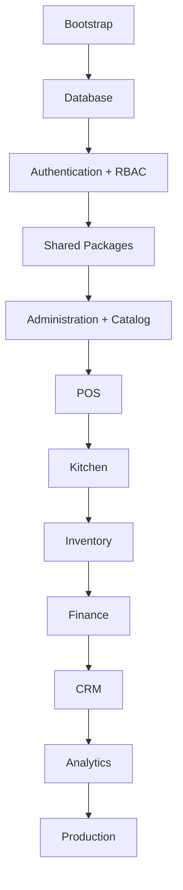

# Implementation Execution Plan: PhaseScope

**Document Version:** 1.0.0-EXEC  
**Document Type:** Master Implementation Execution Plan  
**Status:** Approved for Implementation  
**Reference:** Aligned strictly with `PRD.md`, `Architecture.md`, `DatabaseSchema.md`, `RBAC.md`, `AppFlow.md`, `API.md`, and `CodingStandards.md`

---

## Executive Summary

This document defines the strict, chronologically ordered implementation plan for the Restaurant ERP + POS SaaS platform. It is engineered to minimize rework by ensuring that foundational dependencies (Database, Auth, Multi-Tenancy) are completely finalized before downstream business modules (POS, Inventory, Finance) begin development.

If a phase depends on a previous phase, development **cannot** proceed until the `Definition of Done` for the prior phase is strictly met.

---

## Engineering Execution Strategy

The project follows a task-driven implementation methodology.

Every phase is divided into multiple implementation tasks. A task is the smallest independently implementable engineering unit.

Each task must:

- Have one clear objective
- Be independently testable
- Be independently reviewable
- Be completable in one focused implementation session
- Leave the project in a working state
- Minimize AI context
- Minimize debugging effort
- Minimize merge conflicts
- Minimize unnecessary refactoring

Execution hierarchy becomes:
Project
↓
Phase
↓
Task
↓
Review
↓
Fixes
↓
Task Approval
↓
Next Task
↓
Phase Completion
↓
Git Commit
↓
Phase Freeze
↓
Next Phase

A phase is considered complete ONLY when:

- Every task is completed
- Every task has been reviewed
- Required fixes are completed
- Phase acceptance criteria are satisfied
- Phase Definition of Done is satisfied
- The phase is committed to Git

---

## Phase Dependency Summary

---

## Phase 0: Project Bootstrap & Foundation

**Phase Objective:** Establish the monorepo structure, build tooling, CI/CD pipeline, and developer environment.  
**Business Goal:** Provide a stable, unified foundation so feature teams can begin work without friction.  
**Technical Goal:** Configure TurboRepo, Next.js, Node.js, and shared package boundaries.  
**Dependencies:** None.

### Do Not Modify

- N/A

**Scope:**

- **Modules Included:** N/A (Infrastructure)
- **Features Included:** Monorepo setup, ESLint/Prettier configuration, CI pipelines.
- **Deliverables:** A working TurboRepo containing empty but linked `apps/pos-client`, `apps/api-server`, and `packages/*`.

### Phase Task Breakdown

**Task 0.1**

- **Task Name:** Project Bootstrap
- **Objective:** Initialize the TurboRepo workspace and repository foundation.
- **Scope:** Root directory structure and package managers.
- **Deliverables:** Root `package.json`, `turbo.json`.
- **Dependencies:** None.
- **Completion Criteria:** TurboRepo runs successfully without errors.
- **Suggested AI Model:** Gemini 3.1 Pro (High)
- **Estimated Complexity:** Low

**Task 0.2**

- **Task Name:** Applications Setup
- **Objective:** Create the Web and API applications.
- **Scope:** Frontend and Backend app initialization.
- **Deliverables:** `apps/pos-client` (Next.js) and `apps/api-server` (Express/Fastify).
- **Dependencies:** Task 0.1.
- **Completion Criteria:** Dev servers boot without crashing.
- **Suggested AI Model:** Gemini 3.1 Pro (High)
- **Estimated Complexity:** Low

**Task 0.3**

- **Task Name:** Shared Packages
- **Objective:** Create all reusable shared packages.
- **Scope:** Monorepo package scaffold.
- **Deliverables:** `packages/ui`, `packages/database`, `packages/auth`, `packages/types`, `packages/logger`.
- **Dependencies:** Task 0.1.
- **Completion Criteria:** Packages compile and successfully link to apps.
- **Suggested AI Model:** Gemini 3.1 Pro (High)
- **Estimated Complexity:** Low

**Task 0.4**

- **Task Name:** Development Tooling
- **Objective:** Configure TypeScript, ESLint, Prettier, Husky and lint-staged.
- **Scope:** Linting, formatting, and pre-commit hooks.
- **Deliverables:** Shared `eslint-config`, `typescript-config`, `.husky`.
- **Dependencies:** Task 0.3.
- **Completion Criteria:** Linter succeeds across the monorepo on commit.
- **Suggested AI Model:** Gemini 3.1 Pro (High)
- **Estimated Complexity:** Low

**Task 0.5**

- **Task Name:** Docker & Local Infrastructure
- **Objective:** Configure PostgreSQL, Redis and Docker Compose.
- **Scope:** Local developer environment.
- **Deliverables:** `docker-compose.yml`.
- **Dependencies:** None.
- **Completion Criteria:** `docker compose up` starts databases flawlessly.
- **Suggested AI Model:** Gemini 3.1 Pro (High)
- **Estimated Complexity:** Low

**Task 0.6**

- **Task Name:** Verification & Initial Git Commit
- **Objective:** Verify the workspace, ensure everything builds successfully, and create the initial Git commit.
- **Scope:** CI pipeline and validation.
- **Deliverables:** `.github/workflows/ci.yml`, initial commit.
- **Dependencies:** Task 0.4, Task 0.5.
- **Completion Criteria:** CI Pipeline passes and v0.1.0-bootstrap tag is cut.
- **Suggested AI Model:** Gemini 3.1 Pro (High)
- **Estimated Complexity:** Low

**Criteria & Verification:**

- **Acceptance Criteria:** `npm run build` succeeds across all workspaces; linting passes; CI completes successfully on GitHub Actions.
- **Definition of Done:** Developers can clone, run `npm install`, and start all dev servers without errors.
- **Testing Requirements:** CI pipeline validation only.

**Execution:**

- **Git Milestone:** Branch: `infra/0-bootstrap` -> Tag: `v0.1.0-bootstrap`
- **Expected Output:** Bootstrapped repository.
- **Risk Factors:** Misconfigured monorepo caching leading to slow builds.
- **Estimated Complexity:** Low
- **Recommended AI Model:** Gemini 3.1 Pro (High) (TurboRepo setup and boilerplate generation).
- **Developer Checklist:**
  - [ ] Initialize TurboRepo
  - [ ] Configure `tsconfig.json` bases
  - [ ] Configure `@repo/eslint-config`
  - [ ] Setup GitHub Actions

### Phase Exit Checklist

✓ Build passes
✓ Tests pass
✓ Lint passes
✓ No TypeScript errors
✓ Documentation updated (if needed)
✓ Git committed

---

## Phase 1: Database Schema & ORM Foundation

**Phase Objective:** Translate `DatabaseSchema.md` into physical Prisma schemas and apply the initial migration.  
**Business Goal:** Establish the definitive data structure that will hold all business records.  
**Technical Goal:** Implement PostgreSQL models, relationships, UUID defaults, soft deletes, and audit log structures.  
**Dependencies:** Phase 0.

### Do Not Modify

- Project Bootstrap & Foundation

**Scope:**

- **Modules Included:** Database
- **Features Included:** Prisma Client generation, DB migrations.
- **Deliverables:** Complete `schema.prisma` in `@repo/database`, initial migration applied to Dev DB.

### Phase Task Breakdown

**Task 1.1**

- **Task Name:** Core Models
- **Objective:** Translate Tenant, Branch, User, and Role schemas.
- **Scope:** IAM and physical infrastructure tables.
- **Deliverables:** Prisma models for foundational structures.
- **Dependencies:** Phase 0.
- **Completion Criteria:** Validates via `prisma format`.
- **Suggested AI Model:** Claude Sonnet 4.6 Thinking
- **Estimated Complexity:** Low

**Task 1.2**

- **Task Name:** Catalog & Operational Models
- **Objective:** Translate Menu, Category, Item, Modifier, Order, and Reservation schemas.
- **Scope:** Core POS transaction and setup tables.
- **Deliverables:** Prisma models.
- **Dependencies:** Task 1.1.
- **Completion Criteria:** Valid relationships established.
- **Suggested AI Model:** Claude Sonnet 4.6 Thinking
- **Estimated Complexity:** Medium

**Task 1.3**

- **Task Name:** Supply Chain & Finance Models
- **Objective:** Translate Inventory, PO, Recipe, Invoice, Ledger schemas.
- **Scope:** Back-office tables.
- **Deliverables:** Prisma models.
- **Dependencies:** Task 1.2.
- **Completion Criteria:** Models format correctly.
- **Suggested AI Model:** Claude Sonnet 4.6 Thinking
- **Estimated Complexity:** Medium

**Task 1.4**

- **Task Name:** Schema Validation & Initial Migration
- **Objective:** Translate Audit Log models, execute DB migration, and generate client.
- **Scope:** Local DB setup.
- **Deliverables:** DB Migration file, exported Prisma Client.
- **Dependencies:** Task 1.3.
- **Completion Criteria:** Prisma migration succeeds, DB schema matches.
- **Suggested AI Model:** Claude Sonnet 4.6 Thinking
- **Estimated Complexity:** Low

**Criteria & Verification:**

- **Acceptance Criteria:** Prisma validates schema without errors; DB migration runs successfully; models perfectly match `DatabaseSchema.md`.
- **Definition of Done:** `PrismaClient` is successfully exported from `@repo/database` and typed.
- **Testing Requirements:** Spin up a local PostgreSQL Docker container, run migrations, insert dummy records to verify relations.

**Execution:**

- **Git Milestone:** Branch: `db/1-schema-foundation` -> Tag: `v0.2.0-db-ready`
- **Expected Output:** Working database layer.
- **Risk Factors:** Incorrect foreign key constraints blocking future development.
- **Rollback Strategy:** `prisma migrate resolve --rolled-back` and drop schema.
- **Estimated Complexity:** Medium
- **Recommended AI Model:** Claude Sonnet 4.6 Thinking (Database schema translation and Prisma).
- **Developer Checklist:**
  - [ ] Scaffold `schema.prisma`
  - [ ] Map all models per documentation
  - [ ] Run `prisma generate`
  - [ ] Export client from `@repo/database`

### Mandatory Human Review

This phase cannot be considered complete until the implementation has been reviewed and approved.

Review must verify:

- Architecture compliance
- Documentation compliance
- Code quality
- Security (where applicable)
- Performance (where applicable)
- No unnecessary refactoring
- No architecture drift

### Phase Exit Checklist

✓ Build passes
✓ Tests pass
✓ Lint passes
✓ No TypeScript errors
✓ Documentation updated (if needed)
✓ Git committed

---

## Phase 2: Multi-Tenant, Authentication & RBAC Foundation

**Phase Objective:** Implement identity, authentication, JWT middleware, and Role-Based Access Control logic.  
**Business Goal:** Secure the application and isolate tenant data before any business features are built.  
**Technical Goal:** Build `@repo/auth`, JWT signing/verification, and the API gateway authorization middleware.  
**Dependencies:** Phase 1 (Needs User, Role, Tenant tables).

### Do Not Modify

- Project Bootstrap & Foundation
- Database Schema & ORM Foundation

**Scope:**

- **Modules Included:** Identity & Access Management
- **Features Included:** Login, JWT generation, Role Resolution, Middleware.
- **Deliverables:** API middleware that intercepts requests, validates JWT, checks RBAC, and injects `tenant_id` into context.

### Phase Task Breakdown

**Task 2.1**

- **Task Name:** JWT Authentication Service
- **Objective:** Implement token generation and verification logic.
- **Scope:** Login logic and token management.
- **Deliverables:** JWT utilities in `@repo/auth`.
- **Dependencies:** Phase 1.
- **Completion Criteria:** Successfully signs and verifies tokens.
- **Suggested AI Model:** Claude Sonnet 4.6 Thinking
- **Estimated Complexity:** Medium

**Task 2.2**

- **Task Name:** RBAC Matrix Logic
- **Objective:** Evaluate user permissions against RBAC matrix.
- **Scope:** Permission checking utility.
- **Deliverables:** `evaluatePermissions` service function.
- **Dependencies:** Task 2.1.
- **Completion Criteria:** Validates complex role inheritance accurately.
- **Suggested AI Model:** Claude Sonnet 4.6 Thinking
- **Estimated Complexity:** High

**Task 2.3**

- **Task Name:** API Auth Middleware
- **Objective:** Protect the Express/Fastify gateway.
- **Scope:** HTTP Middleware.
- **Deliverables:** Reusable auth middleware function.
- **Dependencies:** Task 2.2.
- **Completion Criteria:** Rejects unauthorized API hits with 401/403.
- **Suggested AI Model:** Claude Sonnet 4.6 Thinking
- **Estimated Complexity:** Medium

**Task 2.4**

- **Task Name:** Tenant Context Injection
- **Objective:** Force all DB queries to respect `tenant_id`.
- **Scope:** AsyncLocalStorage / Prisma Client Extension.
- **Deliverables:** Tenant-isolated DB connection client.
- **Dependencies:** Task 2.3.
- **Completion Criteria:** Tests confirm cross-tenant data reads are impossible.
- **Suggested AI Model:** Claude Sonnet 4.6 Thinking
- **Estimated Complexity:** High

**Criteria & Verification:**

- **Acceptance Criteria:** Middleware successfully blocks unauthorized requests (401/403); successful JWT payload injection.
- **Definition of Done:** Any new API route can be secured by simply applying the auth middleware.
- **Testing Requirements:** Unit tests for JWT signing; Integration tests for middleware evaluating various RBAC scenarios.

**Execution:**

- **Git Milestone:** Branch: `auth/2-rbac-foundation` -> Tag: `v0.3.0-auth-ready`
- **Expected Output:** Reusable auth package and middleware.
- **Risk Factors:** Data leakage across tenants if context injection fails.
- **Estimated Complexity:** High
- **Recommended AI Model:** Claude Sonnet 4.6 Thinking (Authentication and RBAC).
- **Developer Checklist:**
  - [ ] Implement JWT logic
  - [ ] Build RBAC evaluation engine based on `RBAC.md`
  - [ ] Build Express/Fastify middleware
  - [ ] Integrate with Prisma to filter by `tenant_id`

### Mandatory Human Review

This phase cannot be considered complete until the implementation has been reviewed and approved.

Review must verify:

- Architecture compliance
- Documentation compliance
- Code quality
- Security (where applicable)
- Performance (where applicable)
- No unnecessary refactoring
- No architecture drift

### Phase Exit Checklist

✓ Build passes
✓ Tests pass
✓ Lint passes
✓ No TypeScript errors
✓ Documentation updated (if needed)
✓ Git committed

---

## Phase 3: Shared Packages & Design System

**Phase Objective:** Build the reusable UI components, types, and logging infrastructure.  
**Business Goal:** Ensure consistent UI/UX and prevent duplicated engineering effort.  
**Technical Goal:** Implement Shadcn/UI in `@repo/ui`, define Zod schemas in `@repo/types`, and set up Winston in `@repo/logger`.  
**Dependencies:** Phase 0.

### Do Not Modify

- Project Bootstrap & Foundation
- Database Schema & ORM Foundation
- Multi-Tenant, Authentication & RBAC Foundation

**Scope:**

- **Modules Included:** Frontend UI, Validation, Observability.
- **Features Included:** Buttons, Forms, Modals, Zod base schemas, Structured Logging.
- **Deliverables:** Shared internal libraries ready to be consumed by Apps.

### Phase Task Breakdown

**Task 3.1**

- **Task Name:** Tailwind & Shadcn Setup
- **Objective:** Configure Tailwind CSS and add base components.
- **Scope:** Reusable CSS styling framework.
- **Deliverables:** Configured `@repo/ui` with Button, Input.
- **Dependencies:** Phase 0.
- **Completion Criteria:** UI elements render properly.
- **Suggested AI Model:** Gemini 3.1 Pro (High)
- **Estimated Complexity:** Low

**Task 3.2**

- **Task Name:** Core UI Components
- **Objective:** Expand the shared library with modals and cards.
- **Scope:** Essential layout blocks.
- **Deliverables:** Completed layout components.
- **Dependencies:** Task 3.1.
- **Completion Criteria:** Storybook/test app mounts them correctly.
- **Suggested AI Model:** Gemini 3.1 Pro (High)
- **Estimated Complexity:** Low

**Task 3.3**

- **Task Name:** Zod Validation Schemas
- **Objective:** Define strict Zod validation schemas for API ingestion.
- **Scope:** Validation layer.
- **Deliverables:** Exported Zod schemas in `@repo/types`.
- **Dependencies:** Phase 1.
- **Completion Criteria:** Schema types compile and match Prisma shapes.
- **Suggested AI Model:** Gemini 3.1 Pro (High)
- **Estimated Complexity:** Low

**Task 3.4**

- **Task Name:** Structured Logger Utility
- **Objective:** Build the centralized logger.
- **Scope:** System observability.
- **Deliverables:** Winston/Pino logger instance in `@repo/logger`.
- **Dependencies:** Phase 0.
- **Completion Criteria:** Logs emit standard JSON format.
- **Suggested AI Model:** Gemini 3.1 Pro (High)
- **Estimated Complexity:** Low

**Criteria & Verification:**

- **Acceptance Criteria:** Components render in Storybook/dev app; Zod schemas compile; Logger outputs JSON.
- **Definition of Done:** Next.js apps can import `<Button>` from `@repo/ui` and `Logger` from `@repo/logger`.
- **Testing Requirements:** Component unit tests using React Testing Library.

**Execution:**

- **Git Milestone:** Branch: `ui/3-design-system` -> Tag: `v0.4.0-ui-ready`
- **Expected Output:** Complete design system and core utilities.
- **Risk Factors:** Version mismatches in Tailwind/React dependencies across the monorepo.
- **Estimated Complexity:** Medium
- **Recommended AI Model:** Gemini 3.1 Pro (High) (Shared UI components, Tailwind/Shadcn implementation).
- **Developer Checklist:**
  - [ ] Setup Shadcn/UI
  - [ ] Build core UI components
  - [ ] Setup Zod schema definitions
  - [ ] Setup Structured Logger

### Phase Exit Checklist

✓ Build passes
✓ Tests pass
✓ Lint passes
✓ No TypeScript errors
✓ Documentation updated (if needed)
✓ Git committed

---

## Phase 4: Administration Foundation & Catalog Management

**Phase Objective:** Build the APIs and UI to manage the restaurant structure, staff, settings, and full menu catalog.  
**Business Goal:** Allow tenants to configure their entire restaurant and what they sell before operations begin.  
**Technical Goal:** Implement CRUD endpoints with strict Zod validation, respecting tenant isolation and hierarchical relationships.  
**Dependencies:** Phase 1, Phase 2, Phase 3.

### Do Not Modify

- Project Bootstrap & Foundation
- Database Schema & ORM Foundation
- Multi-Tenant, Authentication & RBAC Foundation
- Shared Packages & Design System

**Scope:**

- **Modules Included:** Admin, Catalog
- **Features Included:** Restaurant, Branch, Employee, Roles, Permissions, Settings, Taxes, Discounts, Tables, Menu, Categories, Menu Items, Modifiers, Feature Flags, Printer Configuration.
- **Deliverables:** API routes for all configuration entities; React UI pages for admin configuration.

### Phase Task Breakdown

**Task 4.1**

- **Task Name:** Restaurant & Branch API
- **Objective:** Endpoints for managing physical locations.
- **Scope:** Core operational structure CRUD.
- **Deliverables:** APIs and backend services.
- **Dependencies:** Phase 3.
- **Completion Criteria:** Branch can be created and stored properly.
- **Suggested AI Model:** Gemini 3.1 Pro (High)
- **Estimated Complexity:** Medium

**Task 4.2**

- **Task Name:** Staff & Settings API
- **Objective:** Configure roles, staff, and general store settings.
- **Scope:** Employee management.
- **Deliverables:** Staff endpoints.
- **Dependencies:** Task 4.1.
- **Completion Criteria:** Users can be linked to stores accurately.
- **Suggested AI Model:** Gemini 3.1 Pro (High)
- **Estimated Complexity:** Medium

**Task 4.3**

- **Task Name:** Catalog API
- **Objective:** Manage Menus, Categories, Items, and nested Modifiers.
- **Scope:** The complete inventory catalog backbone.
- **Deliverables:** Complex CRUD APIs.
- **Dependencies:** Task 4.2.
- **Completion Criteria:** Deeply nested modifiers persist without data corruption.
- **Suggested AI Model:** Claude Sonnet 4.6 Thinking
- **Estimated Complexity:** High

**Task 4.4**

- **Task Name:** Admin Dashboard UI
- **Objective:** Create the React pages for the APIs.
- **Scope:** Back-office Next.js UI integration.
- **Deliverables:** Working web dashboard.
- **Dependencies:** Task 4.3.
- **Completion Criteria:** UI allows full navigation and menu building.
- **Suggested AI Model:** Gemini 3.1 Pro (High)
- **Estimated Complexity:** High

**Criteria & Verification:**

- **Acceptance Criteria:** A tenant can create a complete menu hierarchy and branch layout; 403 returned if unauthorized; Data isolates per tenant.
- **Definition of Done:** Admin API is fully functional; Admin UI allows complete restaurant and catalog management.
- **Testing Requirements:** API Integration tests; E2E test for complete Restaurant and Menu creation flow.

**Execution:**

- **Git Milestone:** Branch: `feat/4-admin-catalog` -> Merge to `main`
- **Expected Output:** Working Admin and Menu management modules.
- **Risk Factors:** Complex relational nesting causing slow API responses.
- **Estimated Complexity:** Medium
- **Recommended AI Model:** Gemini 3.1 Pro (High) (CRUD pages and general implementation work).
- **Developer Checklist:**
  - [ ] API Controllers & Services for Admin entities
  - [ ] API Controllers & Services for Catalog entities
  - [ ] Zod Schemas
  - [ ] Admin UI pages
  - [ ] React Query integration

### Phase Exit Checklist

✓ Build passes
✓ Tests pass
✓ Lint passes
✓ No TypeScript errors
✓ Documentation updated (if needed)
✓ Git committed

---

## Phase 5: Core POS Operations

**Phase Objective:** Implement the core point-of-sale functionality for taking orders and managing service.  
**Business Goal:** Enable waitstaff and cashiers to manage tables and capture revenue.  
**Technical Goal:** Implement the Order State Machine (`AppFlow.md`), optimistic concurrency, and idempotency logic.  
**Dependencies:** Phase 4.

### Do Not Modify

- Project Bootstrap & Foundation
- Database Schema & ORM Foundation
- Multi-Tenant, Authentication & RBAC Foundation
- Shared Packages & Design System
- Administration Foundation & Catalog Management

**Scope:**

- **Modules Included:** POS, Orders, Reservations
- **Features Included:** Table Service, Order Capture, Cart, Reservation, Billing Foundation.
- **Deliverables:** POS frontend UI; Order and Reservation APIs.

### Phase Task Breakdown

**Task 5.1**

- **Task Name:** Idempotency & Concurrency Middleware
- **Objective:** Block duplicate transaction executions.
- **Scope:** API safety layers.
- **Deliverables:** Middleware intercepting duplicate requests via keys.
- **Dependencies:** Phase 4.
- **Completion Criteria:** Submitting twice yields exactly 1 database write.
- **Suggested AI Model:** Claude Sonnet 4.6 Thinking
- **Estimated Complexity:** High

**Task 5.2**

- **Task Name:** Reservation APIs
- **Objective:** Manage table reservations.
- **Scope:** Table status changes.
- **Deliverables:** Reservation endpoints.
- **Dependencies:** Task 5.1.
- **Completion Criteria:** Accurate table state toggling on arrival.
- **Suggested AI Model:** Claude Sonnet 4.6 Thinking
- **Estimated Complexity:** Medium

**Task 5.3**

- **Task Name:** Order Capture & State Machine API
- **Objective:** Build the core engine that transitions orders from Draft to Placed.
- **Scope:** Central Transaction Block logic.
- **Deliverables:** Core POS API routes.
- **Dependencies:** Task 5.2.
- **Completion Criteria:** API securely validates inventory and saves order accurately.
- **Suggested AI Model:** Claude Sonnet 4.6 Thinking
- **Estimated Complexity:** Very High

**Task 5.4**

- **Task Name:** POS Frontend UI
- **Objective:** Build the Cart, Menu Layout, and Table Map for staff.
- **Scope:** Next.js POS client interface.
- **Deliverables:** Working interactive POS interface with Zustand state.
- **Dependencies:** Task 5.3.
- **Completion Criteria:** Cashier can successfully place a full order via UI.
- **Suggested AI Model:** Gemini 3.1 Pro (High)
- **Estimated Complexity:** High

**Criteria & Verification:**

- **Acceptance Criteria:** Waiter can open table, add items, and fire order; Idempotency prevents double firing; Concurrent edits yield 409 Conflict.
- **Definition of Done:** Order transitions perfectly from Draft -> Placed.
- **Testing Requirements:** Extensive unit tests on Order Service state transitions; E2E tests for concurrency handling.

**Execution:**

- **Git Milestone:** Branch: `feat/5-pos-operations` -> Merge to `main`
- **Expected Output:** Functioning POS cart and order persistence.
- **Risk Factors:** Poor UI performance if Zustand store grows too large.
- **Estimated Complexity:** Very High
- **Recommended AI Model:** Claude Sonnet 4.6 Thinking (Complex services, state machines, concurrency, and optimistic locking).
- **Developer Checklist:**
  - [ ] Idempotency middleware
  - [ ] Order Services & Transaction blocks
  - [ ] POS UI Cart & Table Map
  - [ ] Reservation APIs
  - [ ] Concurrency handling

### Mandatory Human Review

This phase cannot be considered complete until the implementation has been reviewed and approved.

Review must verify:

- Architecture compliance
- Documentation compliance
- Code quality
- Security (where applicable)
- Performance (where applicable)
- No unnecessary refactoring
- No architecture drift

### Phase Exit Checklist

✓ Build passes
✓ Tests pass
✓ Lint passes
✓ No TypeScript errors
✓ Documentation updated (if needed)
✓ Git committed

---

## Phase 6: Kitchen Fulfillment

**Phase Objective:** Build the real-time Kitchen Display System.  
**Business Goal:** Route orders to the kitchen instantly without manual paper tickets.  
**Technical Goal:** Implement WebSocket infrastructure, Redis Pub/Sub, and KDS UI.  
**Dependencies:** Phase 5.

### Do Not Modify

- Project Bootstrap & Foundation
- Database Schema & ORM Foundation
- Multi-Tenant, Authentication & RBAC Foundation
- Shared Packages & Design System
- Administration Foundation & Catalog Management
- Core POS Operations

**Scope:**

- **Modules Included:** Fulfillment
- **Features Included:** KDS, WebSockets, Real-time Sync, Kitchen Workflow.
- **Deliverables:** WebSocket server; KDS React application; Redis Pub/Sub events.

### Phase Task Breakdown

**Task 6.1**

- **Task Name:** WebSocket Server Setup
- **Objective:** Establish the dedicated socket server.
- **Scope:** Communication infrastructure.
- **Deliverables:** Working WS server with Auth.
- **Dependencies:** Phase 5.
- **Completion Criteria:** Client reliably connects with ping/pong heartbeat.
- **Suggested AI Model:** Gemini 3.1 Pro (High)
- **Estimated Complexity:** High

**Task 6.2**

- **Task Name:** Redis Pub/Sub Event Synchronization
- **Objective:** Broadcast POS state changes to connected sockets.
- **Scope:** Server-side event emitters.
- **Deliverables:** Pub/Sub interceptors.
- **Dependencies:** Task 6.1.
- **Completion Criteria:** Fired orders broadcast instantly across nodes.
- **Suggested AI Model:** Gemini 3.1 Pro (High)
- **Estimated Complexity:** Medium

**Task 6.3**

- **Task Name:** KDS Frontend UI
- **Objective:** Build the Kitchen board display UI.
- **Scope:** KDS application screens.
- **Deliverables:** Ticket card layout UI.
- **Dependencies:** Task 6.2.
- **Completion Criteria:** Visually presents live payloads accurately.
- **Suggested AI Model:** Gemini 3.1 Pro (High)
- **Estimated Complexity:** Medium

**Task 6.4**

- **Task Name:** Bi-directional Bump Sync Logic
- **Objective:** Sync bump events back to the POS and database.
- **Scope:** KDS write operations.
- **Deliverables:** WS bump event handler.
- **Dependencies:** Task 6.3.
- **Completion Criteria:** Kitchen staff bumping updates order to Ready.
- **Suggested AI Model:** Gemini 3.1 Pro (High)
- **Estimated Complexity:** Medium

**Criteria & Verification:**

- **Acceptance Criteria:** Firing an order on POS appears on KDS in < 500ms; Bumping on KDS updates order state to `Ready`.
- **Definition of Done:** Real-time bi-directional sync operates flawlessly between POS and KDS.
- **Testing Requirements:** WebSocket load testing; UI component tests for KDS board.

**Execution:**

- **Git Milestone:** Branch: `feat/6-kitchen-fulfillment` -> Merge to `main`
- **Expected Output:** Live Kitchen Display System.
- **Risk Factors:** WebSocket disconnection leading to lost tickets.
- **Rollback Strategy:** Revert to polling fallback.
- **Estimated Complexity:** High
- **Recommended AI Model:** Gemini 3.1 Pro (High) (WebSocket integration and frontend development).
- **Developer Checklist:**
  - [ ] WebSocket Server setup
  - [ ] Redis Pub/Sub integration
  - [ ] POS event emitters
  - [ ] KDS frontend UI

### Phase Exit Checklist

✓ Build passes
✓ Tests pass
✓ Lint passes
✓ No TypeScript errors
✓ Documentation updated (if needed)
✓ Git committed

---

## Phase 7: Inventory & Procurement

**Phase Objective:** Manage physical stock and supply chain, directly responding to operational events.  
**Business Goal:** Track COGS, prevent stockouts, and manage vendors.  
**Technical Goal:** Build background workers for asynchronous inventory depletion, Purchase Order APIs.  
**Dependencies:** Phase 6 (Inventory depletes when Order is Paid/Prepared).

### Do Not Modify

- Project Bootstrap & Foundation
- Database Schema & ORM Foundation
- Multi-Tenant, Authentication & RBAC Foundation
- Shared Packages & Design System
- Administration Foundation & Catalog Management
- Core POS Operations
- Kitchen Fulfillment

**Scope:**

- **Modules Included:** Inventory, Supply Chain
- **Features Included:** Recipes, Ingredients, Stock, Purchase Orders, Goods Receipt, Vendors, Stock Ledger, Batch Tracking.
- **Deliverables:** BullMQ worker for async depletion; Inventory UI.

### Phase Task Breakdown

**Task 7.1**

- **Task Name:** Inventory & Vendor CRUD APIs
- **Objective:** Manage raw ingredients and suppliers.
- **Scope:** Admin Back-office API.
- **Deliverables:** Inventory API routes.
- **Dependencies:** Phase 6.
- **Completion Criteria:** Admin UI can add new raw materials.
- **Suggested AI Model:** Claude Sonnet 4.6 Thinking
- **Estimated Complexity:** Low

**Task 7.2**

- **Task Name:** Purchase Order & Goods Receipt APIs
- **Objective:** Lifecycle for ordering stock and receiving it.
- **Scope:** Procurement flow logic.
- **Deliverables:** PO state machine APIs.
- **Dependencies:** Task 7.1.
- **Completion Criteria:** Completing a GRN accurately increases stock count.
- **Suggested AI Model:** Claude Sonnet 4.6 Thinking
- **Estimated Complexity:** High

**Task 7.3**

- **Task Name:** Recipe Explosion Logic
- **Objective:** Translate a final menu item into its raw components.
- **Scope:** Algorithmic calculation.
- **Deliverables:** Explosion calculation service function.
- **Dependencies:** Task 7.2.
- **Completion Criteria:** Complex nested recipes flatten into correct ingredient volumes.
- **Suggested AI Model:** Claude Sonnet 4.6 Thinking
- **Estimated Complexity:** Very High

**Task 7.4**

- **Task Name:** BullMQ Depletion Worker
- **Objective:** Asynchronously deduct stock upon sale.
- **Scope:** Background processing.
- **Deliverables:** BullMQ worker and queue definitions.
- **Dependencies:** Task 7.3.
- **Completion Criteria:** Sales seamlessly decrement stock asynchronously.
- **Suggested AI Model:** Claude Sonnet 4.6 Thinking
- **Estimated Complexity:** High

**Criteria & Verification:**

- **Acceptance Criteria:** Selling an item accurately depletes raw materials based on recipe; PO matches GRN.
- **Definition of Done:** Inventory lifecycle runs automatically based on POS sales.
- **Testing Requirements:** Integration tests verifying that Paid Orders trigger BullMQ jobs that accurately update Stock levels.

**Execution:**

- **Git Milestone:** Branch: `feat/7-inventory` -> Merge to `main`
- **Expected Output:** Working supply chain module.
- **Risk Factors:** Background job failures leading to phantom stock.
- **Estimated Complexity:** High
- **Recommended AI Model:** Claude Sonnet 4.6 Thinking (Inventory calculations and complex services).
- **Developer Checklist:**
  - [ ] BullMQ configuration
  - [ ] Depletion Worker
  - [ ] PO / GRN APIs
  - [ ] Inventory Management UI

### Mandatory Human Review

This phase cannot be considered complete until the implementation has been reviewed and approved.

Review must verify:

- Architecture compliance
- Documentation compliance
- Code quality
- Security (where applicable)
- Performance (where applicable)
- No unnecessary refactoring
- No architecture drift

### Phase Exit Checklist

✓ Build passes
✓ Tests pass
✓ Lint passes
✓ No TypeScript errors
✓ Documentation updated (if needed)
✓ Git committed

---

## Phase 8: Finance

**Phase Objective:** Handle the lifecycle of money changing hands and formal accounting.  
**Business Goal:** Capture revenue, secure cash drawers, and maintain financial integrity.  
**Technical Goal:** Implement invoice generation, payment gateways, ledger entries, and Shift/Day session logic.  
**Dependencies:** Phase 7.

### Do Not Modify

- Project Bootstrap & Foundation
- Database Schema & ORM Foundation
- Multi-Tenant, Authentication & RBAC Foundation
- Shared Packages & Design System
- Administration Foundation & Catalog Management
- Core POS Operations
- Kitchen Fulfillment
- Inventory & Procurement

**Scope:**

- **Modules Included:** Finance, Operations
- **Features Included:** Invoice, Payment, Refund, Expense, Journals, Ledger, Daily Closing, Shift Closing, Cash Drawer.
- **Deliverables:** Payment APIs, Shift management APIs, General Ledger logic, Threshold approval middleware.

### Phase Task Breakdown

**Task 8.1**

- **Task Name:** Invoice & Payment APIs
- **Objective:** Handle bill settlement and gateway logic.
- **Scope:** Cash and Card checkout routes.
- **Deliverables:** Payment controller endpoints.
- **Dependencies:** Phase 7.
- **Completion Criteria:** Outstanding bills close correctly when fully paid.
- **Suggested AI Model:** Claude Sonnet 4.6 Thinking
- **Estimated Complexity:** High

**Task 8.2**

- **Task Name:** General Ledger Journal Entries
- **Objective:** Double-entry accounting system for all financial events.
- **Scope:** Core accounting engine.
- **Deliverables:** GL generation services.
- **Dependencies:** Task 8.1.
- **Completion Criteria:** Transaction debits strictly balance with credits.
- **Suggested AI Model:** Claude Sonnet 4.6 Thinking
- **Estimated Complexity:** High

**Task 8.3**

- **Task Name:** Threshold Approval Middleware
- **Objective:** Block large voids/refunds requiring manager pins.
- **Scope:** Security integration with Finance.
- **Deliverables:** Approval intercept middleware.
- **Dependencies:** Task 8.2.
- **Completion Criteria:** Enforces financial SoD limits properly.
- **Suggested AI Model:** Claude Sonnet 4.6 Thinking
- **Estimated Complexity:** Medium

**Task 8.4**

- **Task Name:** Day/Shift Open & Close Logic
- **Objective:** Ensure cash reconciliation across shifts.
- **Scope:** Operational workflow endpoints.
- **Deliverables:** Z-Report and Shift APIs.
- **Dependencies:** Task 8.3.
- **Completion Criteria:** Properly identifies cash discrepancies on drawer close.
- **Suggested AI Model:** Claude Sonnet 4.6 Thinking
- **Estimated Complexity:** Medium

**Criteria & Verification:**

- **Acceptance Criteria:** Bills can be generated and paid; Shift cannot close with open tables; High-value voids trigger manager escalation.
- **Definition of Done:** The complete Order to Cash to Ledger lifecycle is functional.
- **Testing Requirements:** E2E payment flows; Extensive unit tests on approval thresholds and SoD rules (`RBAC.md`).

**Execution:**

- **Git Milestone:** Branch: `feat/8-finance` -> Tag: `v1.0.0-rc1`
- **Expected Output:** Revenue generation and accounting logic.
- **Risk Factors:** Floating-point math errors in bill splitting and journal balancing.
- **Estimated Complexity:** High
- **Recommended AI Model:** Claude Sonnet 4.6 Thinking (Financial logic, complex services, and security).
- **Developer Checklist:**
  - [ ] Invoice & Payment processing logic
  - [ ] Journal Entry generation
  - [ ] Threshold evaluation middleware
  - [ ] Day/Shift Open/Close logic

### Mandatory Human Review

This phase cannot be considered complete until the implementation has been reviewed and approved.

Review must verify:

- Architecture compliance
- Documentation compliance
- Code quality
- Security (where applicable)
- Performance (where applicable)
- No unnecessary refactoring
- No architecture drift

### Phase Exit Checklist

✓ Build passes
✓ Tests pass
✓ Lint passes
✓ No TypeScript errors
✓ Documentation updated (if needed)
✓ Git committed

---

## Phase 9: CRM

**Phase Objective:** Manage customer identity and retention.  
**Business Goal:** Increase repeat business through loyalty and targeted offers.  
**Technical Goal:** Customer database, point accrual logic, discount structures.  
**Dependencies:** Phase 8.

### Do Not Modify

- Project Bootstrap & Foundation
- Database Schema & ORM Foundation
- Multi-Tenant, Authentication & RBAC Foundation
- Shared Packages & Design System
- Administration Foundation & Catalog Management
- Core POS Operations
- Kitchen Fulfillment
- Inventory & Procurement
- Finance

**Scope:**

- **Modules Included:** CRM
- **Features Included:** Customer, Loyalty, Membership, Coupons, Gift Cards, Reviews.
- **Deliverables:** CRM APIs, POS integration for attaching customers and applying offers.

### Phase Task Breakdown

**Task 9.1**

- **Task Name:** Customer CRUD APIs
- **Objective:** Create and fetch CRM profiles.
- **Scope:** Baseline customer management.
- **Deliverables:** Customer API routes.
- **Dependencies:** Phase 8.
- **Completion Criteria:** Successfully stores protected customer data.
- **Suggested AI Model:** Gemini 3.1 Pro (High)
- **Estimated Complexity:** Low

**Task 9.2**

- **Task Name:** Loyalty Point Accrual Engine
- **Objective:** Calculate points earned or spent during a transaction.
- **Scope:** Loyalty calculation algorithms.
- **Deliverables:** Accrual Engine API.
- **Dependencies:** Task 9.1.
- **Completion Criteria:** Adjusts points instantly upon payment success.
- **Suggested AI Model:** Gemini 3.1 Pro (High)
- **Estimated Complexity:** Medium

**Task 9.3**

- **Task Name:** Coupons & Discounts Logic
- **Objective:** Manage and validate discount codes.
- **Scope:** Offer rule evaluation.
- **Deliverables:** Discount applicability service.
- **Dependencies:** Task 9.2.
- **Completion Criteria:** Validates restrictions before applying cart discounts.
- **Suggested AI Model:** Gemini 3.1 Pro (High)
- **Estimated Complexity:** Medium

**Task 9.4**

- **Task Name:** POS UI Loyalty Integration
- **Objective:** Attach customers on the POS UI.
- **Scope:** Frontend POS search components.
- **Deliverables:** React Customer Search UI.
- **Dependencies:** Task 9.3.
- **Completion Criteria:** Cashier can apply points seamlessly.
- **Suggested AI Model:** Gemini 3.1 Pro (High)
- **Estimated Complexity:** Medium

**Criteria & Verification:**

- **Acceptance Criteria:** Closing an order correctly credits loyalty points; coupons apply correct discounts.
- **Definition of Done:** Staff can look up customers and apply points/gift cards during checkout.
- **Testing Requirements:** Unit tests on loyalty calculation algorithms and coupon eligibility.

**Execution:**

- **Git Milestone:** Branch: `feat/9-crm` -> Merge to `main`
- **Expected Output:** CRM and Loyalty modules.
- **Risk Factors:** PII data leakage.
- **Estimated Complexity:** Medium
- **Recommended AI Model:** Gemini 3.1 Pro (High) (Frontend development and CRUD pages).
- **Developer Checklist:**
  - [ ] Customer CRUD APIs
  - [ ] Loyalty point logic
  - [ ] Coupon/Gift Card APIs
  - [ ] POS UI integration

### Phase Exit Checklist

✓ Build passes
✓ Tests pass
✓ Lint passes
✓ No TypeScript errors
✓ Documentation updated (if needed)
✓ Git committed

---

## Phase 10: Analytics & Administration

**Phase Objective:** Back-office reporting and system oversight.  
**Business Goal:** Provide owners with actionable data and administrative control.  
**Technical Goal:** Materialized views for reporting, dashboards, and audit log exploration.  
**Dependencies:** Phase 9.

### Do Not Modify

- Project Bootstrap & Foundation
- Database Schema & ORM Foundation
- Multi-Tenant, Authentication & RBAC Foundation
- Shared Packages & Design System
- Administration Foundation & Catalog Management
- Core POS Operations
- Kitchen Fulfillment
- Inventory & Procurement
- Finance
- CRM

**Scope:**

- **Modules Included:** Admin, Analytics
- **Features Included:** Reports, Dashboards, Forecasting, Audit Viewer, Notifications, Employee Performance, Revenue Reports.
- **Deliverables:** Admin Dashboard UI, Reporting APIs.

### Phase Task Breakdown

**Task 10.1**

- **Task Name:** Reporting Aggregate Queries
- **Objective:** Perform fast analytics queries across transactional tables.
- **Scope:** Database reporting optimization.
- **Deliverables:** Analytics API endpoints.
- **Dependencies:** Phase 9.
- **Completion Criteria:** Heavy queries run efficiently without crashing.
- **Suggested AI Model:** Gemini 3.1 Pro (High)
- **Estimated Complexity:** Medium

**Task 10.2**

- **Task Name:** Audit Log Viewer API & UI
- **Objective:** Expose the immutable audit traces for review.
- **Scope:** Security compliance visibility.
- **Deliverables:** Secure Log interface.
- **Dependencies:** Task 10.1.
- **Completion Criteria:** Correctly paginates massive tables.
- **Suggested AI Model:** Gemini 3.1 Pro (High)
- **Estimated Complexity:** Low

**Task 10.3**

- **Task Name:** Analytics Dashboard UI integration
- **Objective:** Finalize the charting layouts in the admin app.
- **Scope:** Frontend visualization (Recharts).
- **Deliverables:** Polished KPI dashboard.
- **Dependencies:** Task 10.2.
- **Completion Criteria:** Beautiful, accurate representation of store health.
- **Suggested AI Model:** Gemini 3.1 Pro (High)
- **Estimated Complexity:** Medium

**Criteria & Verification:**

- **Acceptance Criteria:** Reports accurately reflect aggregate data; Audit logs are viewable but immutable.
- **Definition of Done:** The back-office suite is fully functional for Management roles.
- **Testing Requirements:** Verification of reporting aggregations against raw data.

**Execution:**

- **Git Milestone:** Branch: `feat/10-analytics` -> Merge to `main`
- **Expected Output:** Back-office ERP reporting interfaces.
- **Risk Factors:** Slow reporting queries bringing down the primary transactional database.
- **Estimated Complexity:** Medium
- **Recommended AI Model:** Gemini 3.1 Pro (High) (Dashboard UI and frontend development).
- **Developer Checklist:**
  - [ ] Reporting aggregate queries
  - [ ] Dashboard UI
  - [ ] Audit Log Viewer
  - [ ] Notification System

### Phase Exit Checklist

✓ Build passes
✓ Tests pass
✓ Lint passes
✓ No TypeScript errors
✓ Documentation updated (if needed)
✓ Git committed

---

## Phase 11: Production Readiness & Deployment

**Phase Objective:** Finalize testing, ensure security, deploy the platform to production, and verify operational health.  
**Business Goal:** Go Live with a stable, secure, and performant product.  
**Technical Goal:** Run regression tests, perform security reviews, provision cloud infrastructure, run final migrations, and configure monitoring.  
**Dependencies:** Phase 10.

### Do Not Modify

- Project Bootstrap & Foundation
- Database Schema & ORM Foundation
- Multi-Tenant, Authentication & RBAC Foundation
- Shared Packages & Design System
- Administration Foundation & Catalog Management
- Core POS Operations
- Kitchen Fulfillment
- Inventory & Procurement
- Finance
- CRM
- Analytics & Administration

**Scope:**

- **Modules Included:** Infrastructure, Observability, QA, Security
- **Features Included:** Testing, Performance, Regression, Security Review, Bug Fixes, Deployment, Monitoring, Logging, Backups, Smoke Testing, README, Release.
- **Deliverables:** Completed test suites, live URLs, automated backup schedules, monitoring dashboards, finalized documentation.

### Phase Task Breakdown

**Task 11.1**

- **Task Name:** Security & Dependency Audit
- **Objective:** Automated checks on all packages and endpoints.
- **Scope:** Vulnerability validation.
- **Deliverables:** Remediated repo.
- **Dependencies:** Phase 10.
- **Completion Criteria:** No critical or high CVEs present.
- **Suggested AI Model:** N/A (DevOps)
- **Estimated Complexity:** Low

**Task 11.2**

- **Task Name:** Regression & Load Testing
- **Objective:** Prove system scales under operational load.
- **Scope:** E2E Load scenarios.
- **Deliverables:** Test execution reports.
- **Dependencies:** Task 11.1.
- **Completion Criteria:** P99 latency remains within acceptable thresholds.
- **Suggested AI Model:** N/A (QA)
- **Estimated Complexity:** High

**Task 11.3**

- **Task Name:** Cloud Infrastructure Provisioning
- **Objective:** Boot up production AWS/GCP clusters and databases.
- **Scope:** Production Environment creation.
- **Deliverables:** Live, secured infrastructure nodes.
- **Dependencies:** Task 11.2.
- **Completion Criteria:** Services resolve correctly internally.
- **Suggested AI Model:** N/A (DevOps/SRE)
- **Estimated Complexity:** High

**Task 11.4**

- **Task Name:** Final Deployment & Smoke Test
- **Objective:** Launch v1.0.0 and manually run end-to-end POS flow on live servers.
- **Scope:** Release sequence.
- **Deliverables:** Public facing URL.
- **Dependencies:** Task 11.3.
- **Completion Criteria:** Successfully processing traffic on the internet.
- **Suggested AI Model:** N/A (DevOps)
- **Estimated Complexity:** High

**Criteria & Verification:**

- **Acceptance Criteria:** Production URL is accessible over HTTPS; SSL certs valid; Metrics flowing to APM; Backups verified; All test suites pass 100%.
- **Definition of Done:** System is securely serving traffic to the public internet, actively monitored, and fully documented.
- **Testing Requirements:** Smoke Testing on production; Penetration testing; Load testing; Final full regression run.

**Execution:**

- **Git Milestone:** Branch: `main` -> Tag: `v1.0.0-PRODUCTION`
- **Expected Output:** Live Production Environment and robust release artifacts.
- **Risk Factors:** Database credentials leaked, incorrect CORS configuration, unhandled edge-case bugs escaping to prod.
- **Rollback Strategy:** Blue/Green deployment reversal.
- **Estimated Complexity:** High
- **Recommended AI Model:** N/A (Requires DevOps/SRE and QA human execution).
- **Developer Checklist:**
  - [ ] Complete Regression & Performance Testing
  - [ ] Sign-off from Security Review and address bug fixes
  - [ ] Environment Variable population & DB connection pooling
  - [ ] Sentry / APM integration
  - [ ] Final Smoke Test
  - [ ] Finalize README and Release Notes

### Mandatory Human Review

This phase cannot be considered complete until the implementation has been reviewed and approved.

Review must verify:

- Architecture compliance
- Documentation compliance
- Code quality
- Security (where applicable)
- Performance (where applicable)
- No unnecessary refactoring
- No architecture drift

### Phase Exit Checklist

✓ Build passes
✓ Tests pass
✓ Lint passes
✓ No TypeScript errors
✓ Documentation updated (if needed)
✓ Git committed

---

## Project Execution Rules

Once a phase has been completed and approved:

- Do not redesign completed phases.
- Do not refactor completed modules unless fixing verified defects.
- Do not change architecture without explicit approval.
- Do not modify database foundations without explicit approval.
- Do not modify RBAC unless explicitly required.
- Do not modify shared packages unless absolutely necessary.
- Every implementation must follow:
  - `PRD.md`
  - `Architecture.md`
  - `DatabaseSchema.md`
  - `RBAC.md`
  - `AppFlow.md`
  - `API.md`
  - `CodingStandards.md`
  - `PhaseScope.md`
- AI assistants must always read the complete documentation before implementing a new phase.
- Previously approved phases are considered frozen.
- New work must remain inside the current phase scope.
- If implementation conflicts with documentation, stop and report the conflict instead of making assumptions.

---

_End of Document. This plan must be followed chronologically by all engineering teams._
