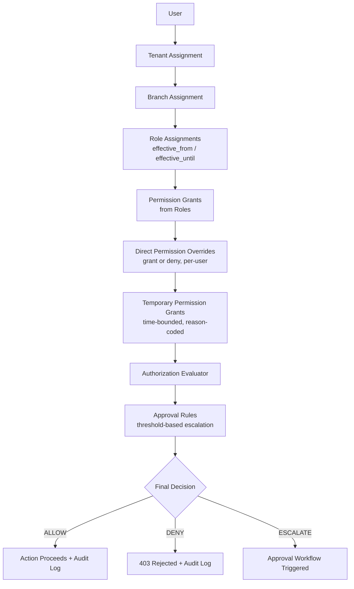
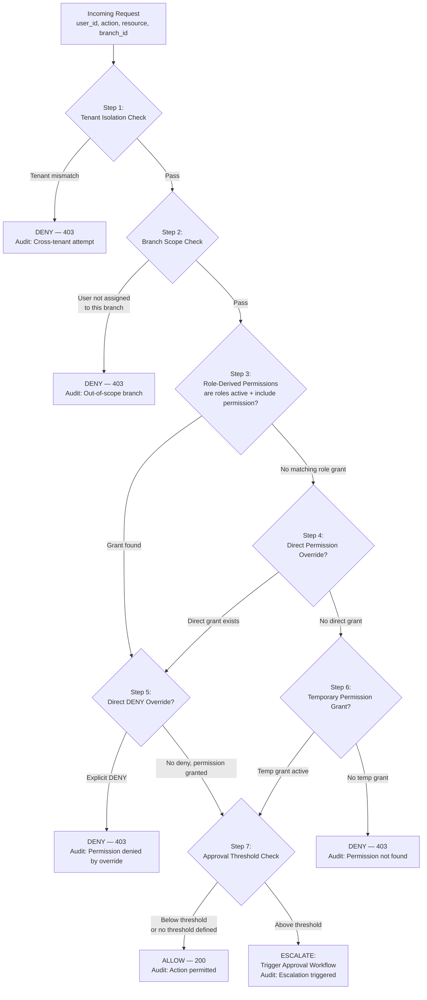
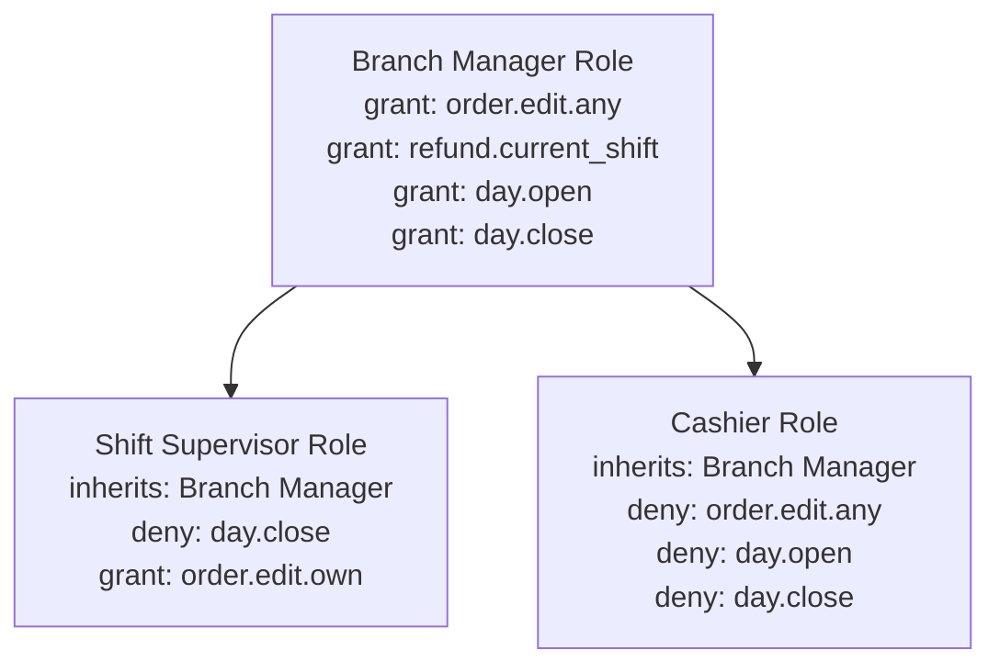
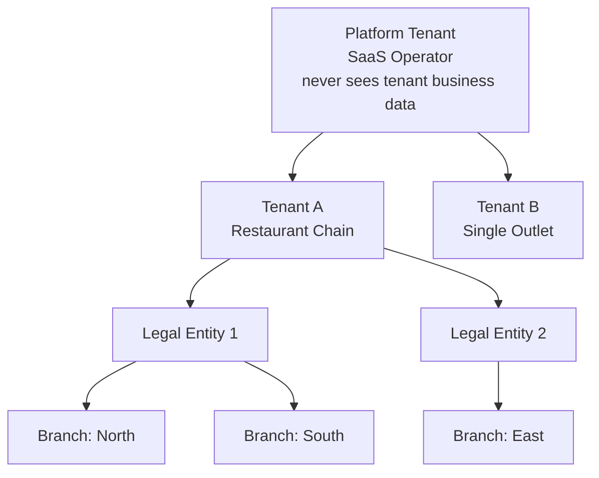
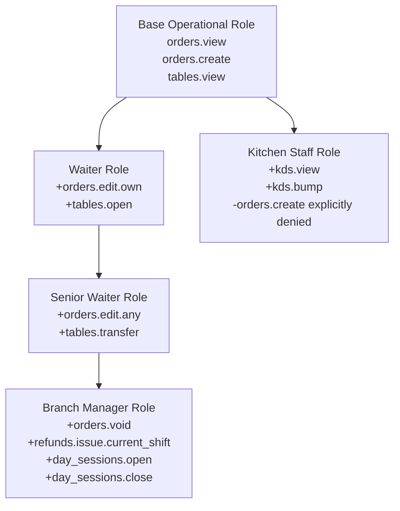
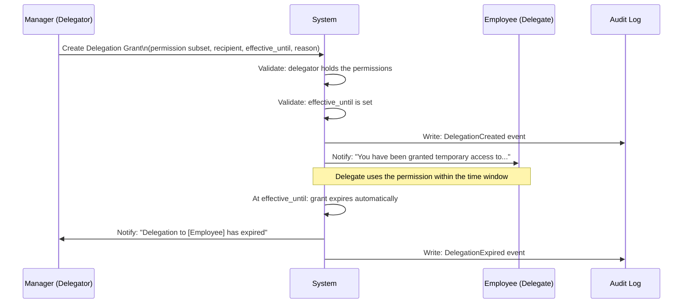
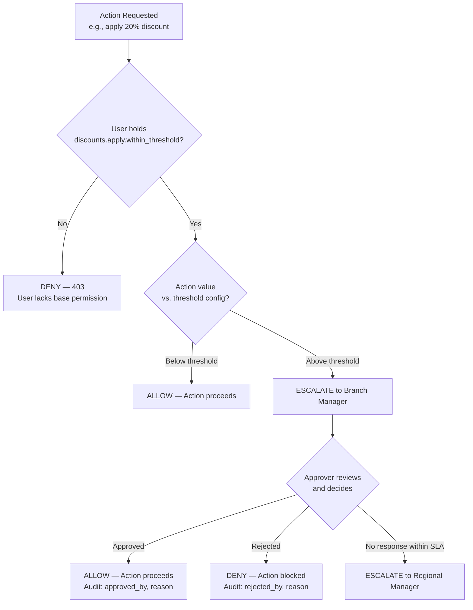

# Authorization Design Document: RBAC

**Document Version:** 1.0.0-SEC  
**Document Type:** Enterprise Authorization Blueprint  
**Status:** Approved for Implementation  
**Reference:** Aligned strictly with `PRD.md` (v1.1.0-PROD), `Architecture.md` (v1.2.0-ARCH), and `DatabaseSchema.md` (v1.0.0-DBA)

---

## Table of Contents

1. Executive Summary
2. Authorization Philosophy
3. RBAC Principles
4. Authentication vs. Authorization
5. Authorization Architecture
6. Permission Resolution Flow
7. Role Model
8. Permission Model
9. Permission Categories
10. Permission Naming Convention
11. Role Assignment Model
12. Multi-Tenant Authorization
13. Branch-Level Authorization
14. Permission Inheritance Strategy
15. Temporary Permission Strategy
16. Permission Delegation
17. Approval Workflow Authorization
18. Separation of Duties
19. Audit & Compliance
20. Security Best Practices
21. Future Scalability
22. Glossary

---

## 1. Executive Summary

This document defines the complete enterprise authorization model for the Restaurant ERP + POS SaaS platform. It translates the RBAC requirements established in the PRD (Section 10) and the architectural decisions in `Architecture.md` (Section 10) into a precise, implementation-ready authorization blueprint.

The platform serves a broad spectrum of restaurant businesses — from a single-outlet café to a 500-branch global chain — under a single SaaS multi-tenant model. Authorization must therefore be simultaneously:

- **Granular** enough to enforce per-action controls (e.g., a cashier cannot refund against a closed period),
- **Configurable** enough to serve a sole-operator and a chain COO on the same codebase,
- **Multi-dimensional** enough to scope permissions to specific tenants, branches, and time windows,
- **Auditable** enough to satisfy external tax authorities and internal fraud prevention requirements.

This document is not backend code, JWT logic, or middleware. It is the authoritative contract that determines: _what a user is allowed to do, in which context, under which conditions, with what level of oversight_.

---

## 2. Authorization Philosophy

The authorization philosophy of this platform rests on seven pillars derived directly from the PRD and Architecture documents:

### 2.1 Configuration Over Hardcoding

Roles, permissions, approval thresholds, and authorization rules are **data, not code**. A tenant administrator creating a new custom role — for example, "Head of Catering" — must never require a software deployment. The authorization engine evaluates rules stored in the database and cached in Redis, not rules burned into application logic.

### 2.2 Principle of Least Privilege

Every user receives the minimum set of permissions required to perform their job function. Default permission grants are conservative; elevation requires explicit configuration. A newly created role begins with zero permissions and is built up deliberately.

### 2.3 Default Deny

If a permission is not explicitly granted, the action is denied. There is no "fall-through" permissiveness. The absence of a grant is itself an authorization decision.

### 2.4 Separation of Duties (SoD)

The person who submits a financially consequential action and the person who approves it can **never** be the same individual, regardless of what role or permissions that individual holds. This is a structural constraint enforced at the authorization layer, not a guideline.

### 2.5 Multi-Tenant Isolation

A permission grant issued within Tenant A **never** propagates to Tenant B. Authorization context is always bound to a specific `tenant_id`. Cross-tenant visibility is architecturally impossible, not merely policy-restricted.

### 2.6 Temporal Awareness

Permission grants are not permanent by default. Grants carry effective dates, allowing time-bounded elevations (e.g., a deputy manager covering a vacation), automatic expiration without manual revocation, and clear historical attribution of who had what access and when.

### 2.7 Full Auditability

Every authorization decision — granted, denied, escalated, delegated, or expired — produces an immutable audit record. The authorization layer is itself a security control surface, not just an enforcement mechanism.

---

## 3. RBAC Principles

### 3.1 Core Model

The authorization model follows a **Multi-Dimensional RBAC** structure:

```
User → [Tenant Assignment] → [Branch Assignment] → Role(s) → Permission Set
```

A user does not hold permissions directly (in the common case). They hold **roles**, and roles aggregate **permissions**. This indirection allows:

- A single role change to instantly update thousands of permission effects across an affected user population.
- Role templates to be standardized at tenant level and cloned across branches.
- Custom per-user permission overrides (grants or denials) to be layered on top of role-derived permissions for exceptional cases — with every such override itself being an audited action.

### 3.2 Key Principles Applied

| Principle                     | Application                                                                                                                                  |
| ----------------------------- | -------------------------------------------------------------------------------------------------------------------------------------------- |
| **Role as Permission Bundle** | Roles are named, configurable sets of permissions. A restaurant creates unlimited roles.                                                     |
| **Scope Binding**             | Every role assignment is scoped to a specific Tenant + Branch context. A role assigned at Branch A does not automatically apply at Branch B. |
| **Temporal Binding**          | Role assignments and direct permission grants carry `effective_from` and `effective_until` fields.                                           |
| **Least Privilege Default**   | New roles start empty. Permissions are added deliberately.                                                                                   |
| **Segregation of Duties**     | Structurally enforced approval chains prevent self-approval regardless of role membership.                                                   |
| **Unlimited Custom Roles**    | The platform defines no fixed, unconfigurable roles. System-provided defaults are starting templates, not locked constructs.                 |

---

## 4. Authentication vs. Authorization

These are fundamentally distinct concerns and must remain architecturally separated.

| Dimension             | Authentication                                 | Authorization                                       |
| --------------------- | ---------------------------------------------- | --------------------------------------------------- |
| **Question answered** | Who are you?                                   | What are you allowed to do?                         |
| **Mechanism**         | Credentials (password, PIN, MFA), JWT issuance | Permission evaluation against RBAC model            |
| **Trigger**           | Login event                                    | Every state-mutating API request                    |
| **State**             | Stateless JWT with claims                      | Dynamic lookup against database/Redis               |
| **Failure mode**      | 401 Unauthorized                               | 403 Forbidden                                       |
| **Scope**             | Platform-wide (identity is global)             | Tenant + Branch scoped (permissions are contextual) |
| **This document**     | Not covered                                    | Fully covered                                       |

The JWT token produced at authentication carries the minimal context needed to bootstrap an authorization check: `user_id`, `tenant_id`, and active `branch_id`. It does **not** embed the full permission set. Permission evaluation occurs at request time against the live (Redis-cached) RBAC model.

---

## 5. Authorization Architecture

### 5.1 Structural Components



### 5.2 Resolution Layers

The authorization engine evaluates six ordered layers before issuing a final decision:

1. **Tenant Isolation Check** — Is the user's `tenant_id` claim consistent with the resource being requested? Cross-tenant access is rejected before any other check.
2. **Branch Scope Check** — Is the user operating within a branch they are assigned to for the required scope?
3. **Role-Derived Permissions** — Does any role currently assigned to the user (within the relevant Tenant + Branch context, and within active effective dates) include the requested permission?
4. **Direct Permission Overrides** — Is there a per-user grant or denial that overrides role-derived permissions?
5. **Temporary Permission Grants** — Is there an active, time-bounded grant that covers this action?
6. **Approval Threshold Check** — Does the action require a secondary approval (e.g., refund above configured threshold) regardless of whether the user holds the base permission?

---

## 6. Permission Resolution Flow



### 6.1 Evaluation Rules

- **Explicit DENY always wins** over any ALLOW at any other layer.
- **Temporary grants do not bypass SoD rules** — a time-bounded refund grant does not allow a user to approve their own refund.
- **Expired grants are silently inactive** — they are not "remembered" for the current session; expiry is wall-clock-driven, not session-driven.
- **Approval escalation is not a denial** — the action is neither permitted nor rejected; it is queued for secondary authorization.

---

## 7. Role Model

### 7.1 What a Role Is

A **Role** is a named, tenant-owned, configurable bundle of permissions. Roles are:

- Created, named, and configured by tenant administrators.
- Cloneable from system-provided default templates.
- Independently versionable (role configuration changes produce a new version for audit trail, without disrupting existing assignments mid-session).
- Assignable to users with an explicit scope (Tenant, Branch) and temporal window.

### 7.2 System-Provided Role Templates

The platform ships with default role templates as starting configurations. These are **not locked** — tenants can modify, clone, or discard them entirely. They exist to reduce onboarding friction.

| Template Name                  | Typical Scope                      | Primary Capability Cluster                                                 |
| ------------------------------ | ---------------------------------- | -------------------------------------------------------------------------- |
| Owner / CEO                    | Tenant-wide                        | Full operational + financial visibility                                    |
| Regional / Operations Director | Multi-branch                       | Cross-branch reporting, approval escalation                                |
| Branch Manager                 | Single branch                      | Daily operations, staff management, day open/close                         |
| Finance Controller             | Tenant-wide (financial)            | Period close, journal entries, elevated refund authority                   |
| Accountant / Bookkeeper        | Tenant-wide (financial)            | AP/AR, reconciliation, read-only financial reports                         |
| Inventory / Purchasing Manager | Branch or tenant-wide              | Stock, suppliers, purchase orders                                          |
| Head Chef / Kitchen Manager    | Single branch                      | Recipes, prep batches, station management                                  |
| Cashier                        | Single branch, single till session | Billing, payment collection, shift-scoped refunds                          |
| Waiter / Server                | Single branch, assigned section    | Order taking, own-table management                                         |
| Kitchen Staff                  | Single branch, assigned station    | KDS interaction, item prep status                                          |
| Marketing Manager              | Tenant-wide (CRM)                  | Campaigns, loyalty, coupons                                                |
| HR / Payroll Admin             | Tenant-wide                        | Employee records, attendance, payroll                                      |
| Auditor (Read-Only)            | Tenant-wide, time-boxed            | Read-only financial + audit data, zero write capability                    |
| Platform Administrator         | Cross-tenant (SaaS operator)       | Tenant provisioning, platform health — never accesses tenant business data |

> **Important:** These templates define _capability clusters_, not exact permission sets. Each tenant configures the precise permission composition of every role they use.

### 7.3 Custom Role Creation

Any tenant administrator with the `roles.manage` permission can create unlimited custom roles. Example use cases from real restaurant operations:

- **"Catering Coordinator"** — can create orders against a specific channel but cannot access financial reports.
- **"Shift Supervisor"** — inherits Waiter capabilities plus limited void authority up to a small threshold, without full Branch Manager operational access.
- **"Central Kitchen Manager"** — can manage stock transfers between branches but cannot access the POS order flow.

### 7.4 Role Hierarchy

Roles can optionally inherit from a parent role. Inheritance is additive: a child role receives all permissions of its parent plus any additional permissions explicitly granted to it. Explicit denials at the child level override inherited grants.



---

## 8. Permission Model

### 8.1 What a Permission Is

A **Permission** is a discrete, named capability that authorizes a specific action on a specific resource. Permissions are:

- Stored as data in the database.
- Evaluated at request time from the Redis-cached RBAC model.
- Independently grantable and deniable.
- Never embedded in application logic as string literals in conditionals — they are evaluated against a loaded permission set.

### 8.2 Permission Components

Every permission is described by five attributes:

| Attribute       | Description                                                          | Example                                       |
| --------------- | -------------------------------------------------------------------- | --------------------------------------------- |
| `module`        | The bounded context that owns this action                            | `orders`, `inventory`, `finance`              |
| `resource`      | The specific entity within the module                                | `order`, `invoice`, `inventory_item`          |
| `action`        | The operation being performed                                        | `create`, `view`, `edit`, `delete`, `approve` |
| `scope`         | The data boundary this action applies to                             | `own`, `branch`, `tenant`, `any`              |
| `threshold_key` | Optional: links to a configurable threshold that triggers escalation | `refund.threshold`, `discount.threshold`      |

### 8.3 Permission Scopes

Scope narrows the boundary within which a permission applies:

| Scope    | Meaning                                                    |
| -------- | ---------------------------------------------------------- |
| `own`    | Only records created by or assigned to the requesting user |
| `branch` | All records within the user's currently active branch      |
| `tenant` | All records within the user's tenant, across all branches  |
| `any`    | Widest scope; used only for highly elevated roles          |

A user can hold the same base permission at different scopes simultaneously. Example: a waiter holds `orders.edit.own` and a manager holds `orders.edit.branch`. Scope expansion is itself a privilege escalation and is independently audited.

---

## 9. Permission Categories

Permissions are grouped by domain, corresponding to the bounded contexts in the Architecture. Below are representative examples — the full permission set lives in system configuration, not in this document.

### 9.1 Identity & Access Management

- `roles.view`, `roles.create`, `roles.edit`, `roles.delete`
- `permissions.grant`, `permissions.revoke`
- `users.invite`, `users.suspend`, `users.terminate`
- `branch_assignments.manage`
- `api_keys.create`, `api_keys.revoke`

### 9.2 Catalog & Menu Management

- `menu.view`, `menu.create`, `menu.edit`, `menu.publish`
- `menu_items.86` _(mark unavailable)_
- `modifiers.manage`
- `combos.manage`
- `pricing.edit`

### 9.3 Orders & POS

- `orders.create`
- `orders.edit.own`, `orders.edit.any`
- `orders.cancel`, `orders.void`
- `orders.transfer` _(reassign to another server)_
- `tables.open`, `tables.merge`, `tables.transfer`, `tables.split`
- `bills.generate`, `bills.split`

### 9.4 Kitchen & Fulfillment

- `kds.view`, `kds.bump`, `kds.recall`
- `kitchen_tickets.reject`
- `stations.manage`

### 9.5 Billing, Payments & Refunds

- `payments.collect`
- `refunds.issue.current_shift`
- `refunds.issue.past_period`
- `discounts.apply.within_threshold`
- `discounts.apply.above_threshold`
- `bills.void.within_threshold`
- `bills.void.above_threshold`
- `gift_cards.issue`, `gift_cards.redeem`
- `coupons.issue.targeted`, `coupons.issue.discretionary`

### 9.6 Inventory & Supply Chain

- `inventory.view`
- `inventory.adjust`
- `inventory.count` _(initiate physical count)_
- `inventory.transfer`
- `recipes.view`, `recipes.edit`
- `purchase_orders.create`, `purchase_orders.approve`, `purchase_orders.receive`
- `suppliers.manage`
- `goods_receipts.create`
- `waste.record`

### 9.7 Finance & Accounting

- `journal_entries.view`, `journal_entries.post`
- `chart_of_accounts.manage`
- `periods.close`, `periods.reopen`
- `day_sessions.open`, `day_sessions.close`
- `cash_drawers.manage`
- `financial_reports.view.branch`, `financial_reports.view.tenant`
- `payables.approve`
- `expenses.submit`, `expenses.approve`

### 9.8 CRM & Marketing

- `customers.view`, `customers.create`, `customers.edit`, `customers.delete`
- `loyalty.manage`
- `coupons.manage`
- `gift_cards.manage`
- `customer_pii.view` _(sensitive, independently audited)_

### 9.9 HR & Workforce

- `employees.view`, `employees.create`, `employees.edit`, `employees.terminate`
- `shifts.manage`
- `attendance.view`, `attendance.correct`
- `payroll.run`, `payroll.approve`

### 9.10 System & Administration

- `audit_logs.view`, `audit_logs.export`
- `notifications.configure`
- `feature_flags.manage`
- `system_config.edit`
- `branch_settings.edit`
- `tax_config.edit`

### 9.11 Reservations

- `reservations.create`, `reservations.edit`, `reservations.cancel`
- `reservations.overbooking.enable`

---

## 10. Permission Naming Convention

All permissions follow a strict, predictable naming scheme:

```
[module].[resource].[action].[scope]
```

Where scope is omitted if the action is inherently unscoped (e.g., system-level actions).

### 10.1 Examples

| Permission String               | Meaning                                                                |
| ------------------------------- | ---------------------------------------------------------------------- |
| `orders.create`                 | Can create a new order at the current branch                           |
| `orders.edit.own`               | Can edit orders created by themselves                                  |
| `orders.edit.branch`            | Can edit any order at their branch                                     |
| `refunds.issue.current_shift`   | Can issue refunds against the currently open shift                     |
| `refunds.issue.past_period`     | Can issue refunds against a closed financial period                    |
| `inventory.adjust.branch`       | Can make inventory adjustments at their branch                         |
| `financial_reports.view.tenant` | Can view financial reports across all branches in the tenant           |
| `periods.reopen`                | Can reopen a closed financial period (no scope: tenant-wide by nature) |
| `customer_pii.view`             | Can view sensitive personally identifiable customer information        |

### 10.2 Naming Rules

1. Use lowercase with dots as separators.
2. Module names correspond exactly to bounded context names from the Architecture.
3. Action verbs are standardized: `create`, `view`, `edit`, `delete`, `approve`, `reject`, `export`, `manage`.
4. `manage` is a compound shorthand meaning `create + view + edit + delete` within the resource — used only when the distinction is not operationally meaningful.
5. Scope suffixes are only appended when the same action has meaningful data boundary variants.

---

## 11. Role Assignment Model

### 11.1 Assignment Structure

A role assignment is a first-class data entity with the following attributes:

| Attribute         | Type              | Description                                              |
| ----------------- | ----------------- | -------------------------------------------------------- |
| `user_id`         | UUID              | The user receiving the assignment                        |
| `role_id`         | UUID              | The role being assigned                                  |
| `tenant_id`       | UUID              | The tenant context                                       |
| `branch_id`       | UUID or NULL      | NULL for tenant-wide roles                               |
| `effective_from`  | Timestamp         | When the assignment becomes active                       |
| `effective_until` | Timestamp or NULL | NULL for permanent assignments                           |
| `granted_by`      | UUID              | The user who created this assignment                     |
| `reason`          | Text              | Required reason for elevated or time-bounded assignments |
| `created_at`      | Timestamp         | Immutable record                                         |

### 11.2 Multi-Role Assignment

A single user can hold multiple roles simultaneously, scoped differently:

```
User: Grace (Branch Manager)
├── Role: Branch Manager @ Branch: Downtown → effective: permanent
└── Role: Cashier @ Branch: Midtown → effective: Saturdays only (via temporal grants)
```

The user's effective permission set at any request is the **union of all active role grants** scoped to the current branch context. Explicit denials applied at any layer reduce this union.

### 11.3 Role Change Procedure

1. Administrator creates a new role assignment (or modifies effective dates of existing one).
2. Old assignment is end-dated (not deleted — retained for audit history).
3. New assignment is created with `effective_from` set to the handover time.
4. The change is written to the audit log before taking effect.
5. If the user has an active session, the session receives an authorization context refresh notification.

---

## 12. Multi-Tenant Authorization

### 12.1 Tenant Isolation

Authorization context is **always** established relative to a Tenant. Every inbound request presents a JWT containing `tenant_id`. The authorization engine:

1. Validates that `tenant_id` in the JWT matches the tenant context of the requested resource.
2. Rejects any request where this claim is absent or mismatched **before evaluating any permission**.

No permission, role, or grant from Tenant A has any effect on Tenant B's authorization space.

### 12.2 Tenant Hierarchy



### 12.3 Platform Administrator Isolation

The **Platform Administrator** role (SaaS operator) is special:

- It operates outside all tenant authorization spaces.
- It can provision, suspend, and configure tenants.
- It **cannot** read, query, or mutate any tenant's business data (orders, financials, CRM, inventory).
- All Platform Administrator actions are written to a separate, cross-tenant audit trail.

### 12.4 User-to-Tenant Membership

A single user identity (email/phone) can be associated with multiple tenants — for example, a consultant chef working with two independent restaurant groups. Each such association is:

- An independent role assignment within each tenant.
- Isolated in terms of permissions, employment records, and visibility.
- Requires explicit separate login context selection when the user has cross-tenant membership.

### 12.5 Cross-Tenant Restrictions

| Action                                          | Status                                     |
| ----------------------------------------------- | ------------------------------------------ |
| View another tenant's orders                    | Structurally impossible                    |
| Share a menu item across tenants                | Prohibited                                 |
| Use a customer's loyalty balance across tenants | Prohibited (each tenant's CRM is isolated) |
| Share supplier records across tenants           | Prohibited                                 |
| Platform Admin view tenant P&L                  | Prohibited                                 |
| Cross-tenant reporting by Platform Admin        | Prohibited                                 |

---

## 13. Branch-Level Authorization

### 13.1 Branch Scoping

Most operational permissions are branch-scoped. A cashier at Branch A cannot bill orders at Branch B even if they are employed by the same restaurant chain, unless they hold an explicit assignment at Branch B.

### 13.2 Multi-Branch Assignments

Per the PRD (Section 9), the role assignment model is `(user, branch, role, effective_date_range)`. A user can therefore simultaneously hold:

- **Manager** at Branch A (full operational authority)
- **Waiter** at Branch B (limited order authority)

Their effective permission set at any moment is determined by which branch context they are currently operating in — not a global blend of all their assignments.

### 13.3 Tenant-Wide Roles

Some roles operate across all branches (e.g., Finance Controller, Marketing Manager, Auditor). These are distinguished by a `branch_id = NULL` assignment, indicating tenant-wide scope. The authorization engine interprets this as "this role applies to all branches within the tenant."

### 13.4 Cross-Branch Visibility

Cross-branch data visibility (e.g., a chain COO comparing branch performance) is a **permission grant**, not a default. It must be explicitly configured on the role. Without the `financial_reports.view.tenant` permission, a user sees only data within their assigned branch(es).

### 13.5 Branch Suspension Behavior

When a branch is suspended:

- New Day Sessions cannot be opened (structural gate).
- Existing role assignments to that branch become operationally inactive automatically.
- Historical data and audit trails for that branch remain fully accessible to authorized roles.

---

## 14. Permission Inheritance Strategy

### 14.1 Inheritance Model

Role inheritance is an optional, explicitly configured relationship between roles. It is **additive** by default: a child role receives all permissions of its parent role plus any additional permissions defined on it.

### 14.2 Inheritance Rules

| Rule                                                             | Behavior                                                                        |
| ---------------------------------------------------------------- | ------------------------------------------------------------------------------- |
| A child role inherits all grants from its parent                 | Yes, by default                                                                 |
| An explicit DENY at child overrides an inherited ALLOW           | Yes — DENY always wins                                                          |
| An explicit GRANT at child can add new permissions not in parent | Yes                                                                             |
| Multi-level inheritance is supported                             | Yes, but limited to a configurable depth (e.g., 3 levels) to prevent complexity |
| Circular inheritance is prohibited                               | Yes — rejected at role configuration time                                       |

### 14.3 Inheritance Diagram



### 14.4 Conflict Resolution

If a user holds multiple roles that produce conflicting grants:

1. **Explicit DENY at any role takes absolute priority.**
2. **Explicit GRANT at any active role extends the union.**
3. **Scope conflicts** (e.g., `orders.edit.own` from Role A and `orders.edit.branch` from Role B) resolve to the **broader scope**, so the user gets the union of what they were granted.

---

## 15. Temporary Permission Strategy

### 15.1 Purpose

Per the PRD (Section 10.1), permissions can carry `effective_from` / `effective_until` windows. This addresses real-world restaurant operations:

- A deputy manager covering for someone on leave needs elevated approval limits for two weeks.
- An emergency repair situation requires a staff member to access expense submission outside their normal role.
- A shift supervisor is temporarily elevated to Branch Manager for a public holiday staffing crunch.

### 15.2 Temporary Grant Attributes

| Attribute                 | Description                                                          |
| ------------------------- | -------------------------------------------------------------------- |
| `permission` or `role_id` | What is being granted                                                |
| `user_id`                 | Who receives the grant                                               |
| `branch_id`               | Where the grant applies                                              |
| `effective_from`          | Start of the active window                                           |
| `effective_until`         | End of the active window (mandatory for temporary grants)            |
| `granted_by`              | Who authorized this grant                                            |
| `reason`                  | Mandatory reason code (e.g., "Covering for Manager on annual leave") |
| `created_at`              | Immutable record timestamp                                           |

### 15.3 Expiration Behavior

- Expiry is **clock-driven**, not session-driven. A grant that expires at 17:00 is inactive for any request after 17:00, regardless of whether the user has an active session.
- Upon expiration, an active session for the affected user receives a real-time authorization context refresh.
- The grantor receives a pre-expiry notification so they can proactively extend if needed without creating a coverage gap.

### 15.4 Revocation

Temporary grants can be revoked before their natural expiry by any user holding `permissions.revoke`. Revocation is:

- Immediate (takes effect within seconds for new actions).
- Applied to existing active sessions.
- Written to the audit log with the revoking user's identity and mandatory reason.

---

## 16. Permission Delegation

### 16.1 Delegation Rules

Per the PRD (Section 10.1), permission holders can delegate a subset of their permissions to another user for a bounded time window.

The following constraints apply:

1. **Subset only** — a delegator can never grant permissions they do not themselves hold.
2. **Time-bounded** — delegation requires an `effective_until`. Permanent delegations are not permitted.
3. **Cannot escalate** — if the delegator holds `orders.edit.own`, they cannot delegate `orders.edit.any`.
4. **Delegation is audited** — the act of delegation is itself a security event requiring the delegator's explicit confirmation.
5. **Delegation chains are limited** — a delegate cannot re-delegate to another user. Delegation depth is 1.

### 16.2 Delegation Workflow



---

## 17. Approval Workflow Authorization

### 17.1 Threshold-Based Escalation

The PRD (Section 10.2) establishes that approval chains are configured as data:

```
(action_type, threshold_value, required_approver_role, escalation_role)
```

Examples:

- Discount > 15% → requires Branch Manager approval.
- Discount > 30% → requires Regional Manager approval.
- Purchase Order above configured amount → requires Finance Controller approval.
- Refund against a closed period → always requires Finance Controller, regardless of amount.

### 17.2 Two-Stage Authorization Model

For threshold-sensitive actions, the authorization layer produces one of three outcomes:

| Outcome      | Meaning                                                                                                         |
| ------------ | --------------------------------------------------------------------------------------------------------------- |
| **ALLOW**    | User holds the permission and action is below (or has no) threshold                                             |
| **DENY**     | User does not hold the permission at all                                                                        |
| **ESCALATE** | User holds the base permission, but the action exceeds the configured threshold and requires secondary approval |



### 17.3 Approval Chain Actors

- The **submitter** and **approver** are always different individuals (SoD rule — see Section 18).
- Approvers must hold the required role at the time of approval.
- Expired role assignments prevent approval even if the user approved a similar action yesterday.
- An approval decision is itself a permission-checked action (`expenses.approve`, `purchase_orders.approve`).

### 17.4 Authorization for Approval Workflows

| Workflow                             | Base Permission (Initiator)        | Approval Permission Required                     | SoD Enforced               |
| ------------------------------------ | ---------------------------------- | ------------------------------------------------ | -------------------------- |
| Discount above threshold             | `discounts.apply.within_threshold` | `discounts.approve.above_threshold`              | Yes                        |
| Refund (current shift)               | `refunds.issue.current_shift`      | `refunds.approve.above_threshold`                | Yes                        |
| Refund (past period)                 | —                                  | `refunds.issue.past_period` (standalone)         | Yes                        |
| Purchase Order above threshold       | `purchase_orders.create`           | `purchase_orders.approve`                        | Yes                        |
| Inventory adjustment above threshold | `inventory.adjust.branch`          | `inventory.adjust.approve`                       | Yes                        |
| Expense submission                   | `expenses.submit`                  | `expenses.approve`                               | Yes — submitter ≠ approver |
| Period close                         | —                                  | `periods.close` (standalone, Finance Controller) | N/A                        |
| Period reopen                        | —                                  | `periods.reopen` (standalone, elevated)          | Audited + reason required  |
| Payroll run                          | `payroll.run`                      | `payroll.approve`                                | Yes                        |

---

## 18. Separation of Duties

### 18.1 SoD as a Structural Control

Separation of Duties is not a role-design recommendation in this platform — it is a **structural enforcement rule** at the authorization layer. It cannot be overridden by any configuration except in explicitly documented, audited, and reason-coded single-person business scenarios (see Section 18.3).

### 18.2 Core SoD Rules

| Rule                                                                                                  | Rationale                                                 |
| ----------------------------------------------------------------------------------------------------- | --------------------------------------------------------- |
| A user cannot approve their own expense                                                               | Prevents self-enrichment; a classic internal fraud vector |
| A cashier cannot modify closed financial period records                                               | Prevents retrospective manipulation of settled accounts   |
| A waiter cannot change menu pricing                                                                   | Separates order execution from item pricing authority     |
| An inventory manager cannot approve supplier payments                                                 | Separates procurement authority from payment authority    |
| A purchase order submitter cannot be its own approver                                                 | Standard procurement fraud control                        |
| A payroll submitter cannot be the final approver for disbursement                                     | Prevents unauthorized payroll manipulation                |
| A role assignment grantor cannot grant themselves permissions they don't hold                         | Prevents privilege self-escalation                        |
| A user who initiates a period reopen cannot be the sole approver                                      | Preserves financial record integrity                      |
| Coupon discretionary issuance requires a reason code and a secondary observer for large-value coupons | Guards against self-directed discounting                  |

### 18.3 Single-Person Business Exception

The PRD acknowledges that a genuine single-person business (sole-operator owner) structurally cannot have a separate approver. In this case:

- The system does not block the action (doing so would make the platform operationally unusable for this legitimate segment).
- **Self-approval is flagged with maximum visibility** in the audit log as `approval_type: SELF_APPROVED`.
- Self-approval is surfaced in the Void/Discount/Refund exception report (PRD Section 18) as a notable event for any future auditor review.
- SoD-protected actions are also flagged in the owner-level audit dashboard with the explicit label "SoD Bypass — Single Operator."

---

## 19. Audit & Compliance

### 19.1 What Is Audited

Every authorization-related event produces an immutable, append-only record in the audit log:

| Event                              | Audit Data Captured                                                 |
| ---------------------------------- | ------------------------------------------------------------------- |
| Role assigned to user              | role_id, user_id, branch_id, granted_by, effective dates, reason    |
| Role revoked / end-dated           | role_id, user_id, revoked_by, revocation_reason, timestamp          |
| Permission grant created           | permission, user_id, branch_id, granted_by, effective dates, reason |
| Permission explicitly denied       | permission, user_id, denied_by, reason                              |
| Temporary grant created            | All above + explicit `effective_until`                              |
| Temporary grant expired            | Automatic system event, logged with timestamp                       |
| Delegation created                 | delegator, delegate, permission subset, effective_until             |
| Authorization DENIED (403)         | user_id, action, resource, branch_id, denial_reason, timestamp      |
| Approval decision (Approve/Reject) | approver_id, action, resource, decision, reason, timestamp          |
| Privilege escalation attempt       | user_id, attempted action, outcome, timestamp                       |
| SoD rule triggered                 | user_id, action, rule_violated, resolution outcome                  |
| Period close / reopen              | actor, period, action, reason                                       |
| Platform Admin action              | actor, action, affected_tenant (not content), timestamp             |

### 19.2 Audit Log Properties

- **Immutability:** Audit log entries are written once, never updated, never deleted.
- **Attribution:** Every entry is attributed to a specific user_id or API key — never to "system" as an anonymous actor.
- **Before/After State:** For permission configuration changes, both the prior and new state are recorded.
- **Tamper Evidence:** The audit log table has restricted write access — only the internal audit writer service can insert; application layers cannot update or delete.
- **Retention:** Retained per the longest applicable jurisdictional statute of limitations for tax/financial records across the tenant's operating jurisdictions (PRD Section 19).

### 19.3 Audit Log Access

| Role                           | Access                                                  |
| ------------------------------ | ------------------------------------------------------- |
| Auditor (Read-Only)            | Full read, full export — zero write capability          |
| Finance Controller             | Read + export within tenant scope                       |
| Branch Manager                 | Read for branch-scoped events only                      |
| Platform Administrator         | Read for platform-level events; no tenant business data |
| Waiter, Cashier, Kitchen Staff | No access                                               |

### 19.4 Exception Reporting

The following authorization anomalies surface as exception reports per the PRD (Section 14.16, 18):

- Repeated small voids by the same staff member clustering just below the approval threshold.
- Discount patterns clustering just below approval limits.
- Refunds disproportionately issued by a single cashier.
- Orders opened and voided in full without ever being sent to kitchen.
- Failed authorization attempts from a single user within a short window (possible privilege probing).

These are surfaced as **diagnostic signals for human review**, not automated enforcement actions.

---

## 20. Security Best Practices

### 20.1 Least Privilege Enforcement

- New roles begin with **zero permissions**.
- Adding permissions requires deliberate, logged configuration action.
- Wildcard grants ("all permissions") are not available to tenant-level administrators.

### 20.2 Default Deny

The authorization engine's base state is **deny**. Permission evaluation proceeds through all layers, and only produces ALLOW if a matching, active grant is found. Every other outcome is DENY.

### 20.3 Defense in Depth

Authorization is enforced at three independent layers:

1. **API Gateway** — validates JWT signature and tenant context before routing.
2. **Application Service Layer** — evaluates full RBAC model via the `@repo/auth` middleware.
3. **Database Layer** — PostgreSQL Row-Level Security (RLS) policies enforce tenant_id boundaries even if the application layer is bypassed.

No single layer failure should produce a security gap.

### 20.4 Privilege Escalation Prevention

- A user cannot grant permissions they do not hold.
- Role configuration requires `roles.manage` — and this permission cannot be self-granted.
- Delegation depth is limited to 1 (no delegation chains).
- All privilege elevation events (temporary grants, escalated approvals) are written to audit immediately and atomically.

### 20.5 Sensitive Operations

Some permissions are designated **High-Sensitivity** and receive additional controls:

| Permission                  | Additional Control                                      |
| --------------------------- | ------------------------------------------------------- |
| `periods.reopen`            | Mandatory reason code + Finance Controller role + audit |
| `customer_pii.view`         | Access logged with query context                        |
| `refunds.issue.past_period` | Finance Controller only + reason code                   |
| `payroll.approve`           | SoD enforced + second sign-off logged                   |
| `tax_config.edit`           | Branch Manager or above + audit                         |
| `audit_logs.export`         | Auditor or Finance Controller + export logged           |
| `api_keys.create`           | Owner or Platform Admin only                            |
| `roles.manage`              | Tenant Administrator only — never self-served           |

### 20.6 Session & Credential Security

- Access token expiry is short (configurable per deployment, typically 15–30 minutes).
- Terminating a user's access takes effect within seconds for new actions.
- An already-open session for a just-revoked user is **force-terminated**, not merely blocked on next login attempt.
- MFA is **mandatory and non-configurable** for any role with access to financial exports, bank details, or tenant-level configuration.
- PIN-based fast-switch between staff on shared POS terminals is a first-class, separately scoped authentication event — it produces a new authorization context for the terminal without requiring a full logout.

---

## 21. Future Scalability

### 21.1 Attribute-Based Access Control (ABAC) Extension

The current model is RBAC with contextual scoping. As business complexity grows (e.g., a franchise model where certain permissions depend on contract terms rather than just role membership), the permission resolution flow is designed to accommodate additional **attribute-based conditions** as a layer between Role-Derived Permissions and the Approval Check:

```
...Role Grants → Attribute Conditions (ABAC layer) → Approval Threshold → Final Decision...
```

The schema and resolution flow documented here leave room for ABAC conditions without redesigning the core model.

### 21.2 External Identity Provider Support

The Architecture references Auth0 / SAML as future options. The RBAC model is compatible with external IdP federation: the IdP provides authentication and supplies a `user_id`; the platform's authorization engine handles all permission resolution internally using that `user_id` as the lookup key.

### 21.3 Public API Key Authorization

The Architecture (Section 18) anticipates a public API gateway for third-party integrations. API keys will be scoped to a module-level permission set (e.g., a QuickBooks integration key has `journal_entries.view` and nothing else). The permission resolution flow applies identically to API-key-authenticated requests as to user-authenticated requests.

### 21.4 Franchise Governance

The PRD (Section 24, Future Version) references franchise-specific governance tooling. The delegation and inheritance models documented here are pre-positioned for scenarios where a franchisor grants a franchisee limited configuration authority within a bounded permission set — without the need for a separate authorization system.

---

## 22. Glossary

| Term                           | Definition                                                                                                                                  |
| ------------------------------ | ------------------------------------------------------------------------------------------------------------------------------------------- |
| **RBAC**                       | Role-Based Access Control — an authorization model where permissions are granted to roles, and roles are assigned to users                  |
| **ABAC**                       | Attribute-Based Access Control — an authorization model that evaluates dynamic attributes (e.g., time of day, order amount) alongside roles |
| **Permission**                 | A discrete, named capability authorizing a specific action on a specific resource                                                           |
| **Role**                       | A named bundle of permissions, assigned to users in a specific tenant + branch context                                                      |
| **Scope**                      | The data boundary within which a permission applies (`own`, `branch`, `tenant`, `any`)                                                      |
| **Separation of Duties (SoD)** | The principle that the submitter and approver of any financially consequential action are always different individuals                      |
| **Least Privilege**            | The principle that users receive only the minimum permissions required for their role                                                       |
| **Default Deny**               | The principle that access is denied unless explicitly granted                                                                               |
| **Temporal Grant**             | A permission or role assignment with a defined `effective_until` that expires automatically                                                 |
| **Delegation**                 | The act of a permission holder transferring a subset of their permissions to another user for a bounded period                              |
| **Approval Threshold**         | A configured trigger value above which an action requires secondary authorization                                                           |
| **Escalation**                 | An authorization outcome where an action is neither allowed nor denied, but queued for secondary approval                                   |
| **Tenant Isolation**           | The guarantee that no authorization grant in Tenant A has any effect on Tenant B                                                            |
| **Platform Administrator**     | The SaaS operator role — can provision and configure tenants but cannot access any tenant's business data                                   |
| **Auditor Role**               | A read-only role with time-boxed access to financial and audit data, with zero write capability                                             |
| **SoD Bypass**                 | A documented, audited exception for single-person businesses where self-approval cannot be structurally avoided                             |
| **Permission Override**        | A per-user grant or denial that layers on top of role-derived permissions for exceptional cases                                             |
| **Branch Scope**               | Authorization boundary limited to a specific physical operating location                                                                    |
| **Tenant Scope**               | Authorization boundary spanning all branches within a tenant                                                                                |

---

_End of Document. This document is the definitive authorization blueprint for the Restaurant ERP + POS SaaS platform._
